# Displacement forecast

This is a WIP. All this is going to change, for now we're just dumping things here.

## Forecast for 2025-11-28 00:00 UTC

There are 2 active named storms.

## DITWAH India: areas affected

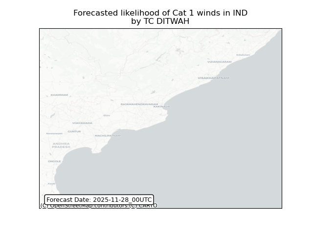

## DITWAH India: people exposed

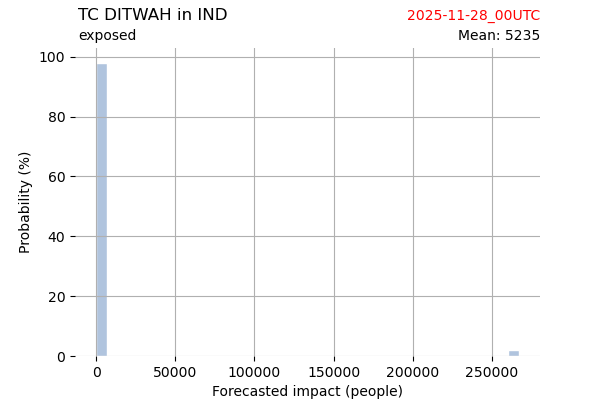

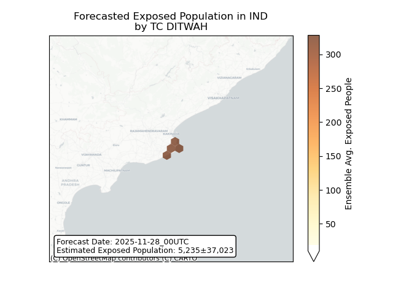

## DITWAH India: people displaced

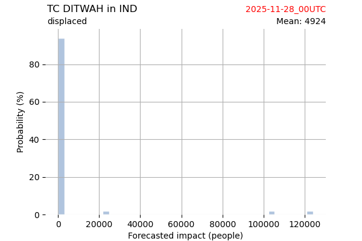

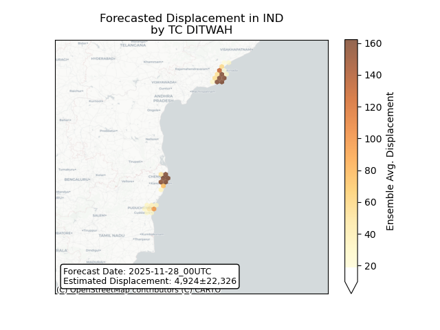

## DITWAH Sri Lanka: areas affected

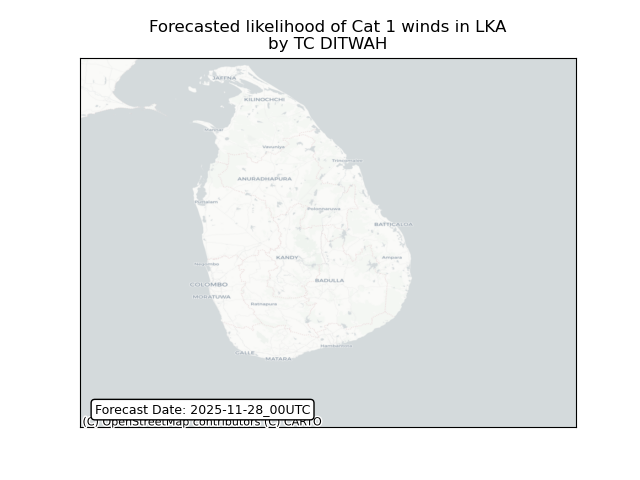

## DITWAH Sri Lanka: people exposed

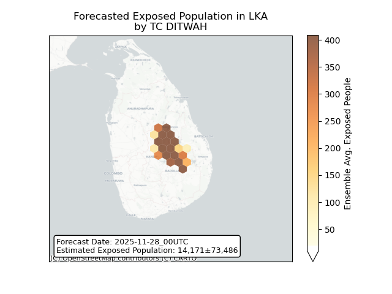

## DITWAH Sri Lanka: people displaced

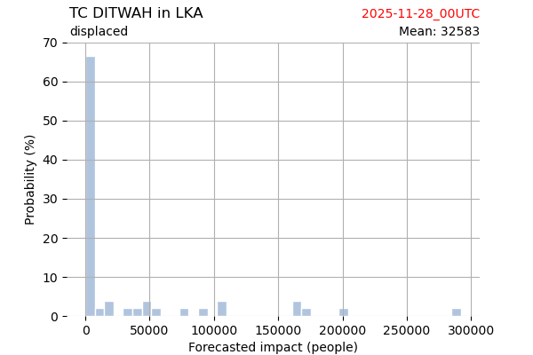

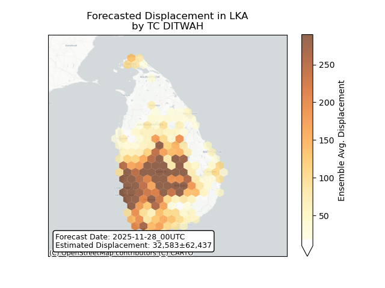

## KOTO Myanmar: areas affected

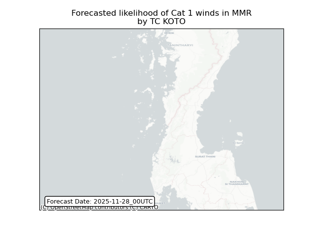

## KOTO Myanmar: people exposed

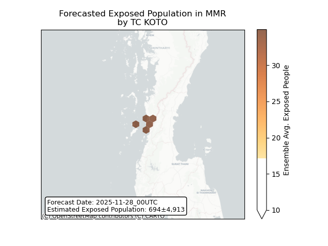

## KOTO Myanmar: people displaced

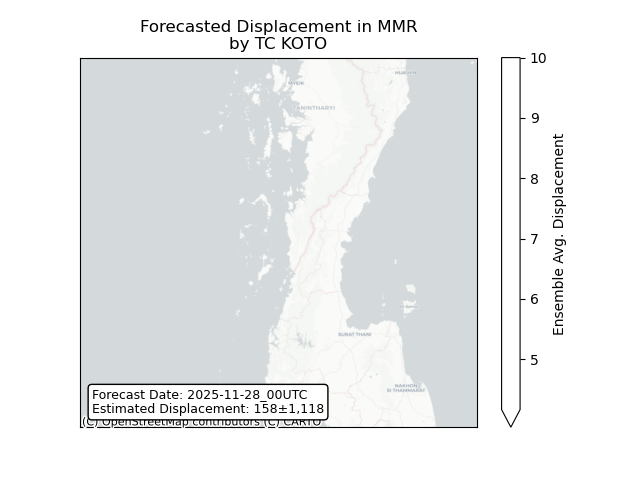

## KOTO Thailand: areas affected

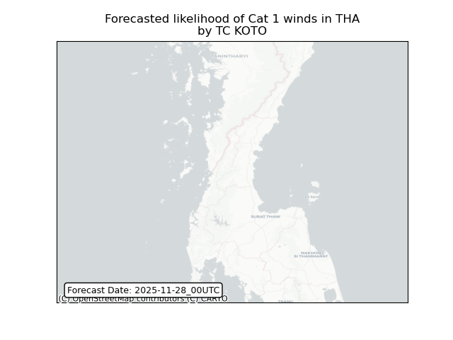

## KOTO Thailand: people exposed

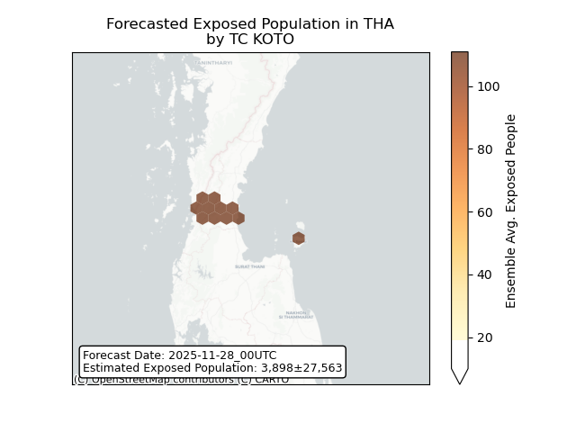

## KOTO Thailand: people displaced

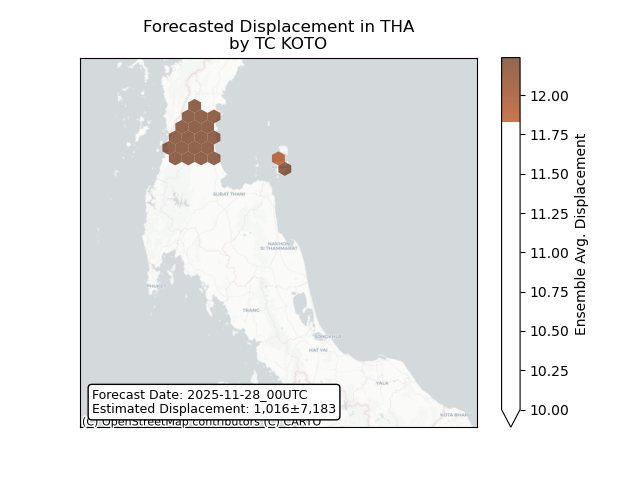

