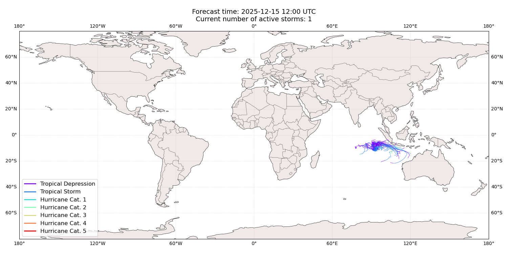
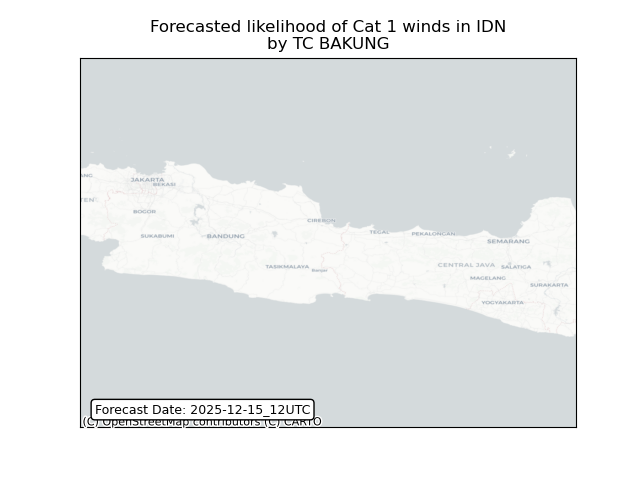
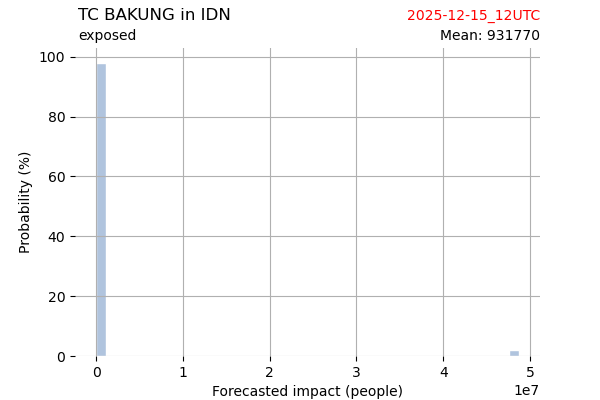
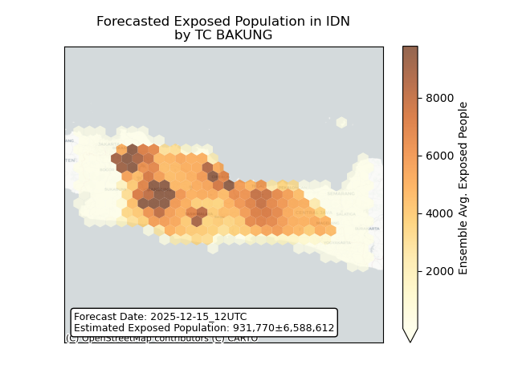
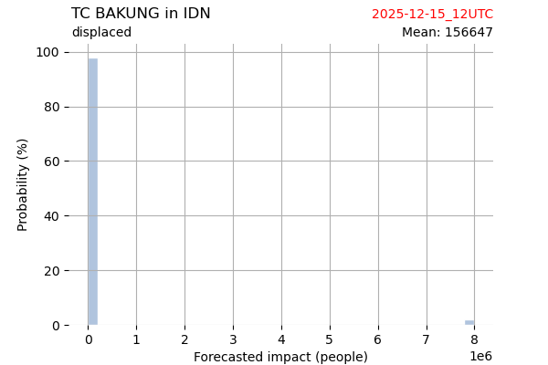
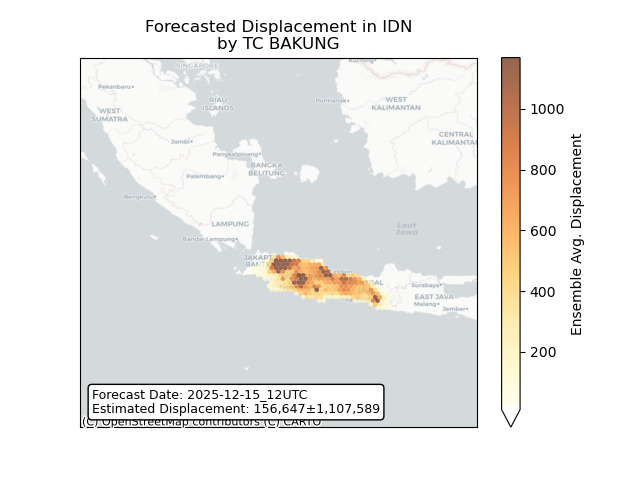

# Displacement forecast

This is a WIP. All this is going to change, for now we're just dumping things here.

## Forecast for 2025-12-15 12:00 UTC

There are 1 active named storms.

## BAKUNG Indonesia: areas affected

## BAKUNG Indonesia: people exposed

## BAKUNG Indonesia: people displaced

