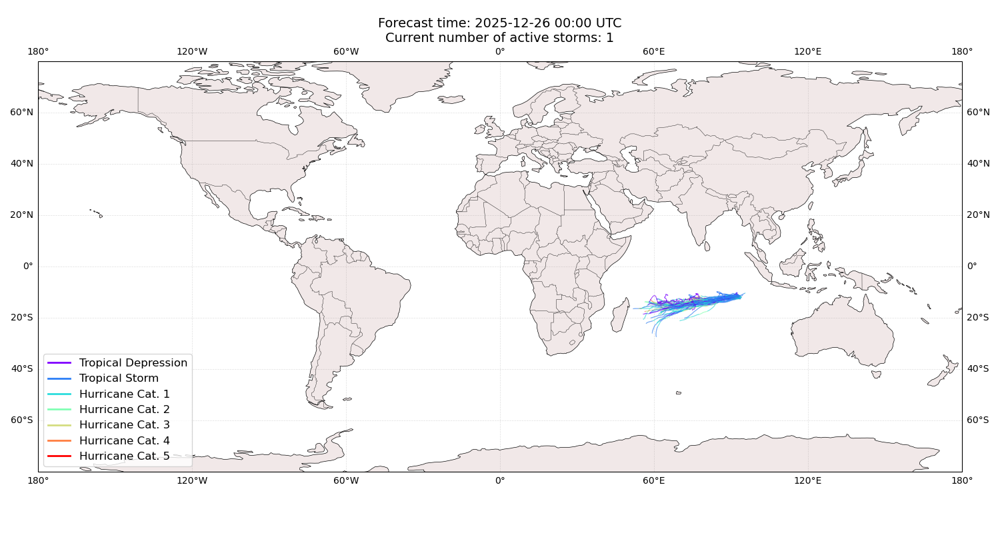
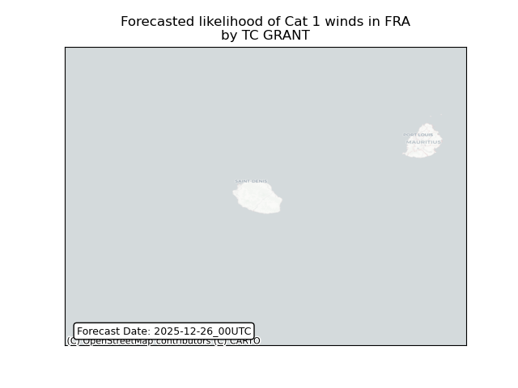
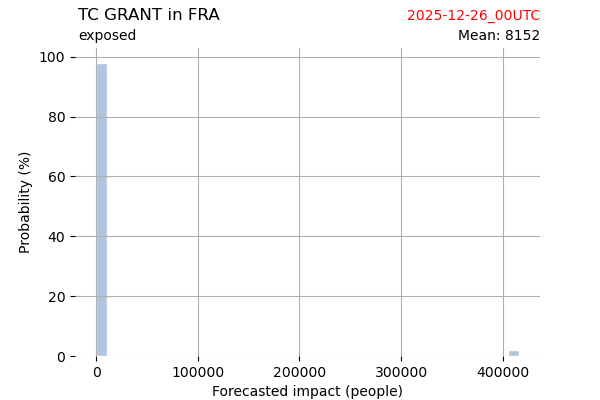
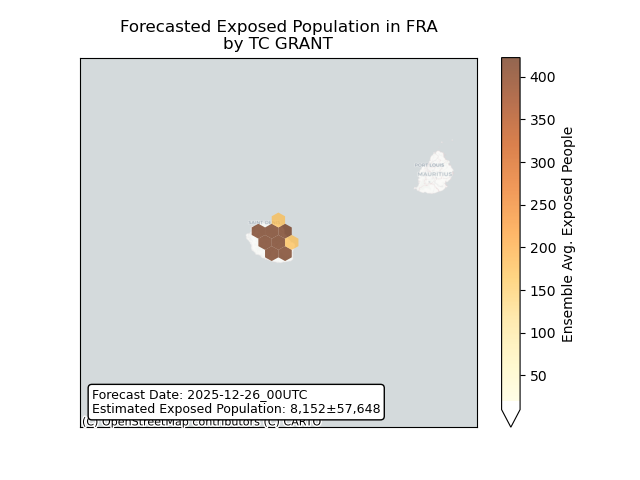
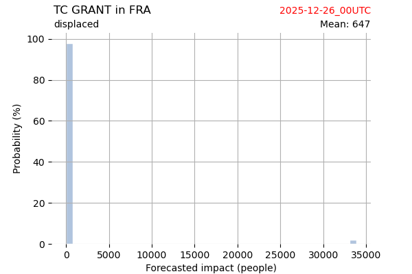
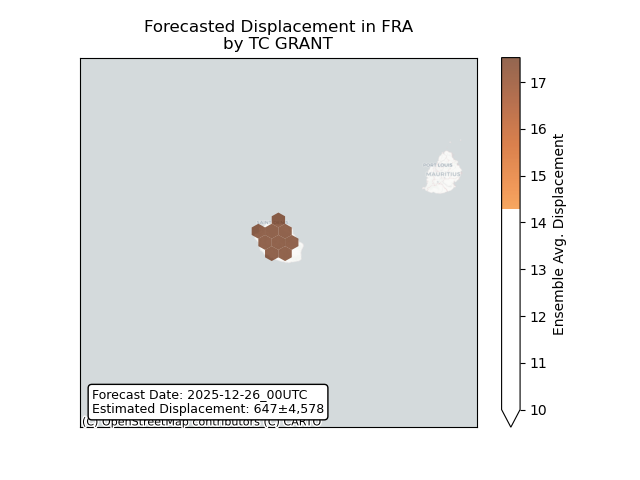

# Displacement forecast

This is a WIP. All this is going to change, for now we're just dumping things here.

## Forecast for 2025-12-26 00:00 UTC

There are 1 active named storms.

## GRANT France: areas affected

## GRANT France: people exposed

## GRANT France: people displaced

