# Displacement forecast

This is a WIP. All this is going to change, for now we're just dumping things here.

## Forecast for 2025-12-30 12:00 UTC

There are 2 active named storms.

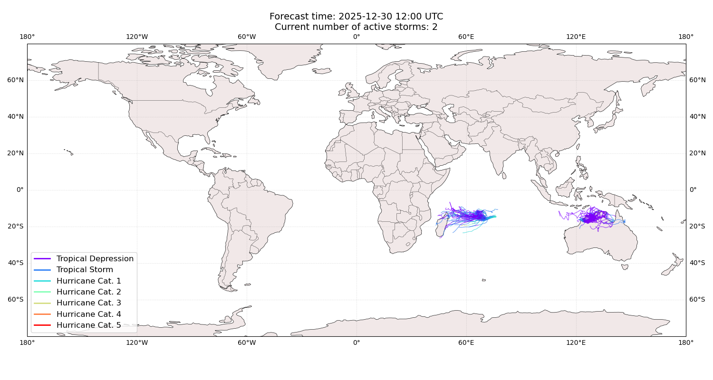

## HAYLEY Australia: areas affected

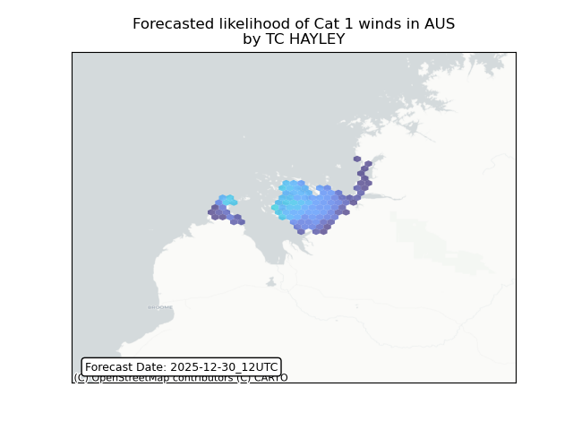

## HAYLEY Australia: people exposed

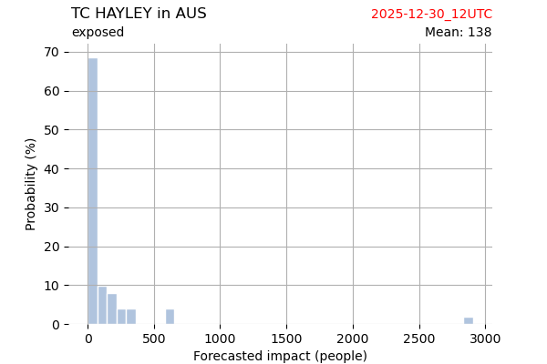

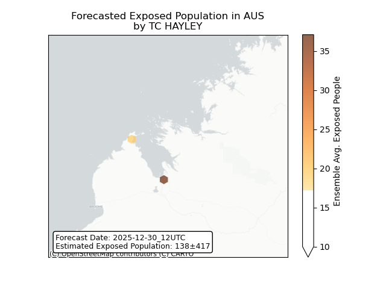

## HAYLEY Australia: people displaced

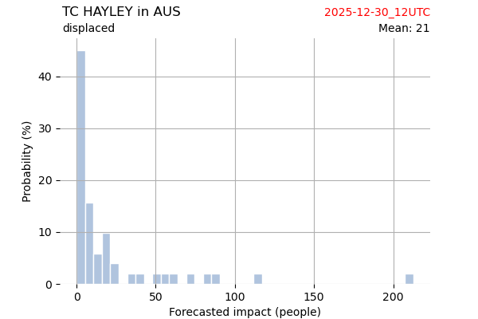

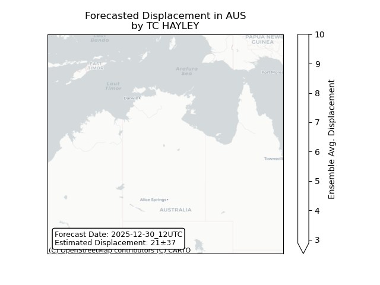

## GRANT Mauritius: areas affected

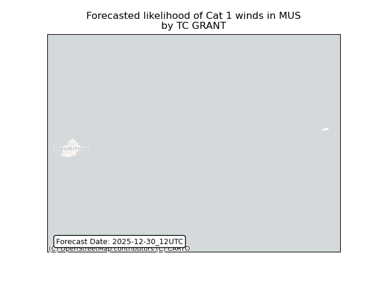

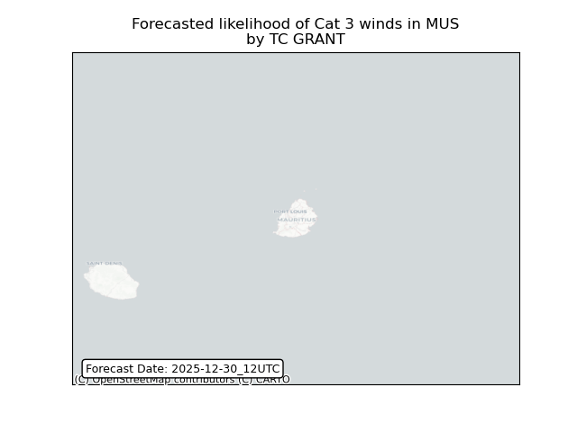

## GRANT Mauritius: people exposed

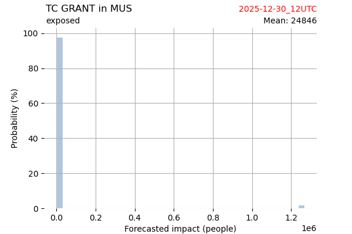

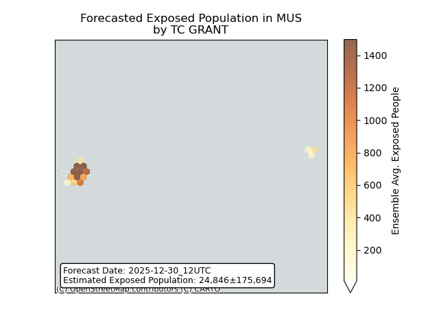

## GRANT Mauritius: people displaced

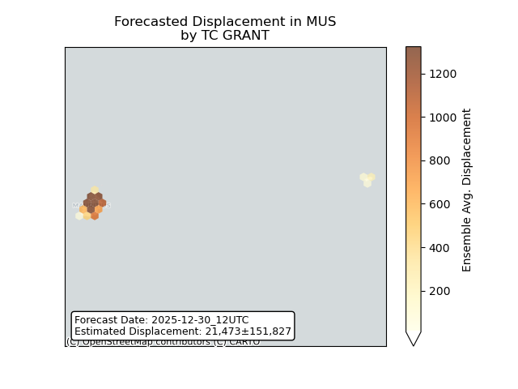

