# Displacement forecast

This is a WIP. All this is going to change, for now we're just dumping things here.

## Forecast for 2025-12-31 00:00 UTC

There are 2 active named storms.

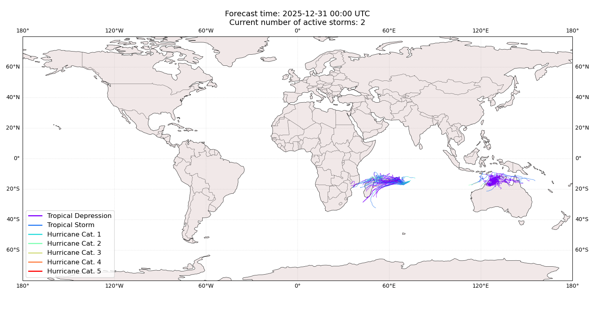

## GRANT Madagascar: areas affected

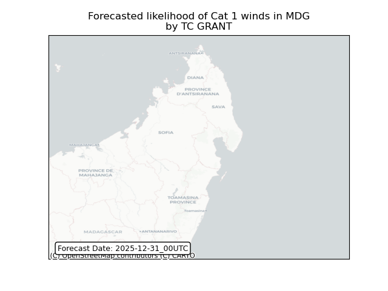

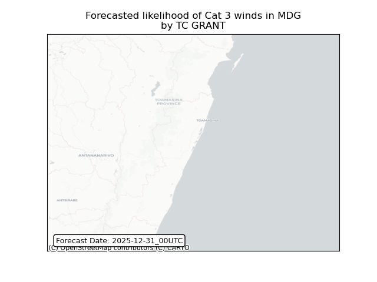

## GRANT Madagascar: people exposed

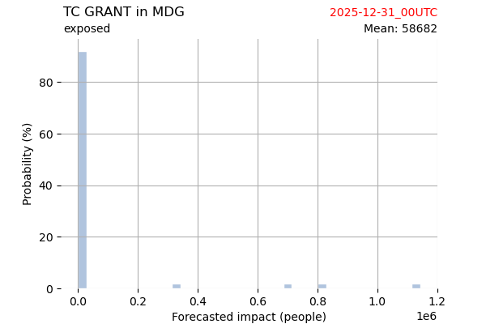

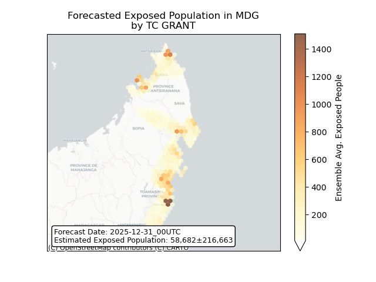

## GRANT Madagascar: people displaced

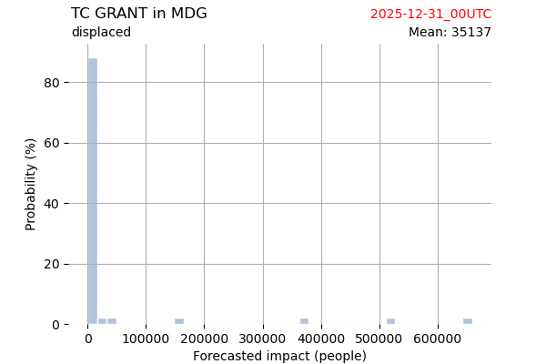

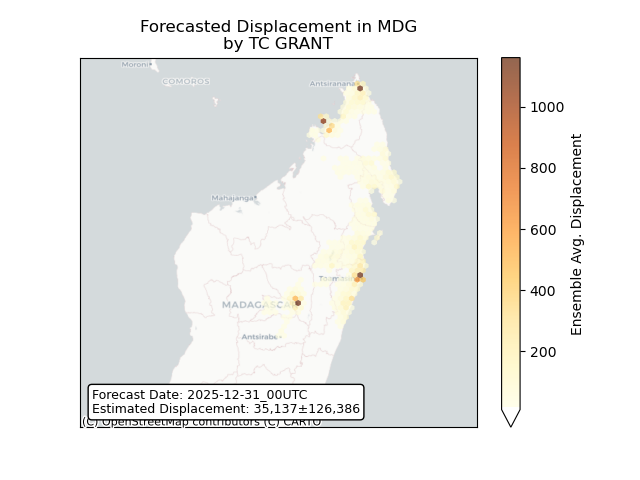

## GRANT Mozambique: areas affected

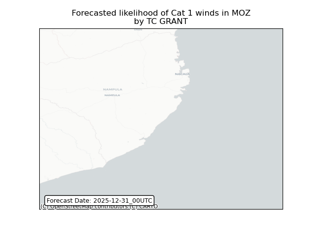

## GRANT Mozambique: people exposed

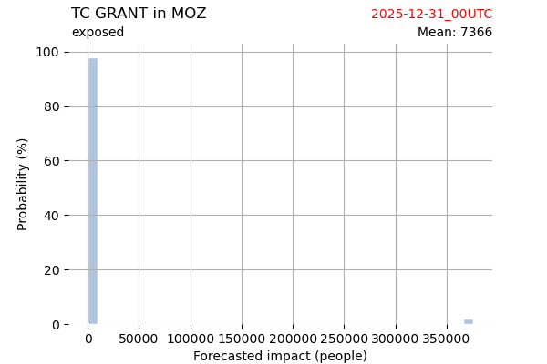

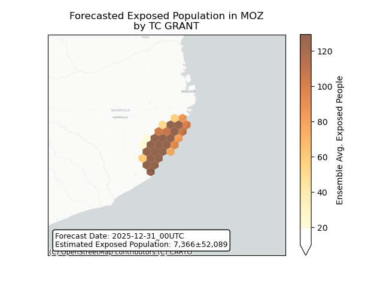

## GRANT Mozambique: people displaced

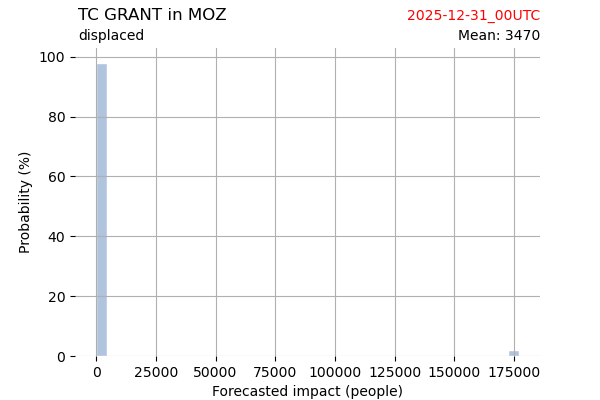

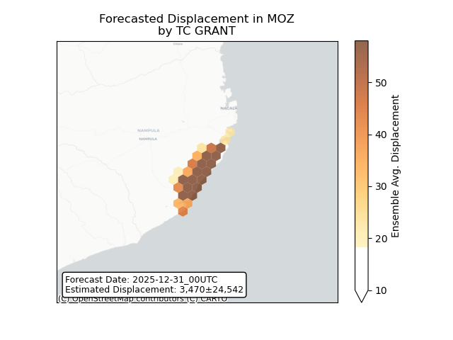

## HAYLEY Australia: areas affected

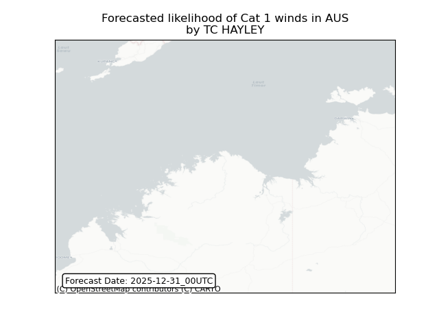

## HAYLEY Australia: people exposed

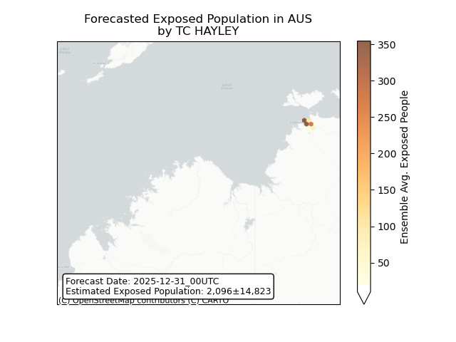

## HAYLEY Australia: people displaced

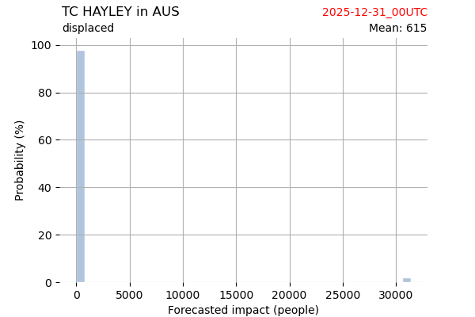

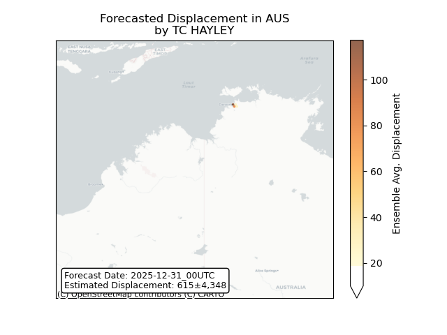

