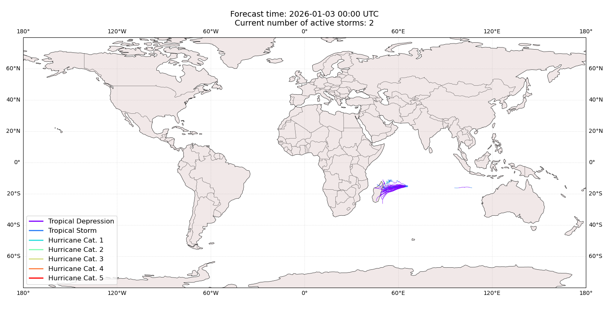
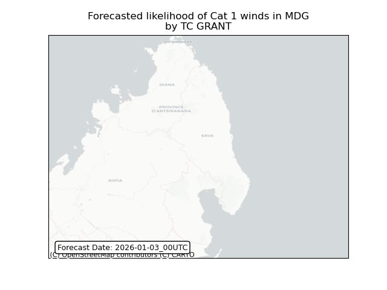
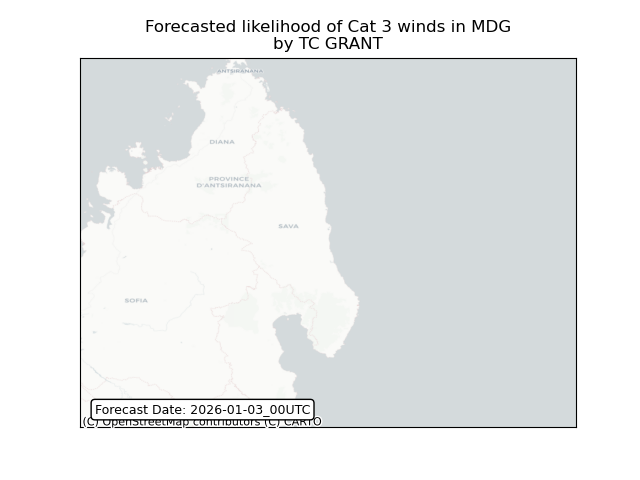
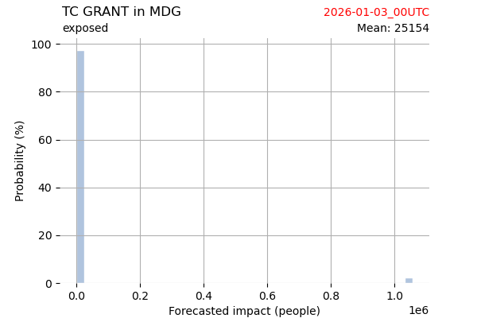
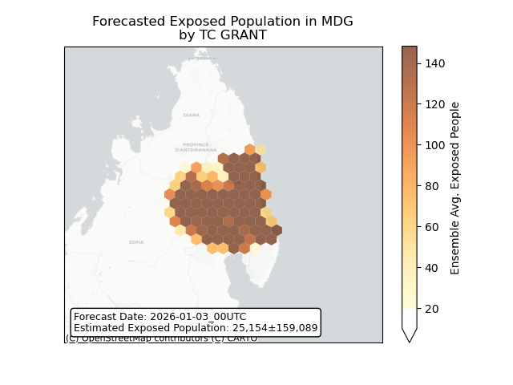
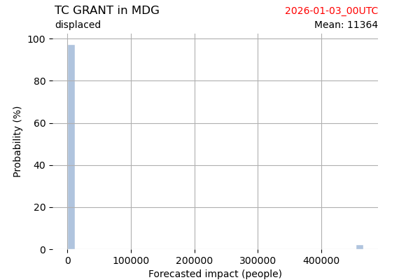
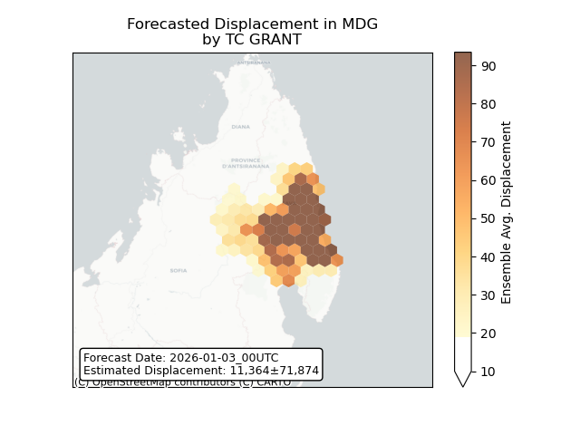

# Displacement forecast

This is a WIP. All this is going to change, for now we're just dumping things here.

## Forecast for 2026-01-03 00:00 UTC

There are 2 active named storms.

## IGGY All countries: No forecast people exposed

Storm IGGY is not forecast to affect people in All countries.

## IGGY All countries: no forecast people displaced

Storm IGGY is not forecast to displace people in All countries.

## GRANT Madagascar: areas affected

## GRANT Madagascar: people exposed

## GRANT Madagascar: people displaced

