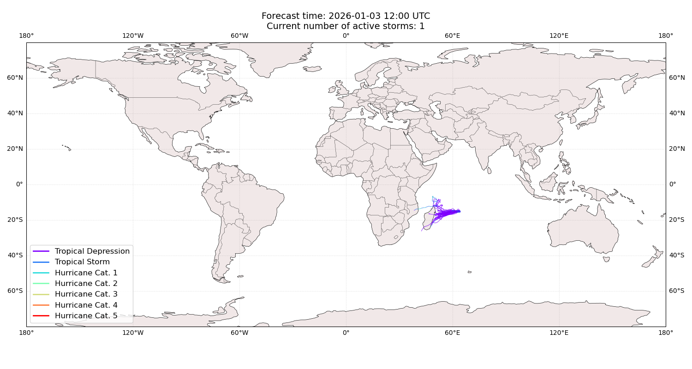
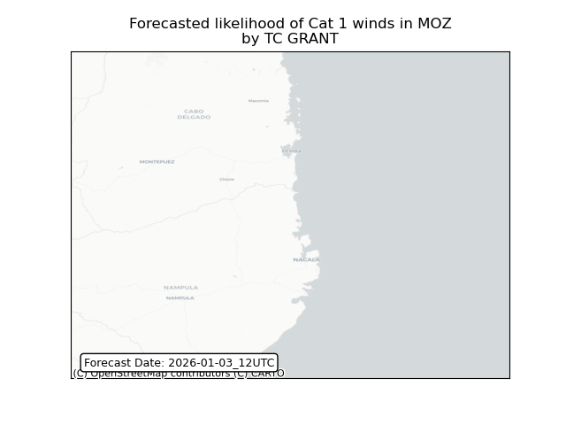
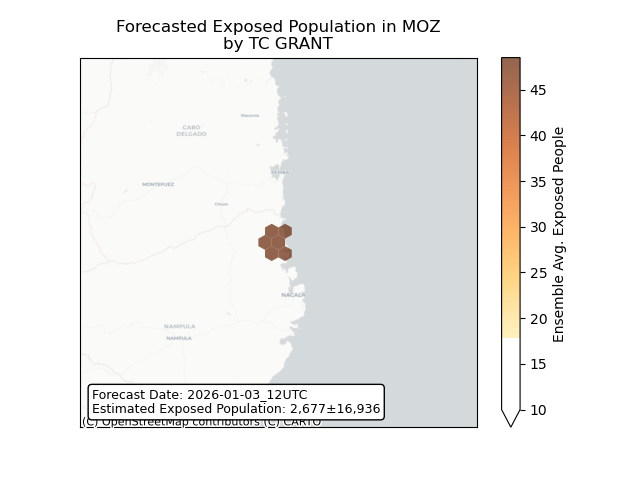
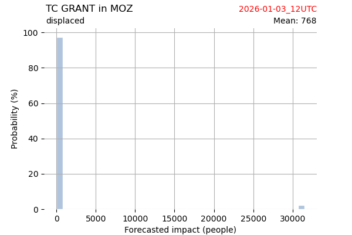
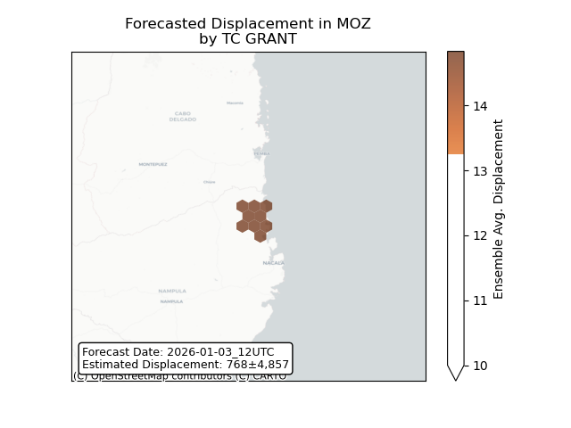

# Displacement forecast

This is a WIP. All this is going to change, for now we're just dumping things here.

## Forecast for 2026-01-03 12:00 UTC

There are 1 active named storms.

## GRANT Mozambique: areas affected

## GRANT Mozambique: people exposed

## GRANT Mozambique: people displaced

