# Displacement forecast

This is a WIP. All this is going to change, for now we're just dumping things here.

## Forecast for 2026-01-10 12:00 UTC

There are 1 active named storms.

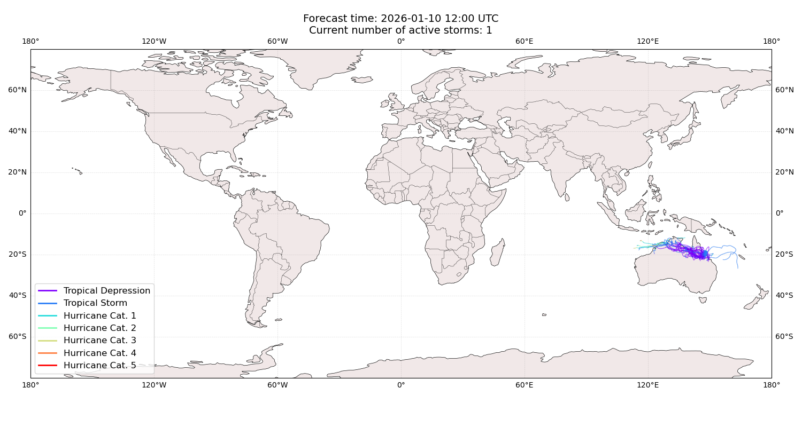

## KOJI Australia: areas affected

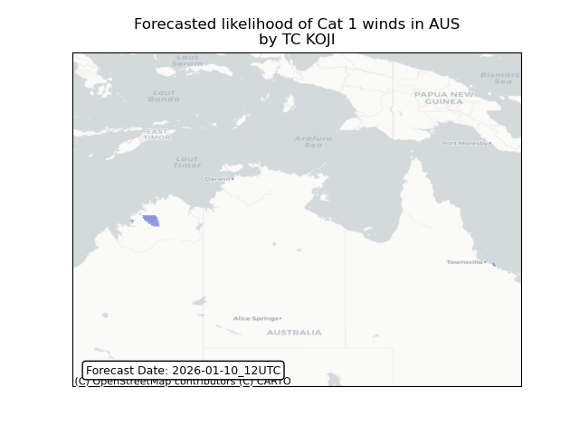

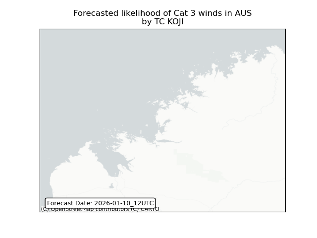

## KOJI Australia: people exposed

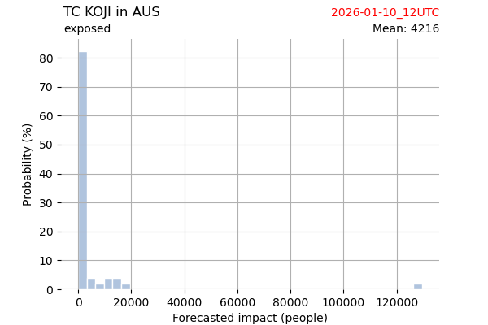

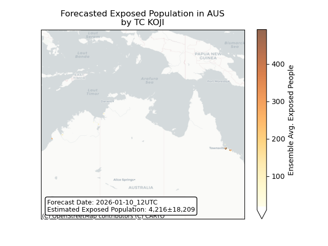

## KOJI Australia: people displaced

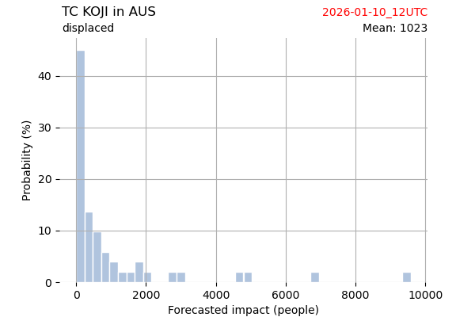

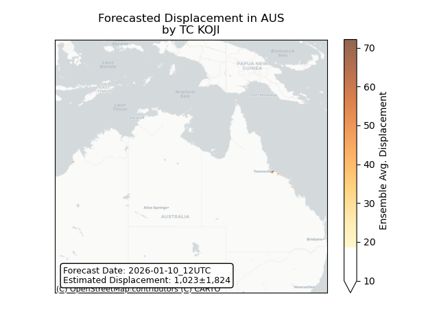

## KOJI New Caledonia: areas affected

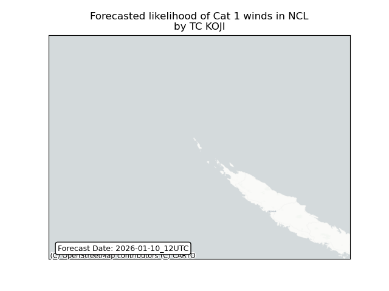

## KOJI New Caledonia: people exposed

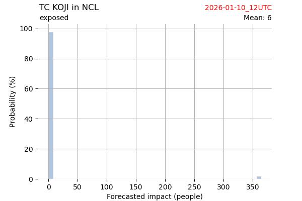

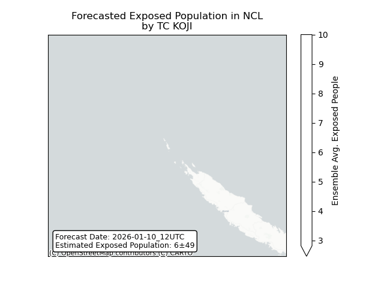

## KOJI New Caledonia: people displaced

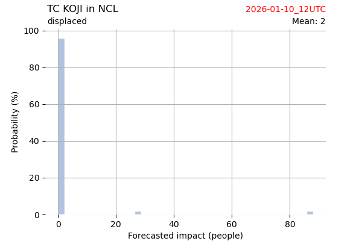

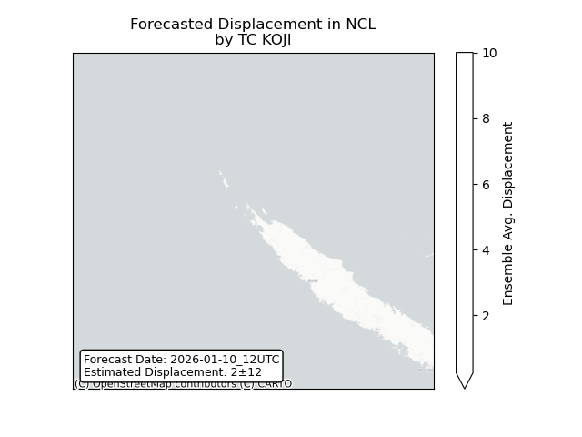

