# Displacement forecast

This is a WIP. All this is going to change, for now we're just dumping things here.

## Forecast for 2026-01-11 00:00 UTC

There are 2 active named storms.

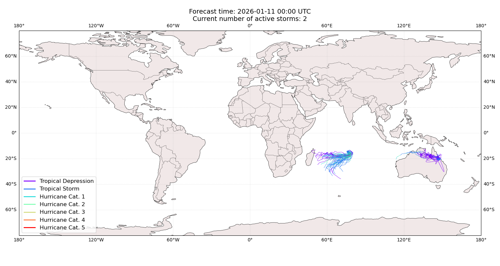

## KOJI Australia: areas affected

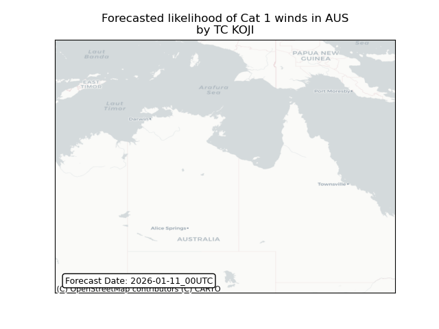

## KOJI Australia: people exposed

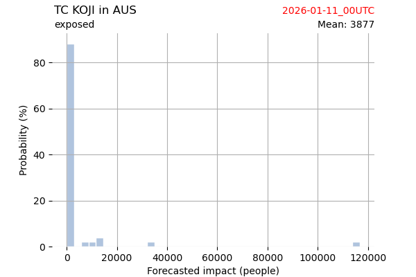

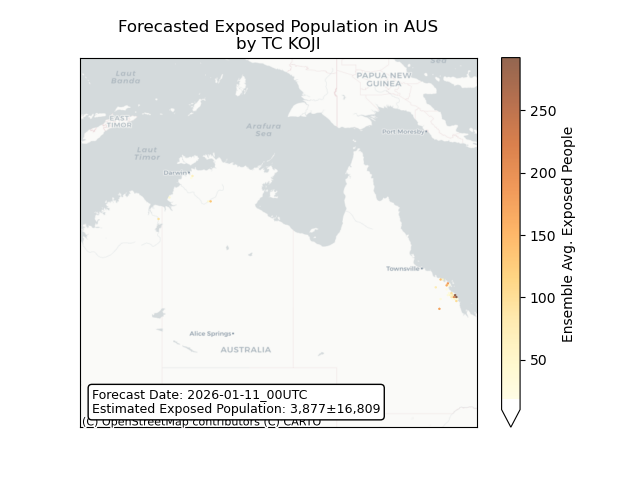

## KOJI Australia: people displaced

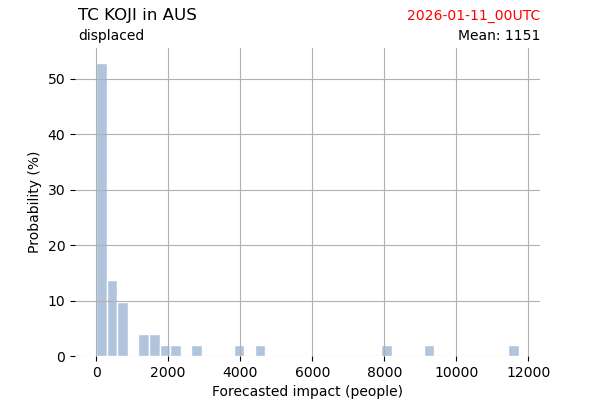

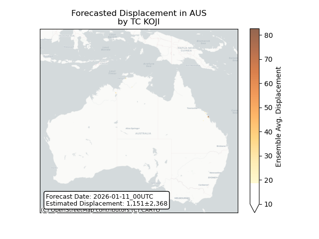

## DUDZAI Mauritius: areas affected

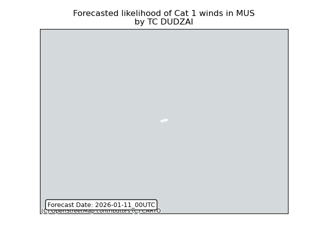

## DUDZAI Mauritius: people exposed

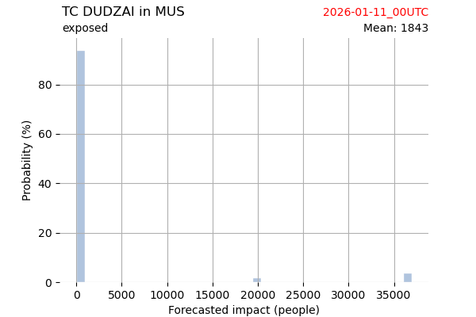

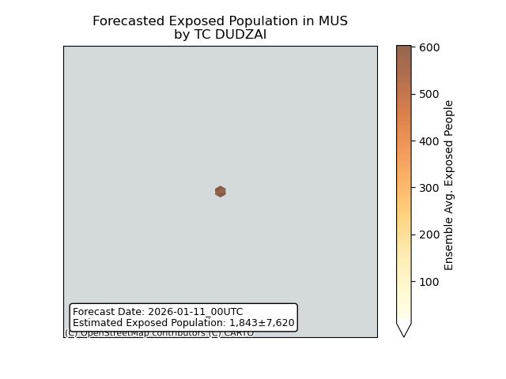

## DUDZAI Mauritius: people displaced

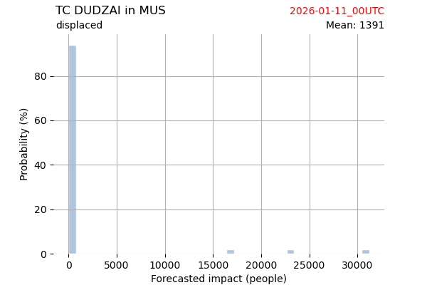

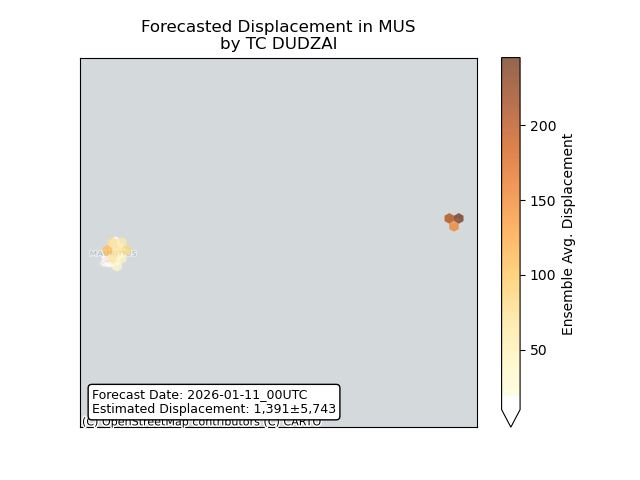

