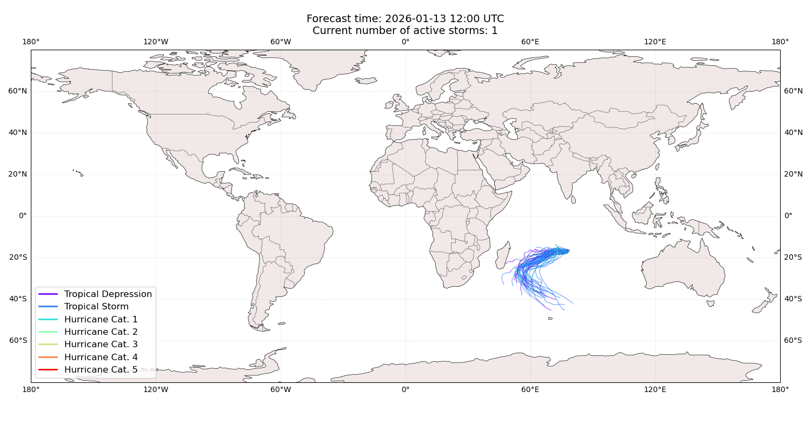
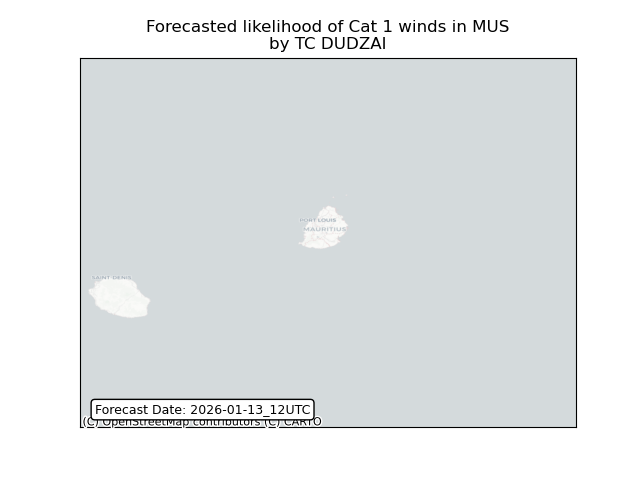
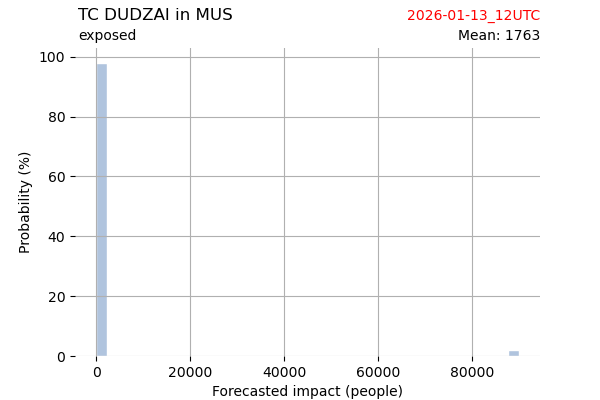
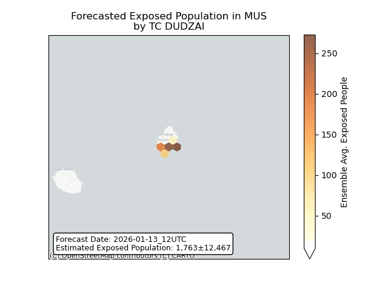
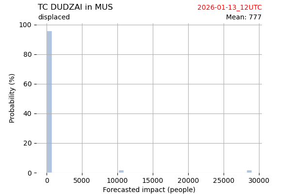
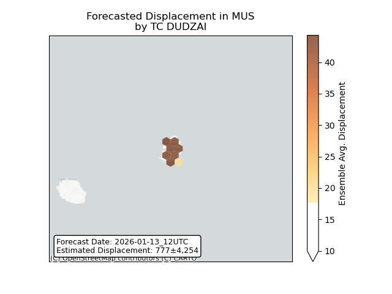

# Displacement forecast

This is a WIP. All this is going to change, for now we're just dumping things here.

## Forecast for 2026-01-13 12:00 UTC

There are 1 active named storms.

## DUDZAI Mauritius: areas affected

## DUDZAI Mauritius: people exposed

## DUDZAI Mauritius: people displaced

