# Displacement forecast

This is a WIP. All this is going to change, for now we're just dumping things here.

## Forecast for 2026-01-15 12:00 UTC

There are 2 active named storms.

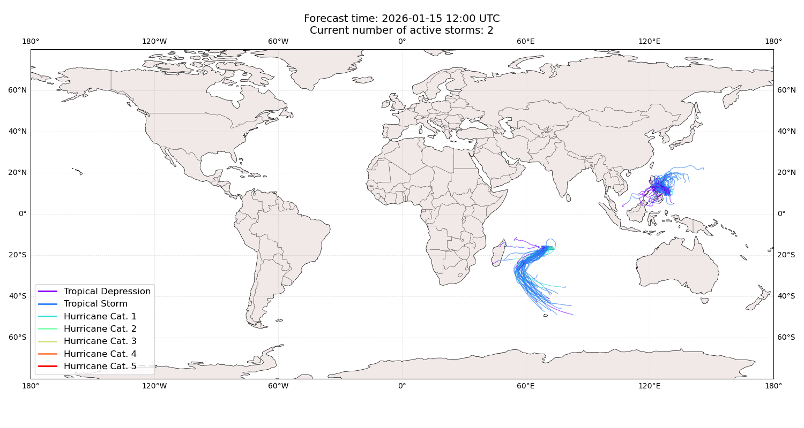

## NOKAEN Philippines: areas affected

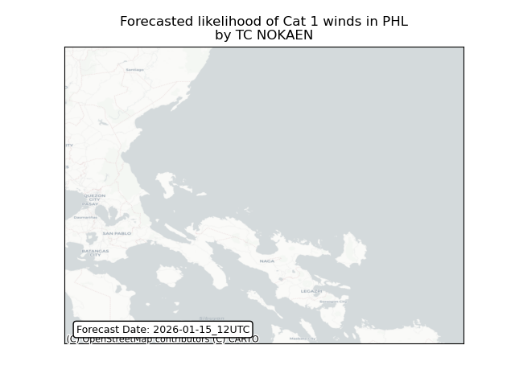

## NOKAEN Philippines: people exposed

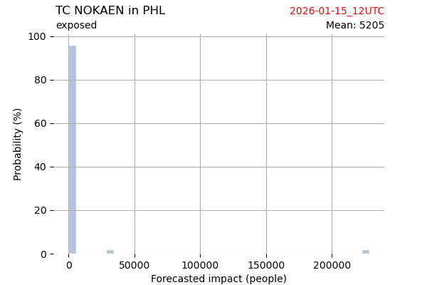

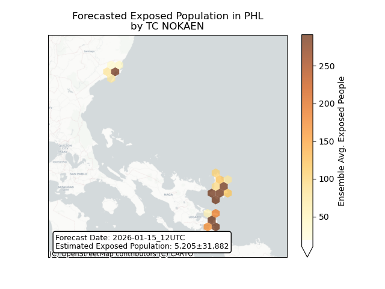

## NOKAEN Philippines: people displaced

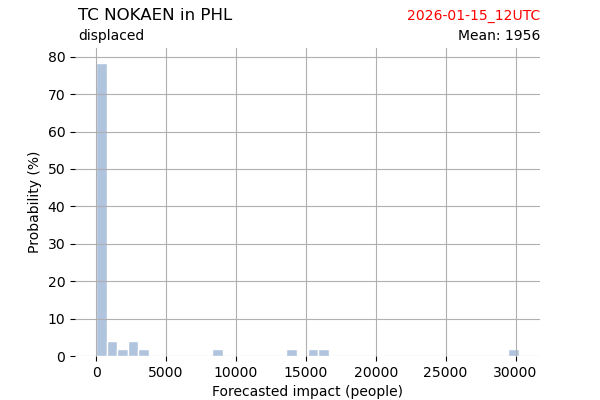

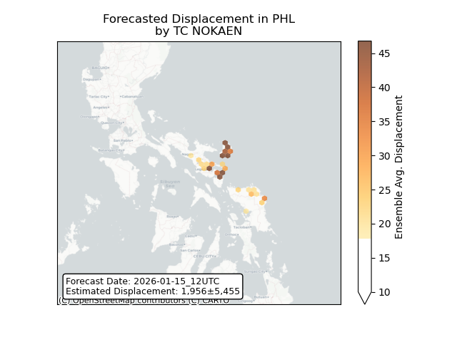

## DUDZAI France: areas affected

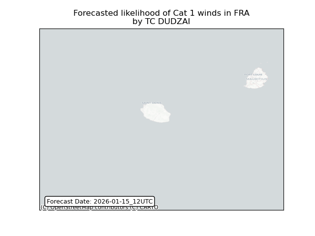

## DUDZAI France: people exposed

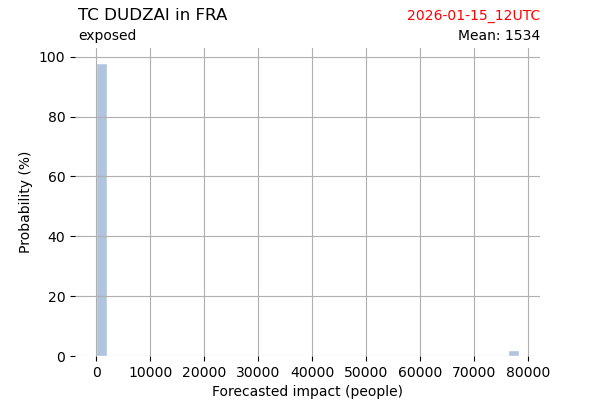

## DUDZAI France: people displaced

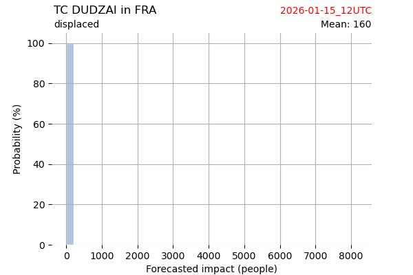

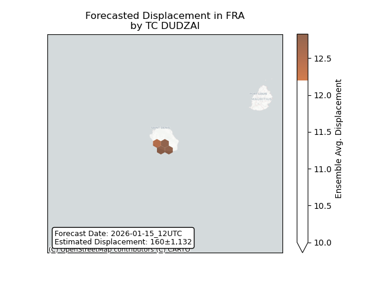

## DUDZAI Mauritius: areas affected

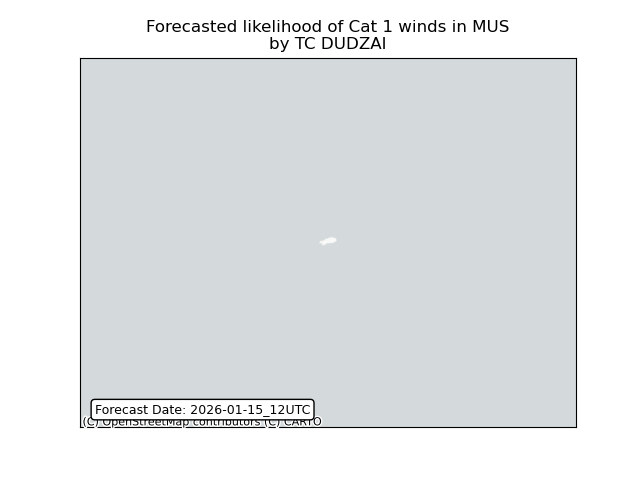

## DUDZAI Mauritius: people exposed

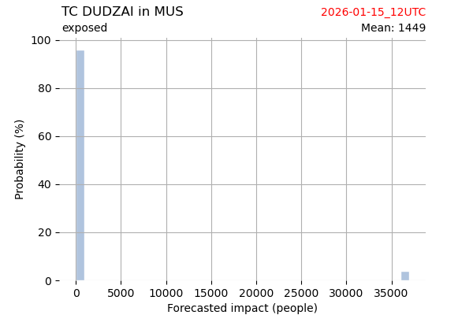

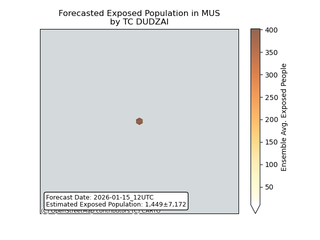

## DUDZAI Mauritius: people displaced

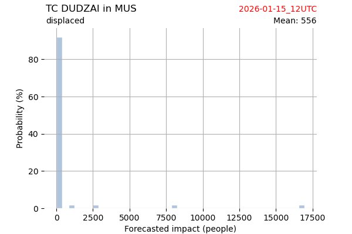

