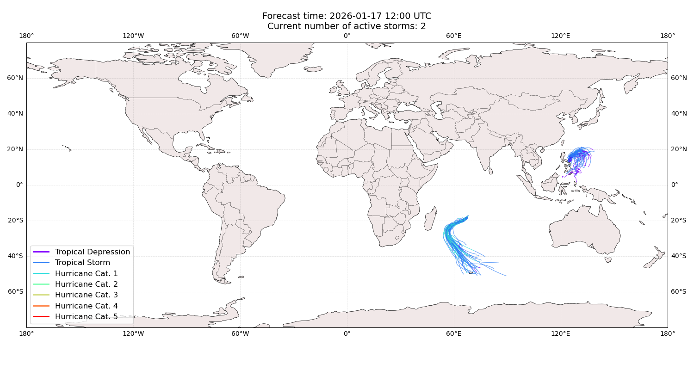
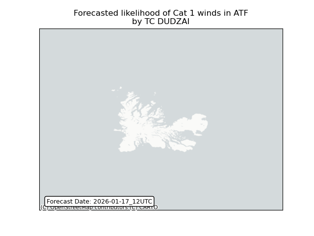

# Displacement forecast

This is a WIP. All this is going to change, for now we're just dumping things here.

## Forecast for 2026-01-17 12:00 UTC

There are 2 active named storms.

## DUDZAI French Southern Territories: areas affected

