# Displacement forecast

This is a WIP. All this is going to change, for now we're just dumping things here.

## Forecast for 2026-01-21 12:00 UTC

There are 2 active named storms.

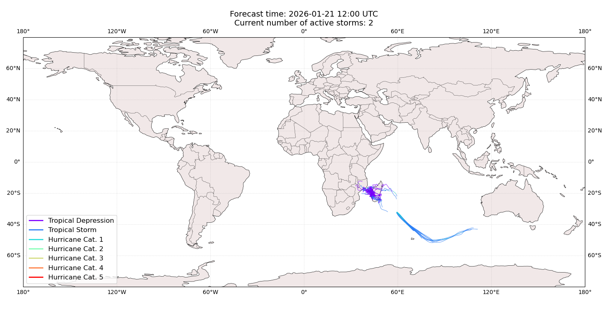

## DUDZAI All countries: No forecast people exposed

Storm DUDZAI is not forecast to affect people in All countries.

## DUDZAI All countries: no forecast people displaced

Storm DUDZAI is not forecast to displace people in All countries.

## EWETSE Madagascar: areas affected

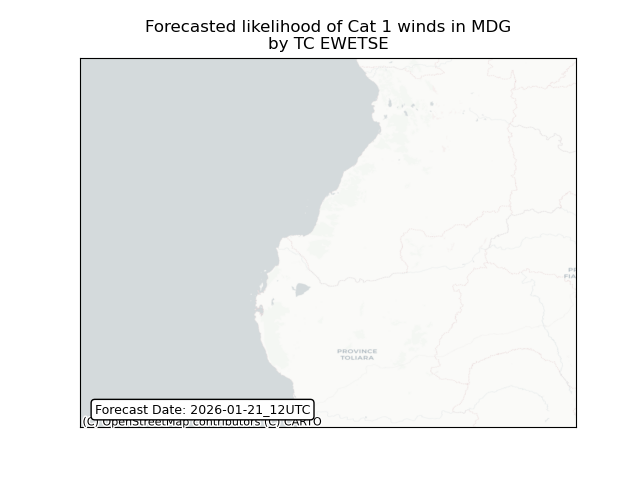

## EWETSE Madagascar: people exposed

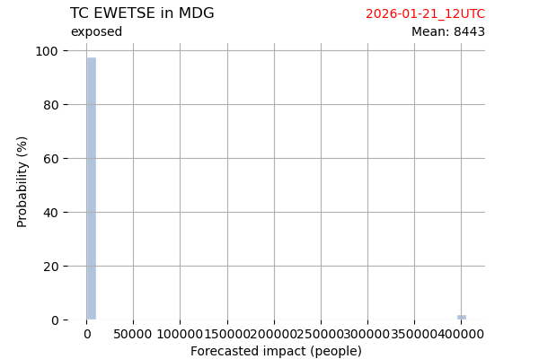

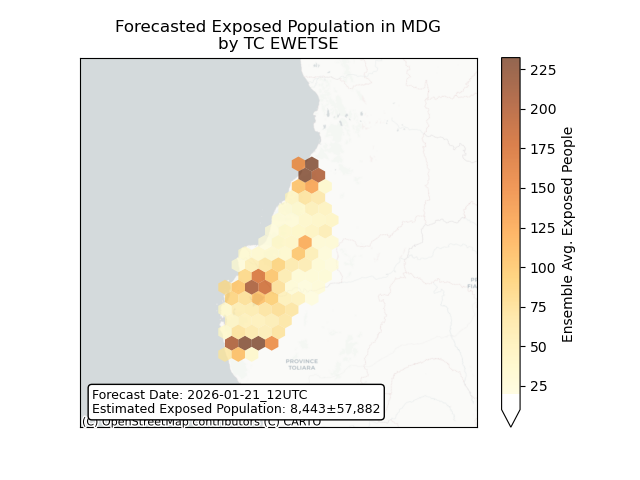

## EWETSE Madagascar: people displaced

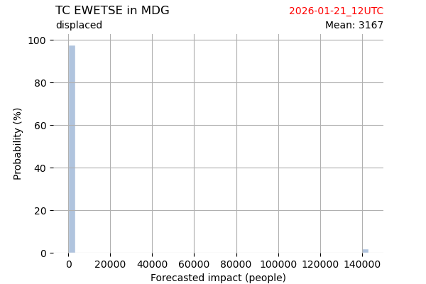

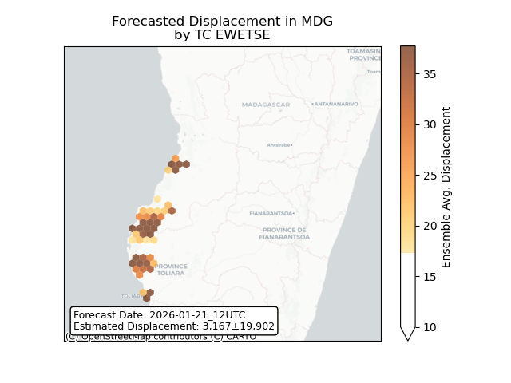

## EWETSE Mozambique: areas affected

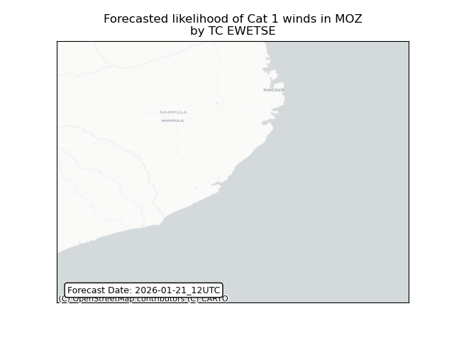

## EWETSE Mozambique: people exposed

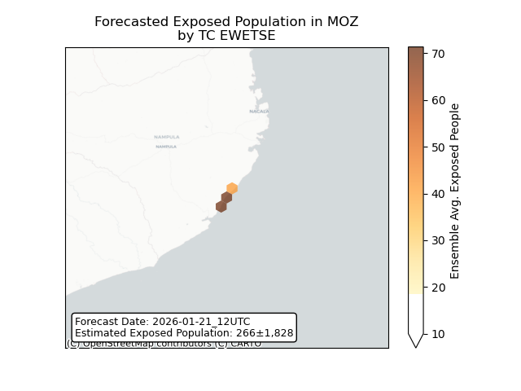

## EWETSE Mozambique: people displaced

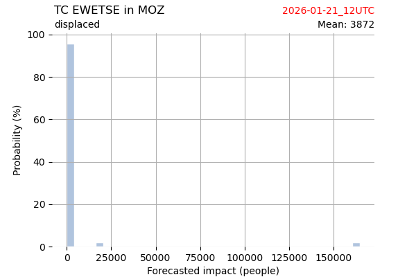

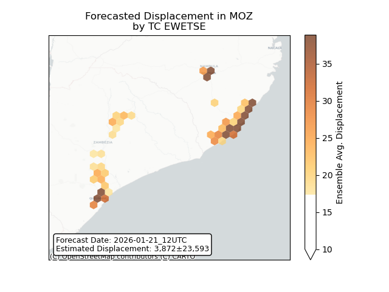

## EWETSE Mauritius: areas affected

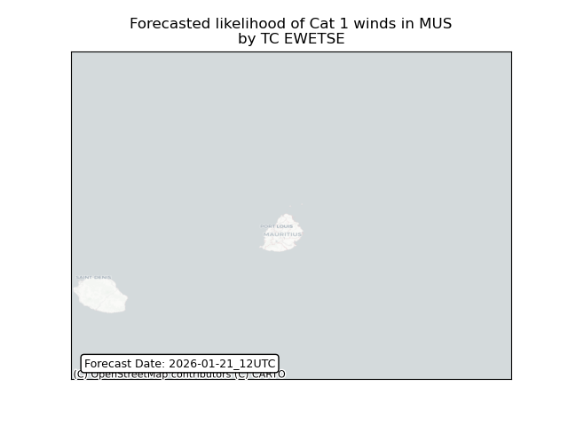

## EWETSE Mauritius: people exposed

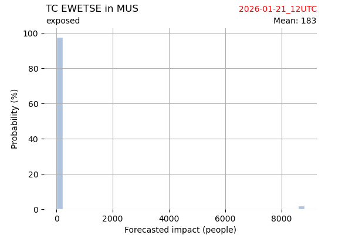

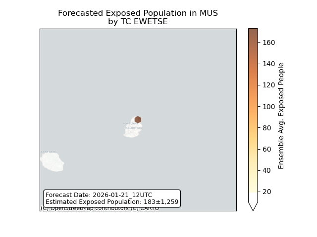

## EWETSE Mauritius: people displaced

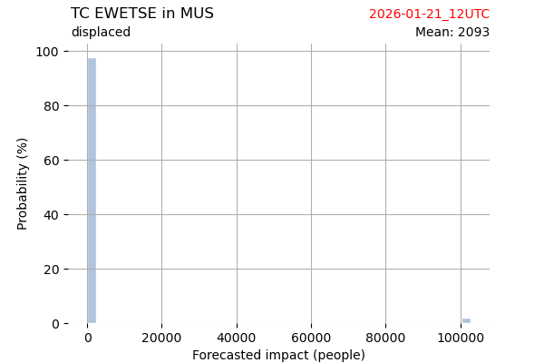

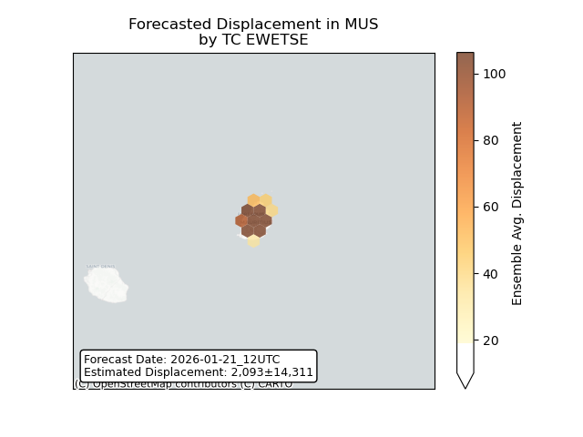

