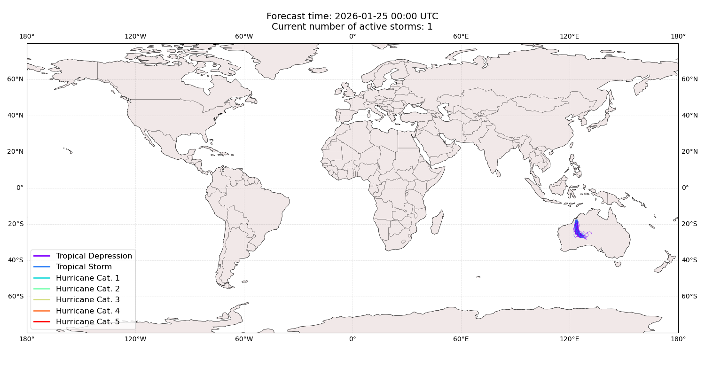
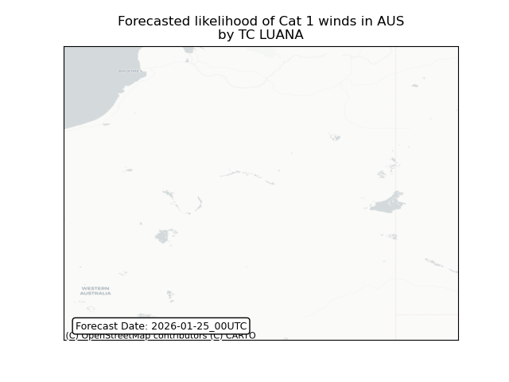
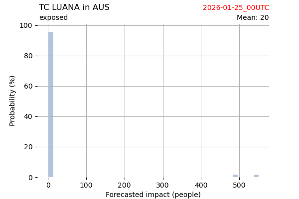
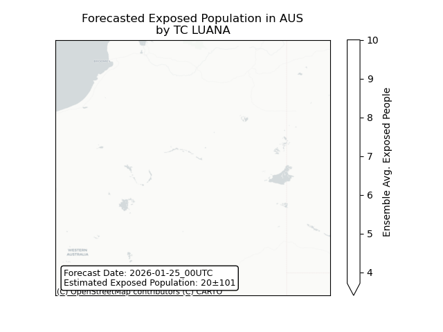
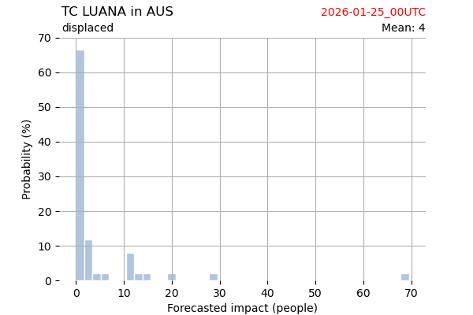
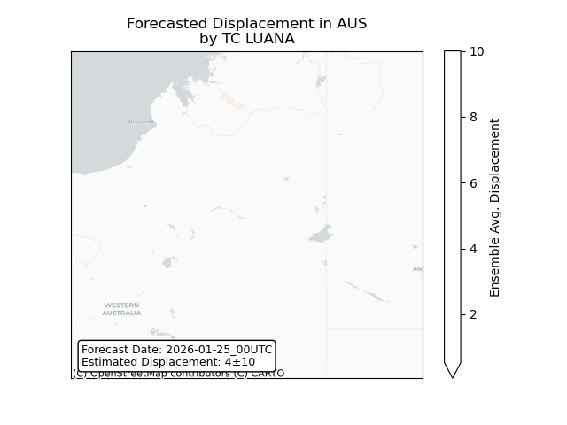

# Displacement forecast

This is a WIP. All this is going to change, for now we're just dumping things here.

## Forecast for 2026-01-25 00:00 UTC

There are 1 active named storms.

## LUANA Australia: areas affected

## LUANA Australia: people exposed

## LUANA Australia: people displaced

