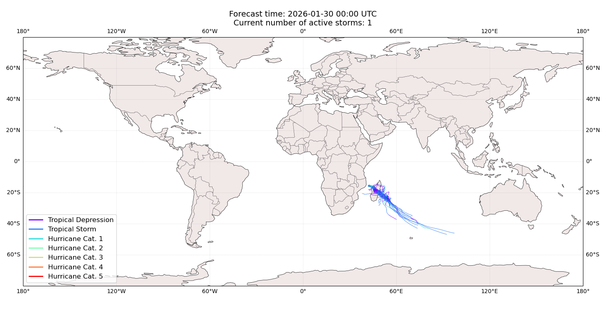
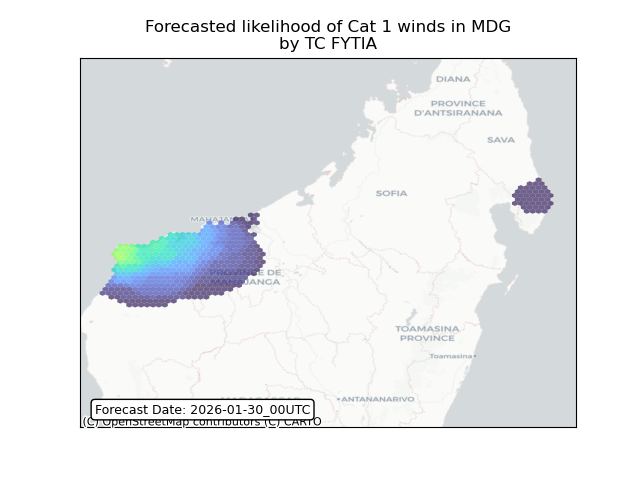
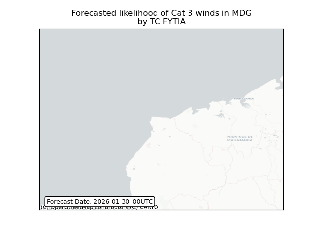
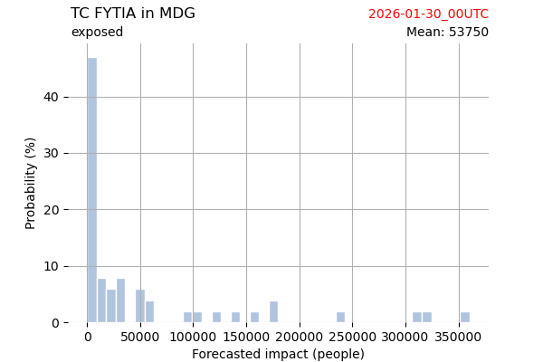
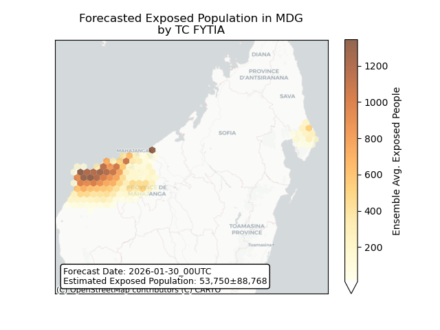
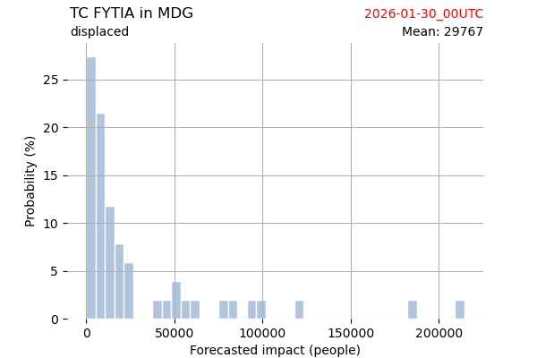
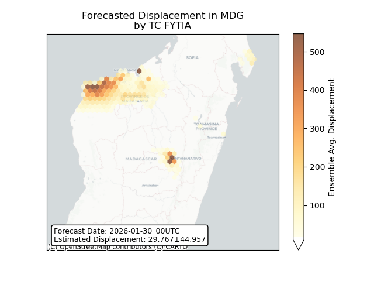

# Displacement forecast

This is a WIP. All this is going to change, for now we're just dumping things here.

## Forecast for 2026-01-30 00:00 UTC

There are 1 active named storms.

## FYTIA Madagascar: areas affected

## FYTIA Madagascar: people exposed

## FYTIA Madagascar: people displaced

