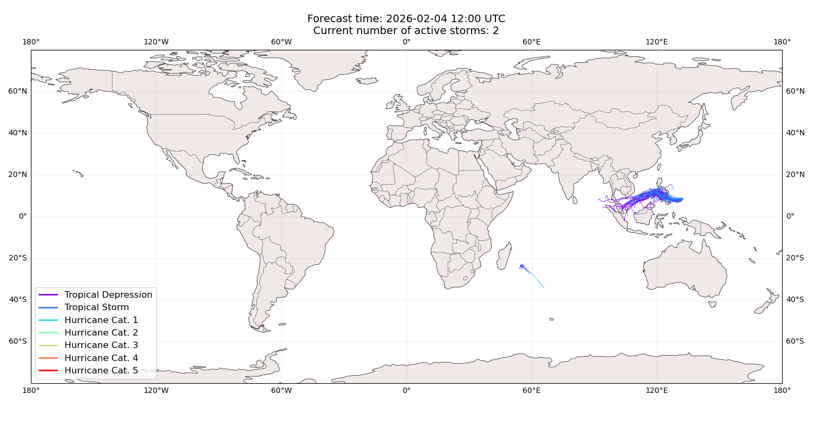
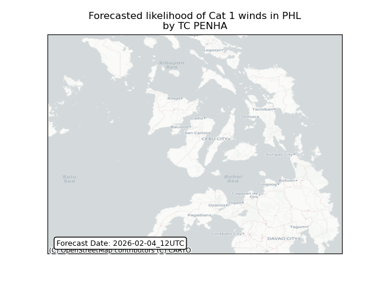
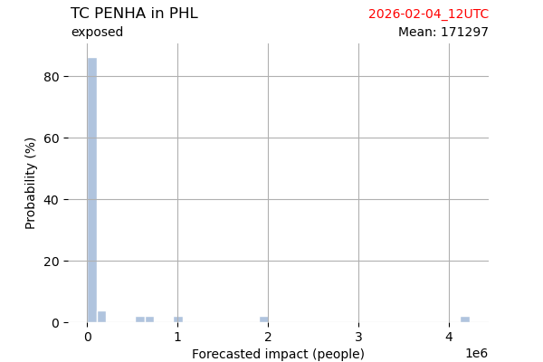
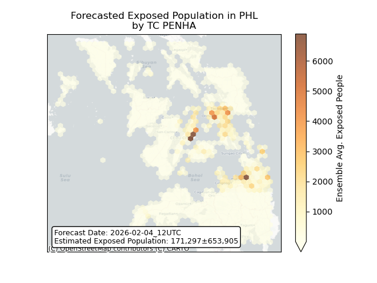
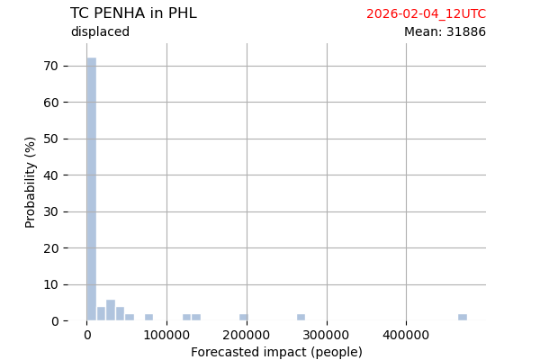
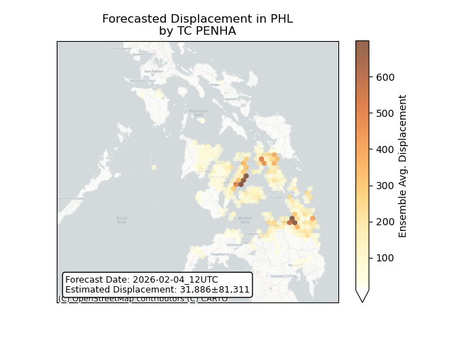

# Displacement forecast

This is a WIP. All this is going to change, for now we're just dumping things here.

## Forecast for 2026-02-04 12:00 UTC

There are 2 active named storms.

## FYTIA All countries: No forecast people exposed

Storm FYTIA is not forecast to affect people in All countries.

## FYTIA All countries: no forecast people displaced

Storm FYTIA is not forecast to displace people in All countries.

## PENHA Philippines: areas affected

## PENHA Philippines: people exposed

## PENHA Philippines: people displaced

