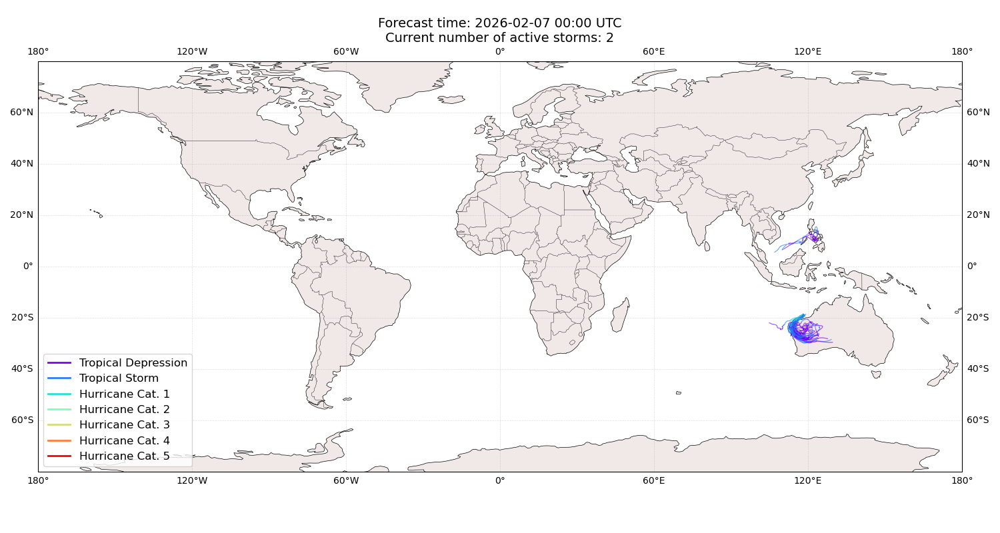
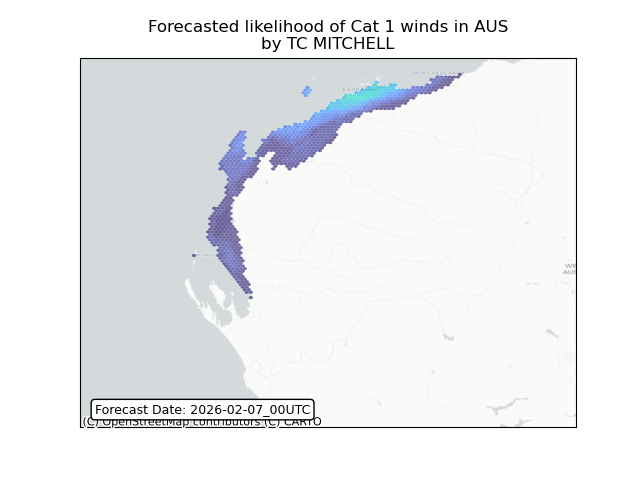
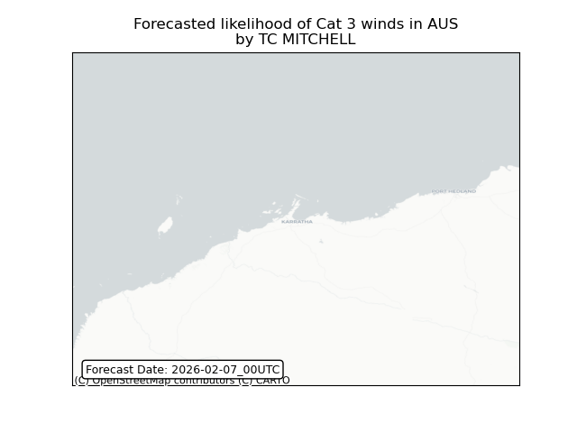
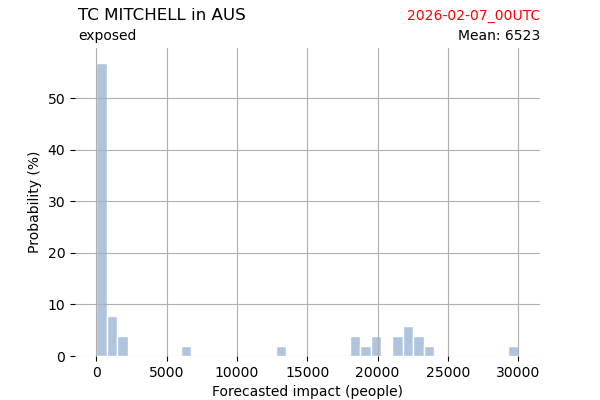
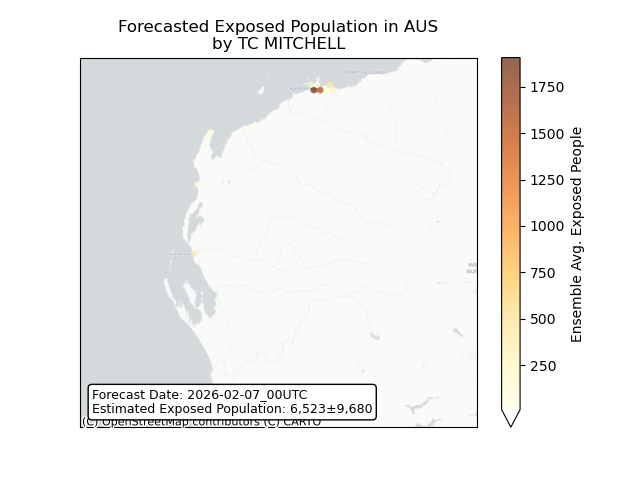
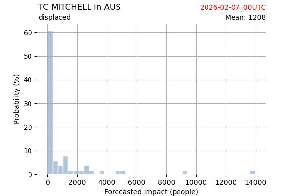
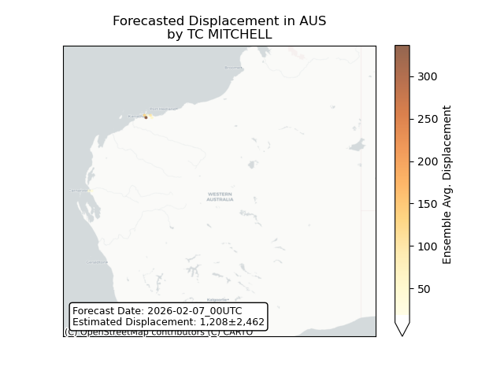

# Displacement forecast

This is a WIP. All this is going to change, for now we're just dumping things here.

## Forecast for 2026-02-07 00:00 UTC

There are 2 active named storms.

## PENHA All countries: No forecast people exposed

Storm PENHA is not forecast to affect people in All countries.

## PENHA All countries: no forecast people displaced

Storm PENHA is not forecast to displace people in All countries.

## MITCHELL Australia: areas affected

## MITCHELL Australia: people exposed

## MITCHELL Australia: people displaced

