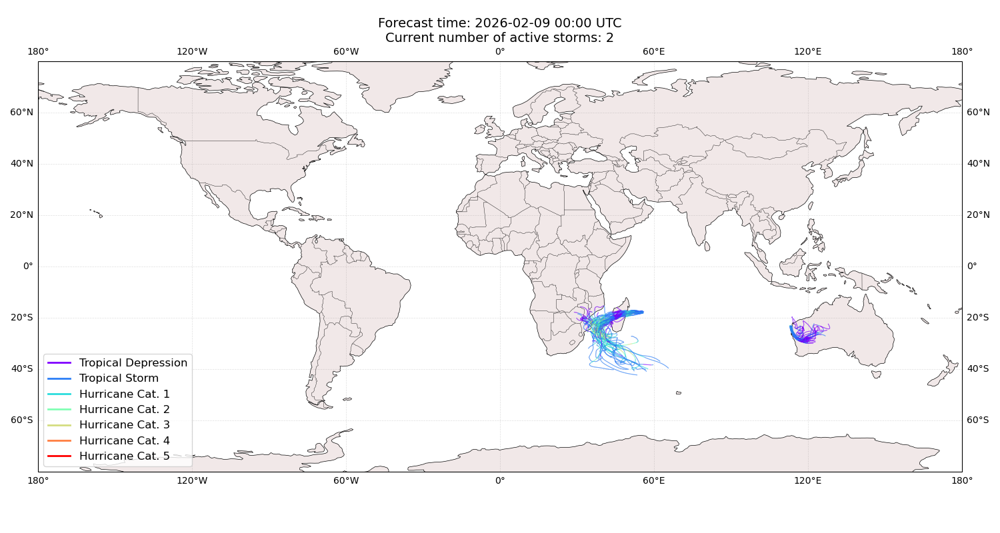
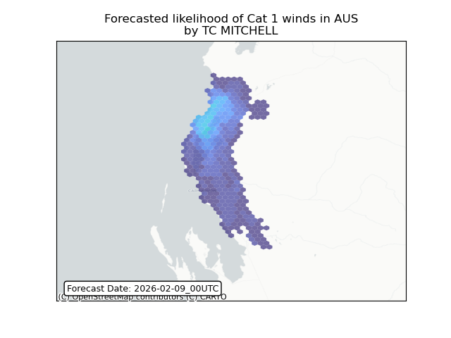
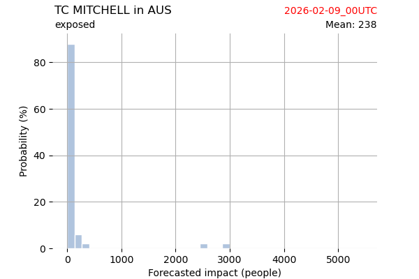
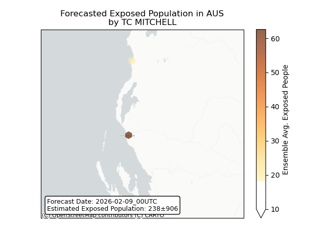
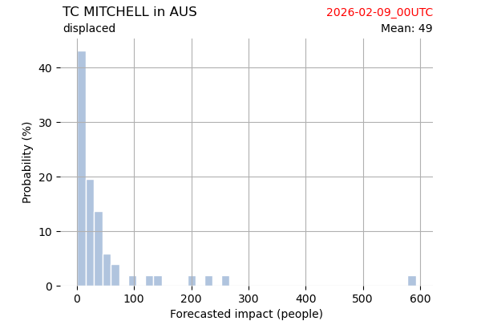
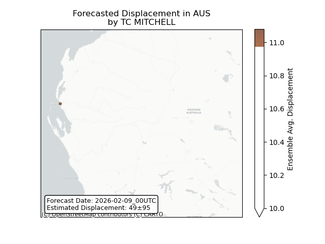

# Displacement forecast

This is a WIP. All this is going to change, for now we're just dumping things here.

## Forecast for 2026-02-09 00:00 UTC

There are 2 active named storms.

## MITCHELL Australia: areas affected

## MITCHELL Australia: people exposed

## MITCHELL Australia: people displaced

