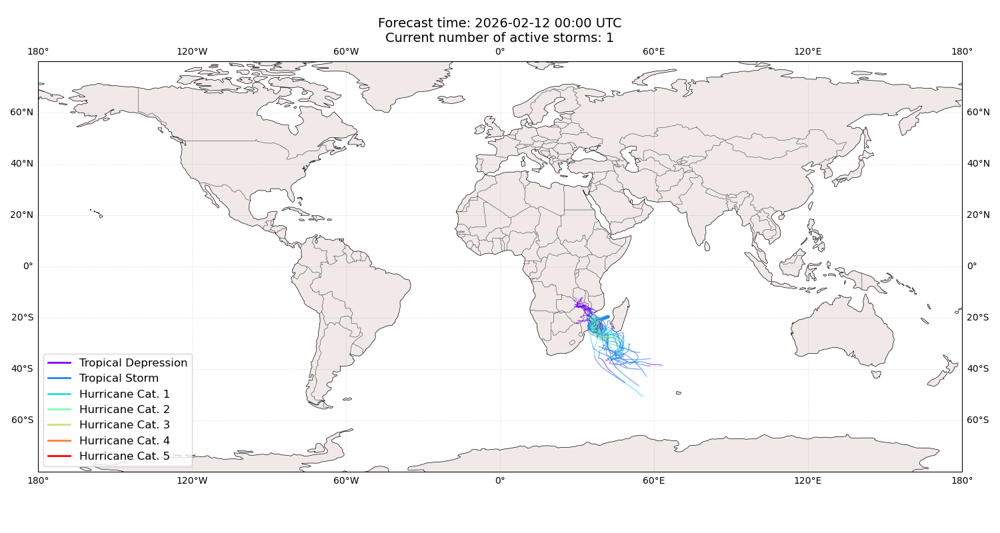
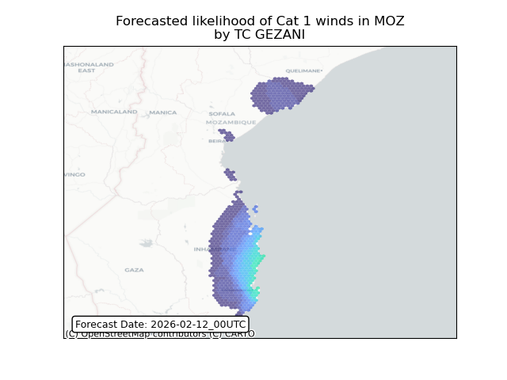
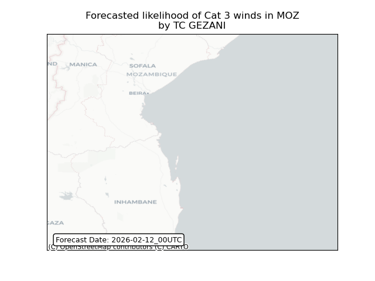
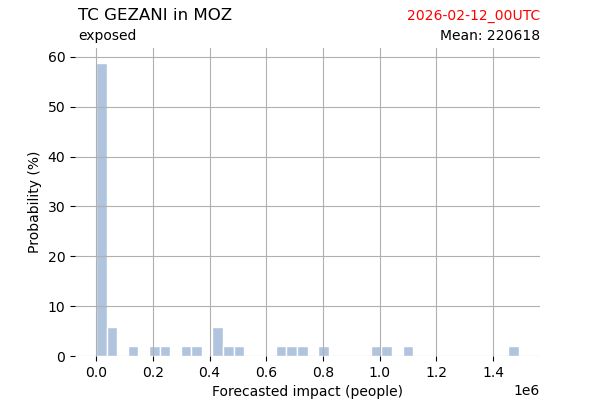
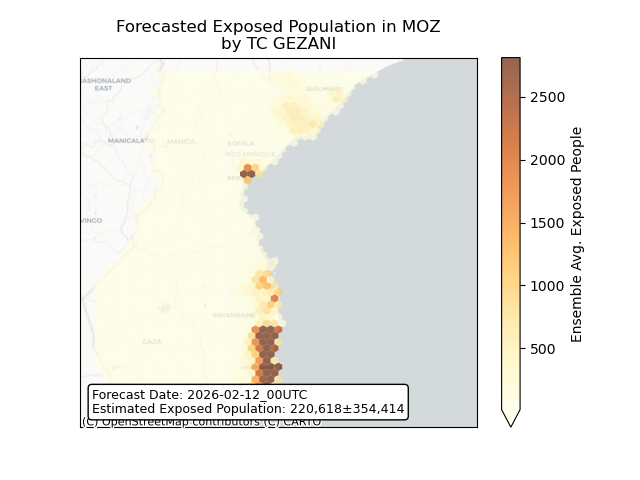
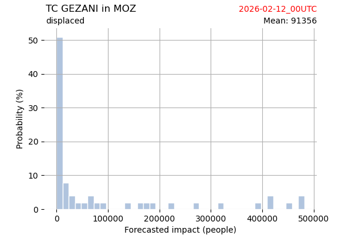
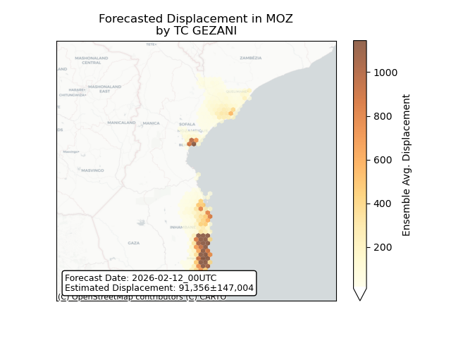

# Displacement forecast

This is a WIP. All this is going to change, for now we're just dumping things here.

## Forecast for 2026-02-12 00:00 UTC

There are 1 active named storms.

## GEZANI Mozambique: areas affected

## GEZANI Mozambique: people exposed

## GEZANI Mozambique: people displaced

