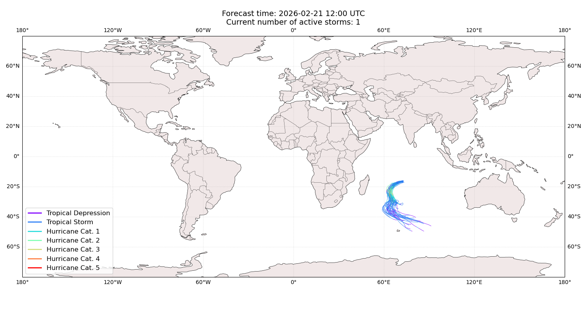
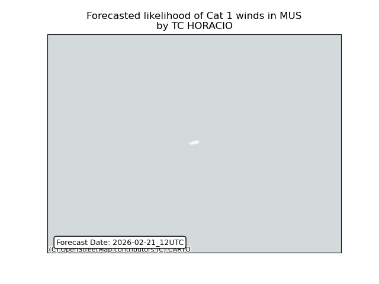
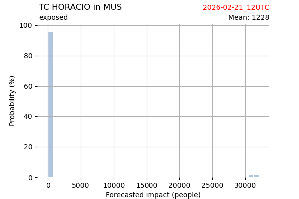
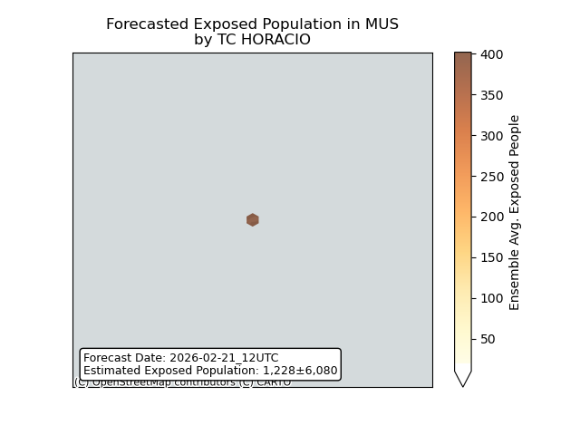
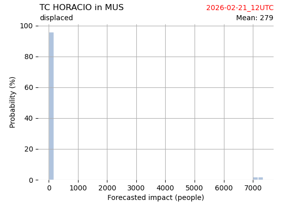
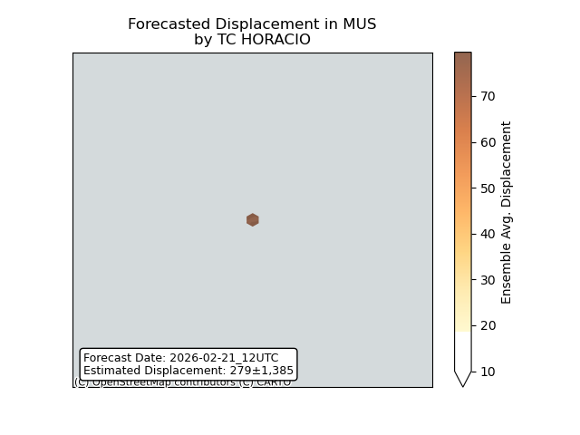

# Displacement forecast

This is a WIP. All this is going to change, for now we're just dumping things here.

## Forecast for 2026-02-21 12:00 UTC

There are 1 active named storms.

## HORACIO Mauritius: areas affected

## HORACIO Mauritius: people exposed

## HORACIO Mauritius: people displaced

