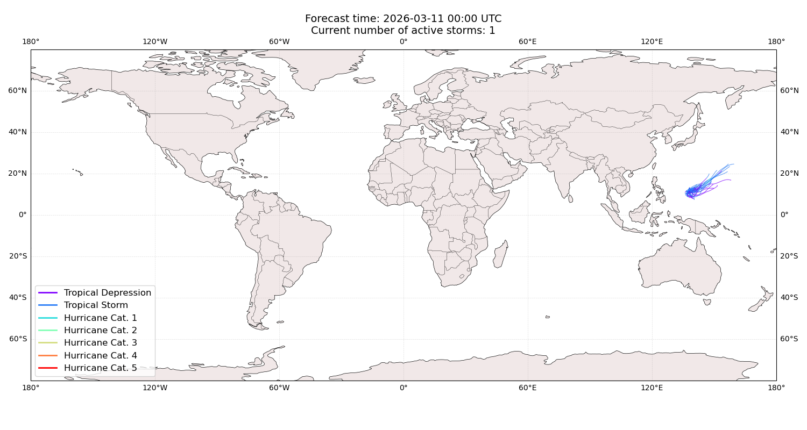
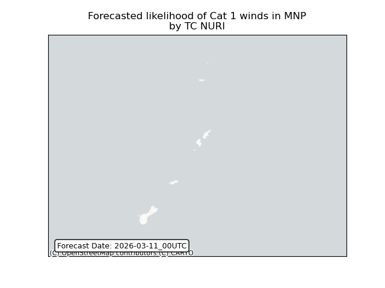
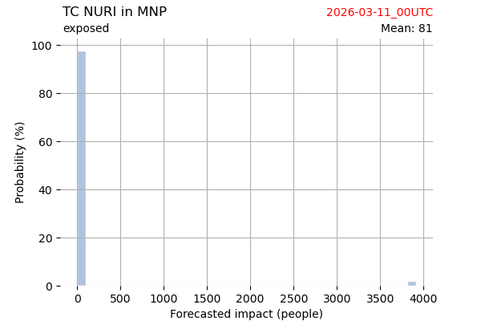
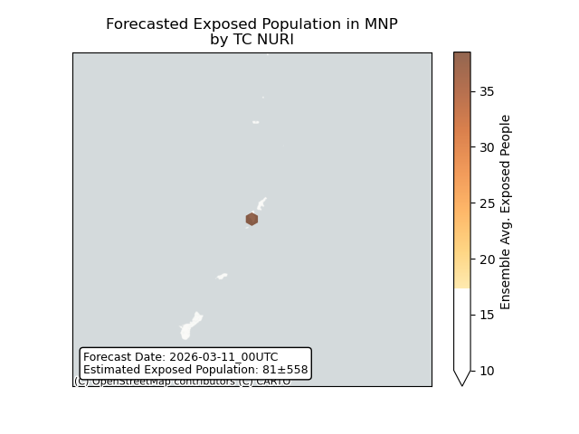
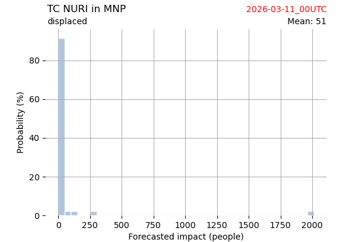
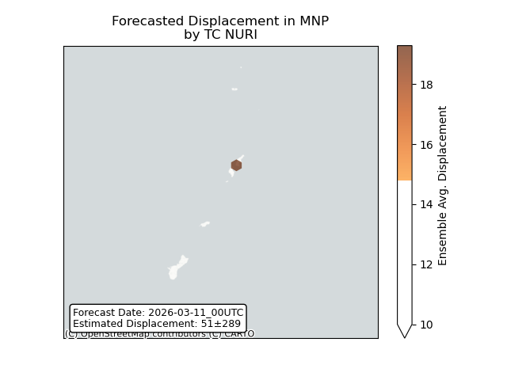

# Displacement forecast

This is a WIP. All this is going to change, for now we're just dumping things here.

## Forecast for 2026-03-11 00:00 UTC

There are 1 active named storms.

## NURI Northern Mariana Islands: areas affected

## NURI Northern Mariana Islands: people exposed

## NURI Northern Mariana Islands: people displaced

