# Displacement forecast

This is a WIP. All this is going to change, for now we're just dumping things here.

## Forecast for 2026-03-17 12:00 UTC

There are 1 active named storms.

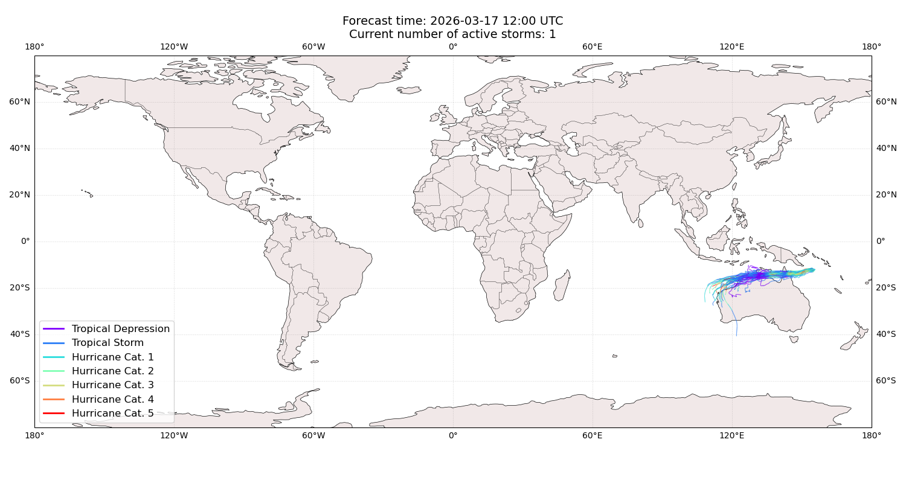

## NARELLE Australia: areas affected

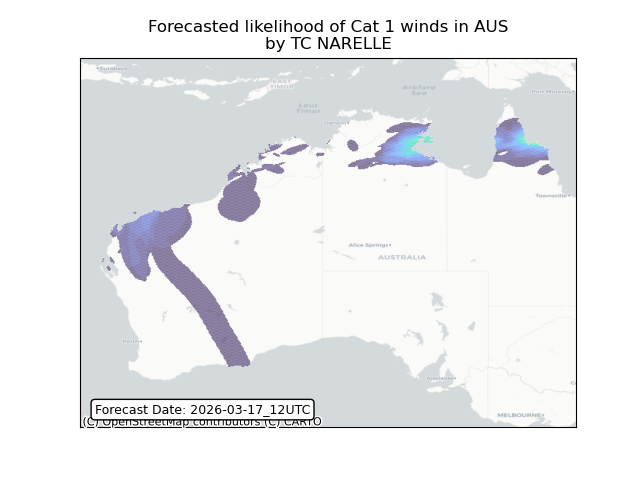

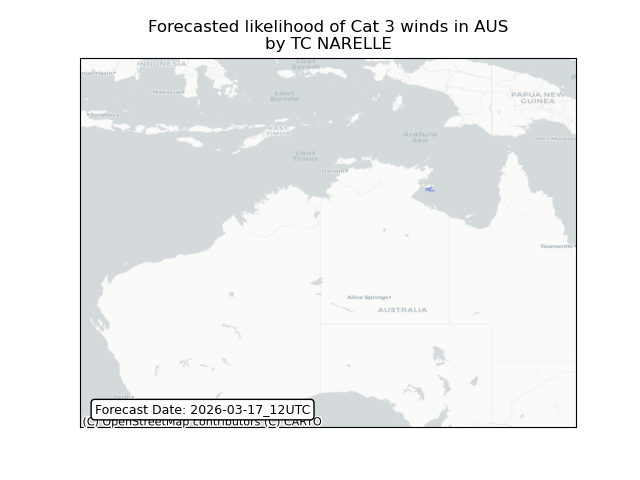

## NARELLE Australia: people exposed

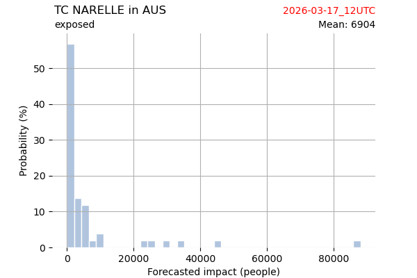

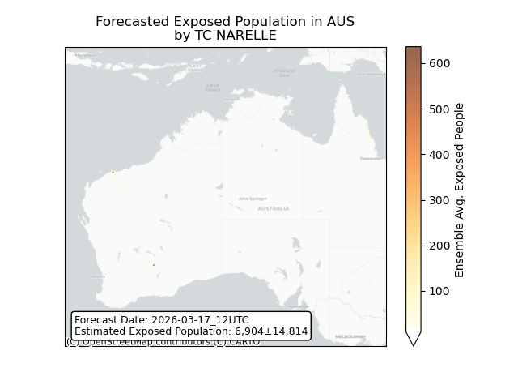

## NARELLE Australia: people displaced

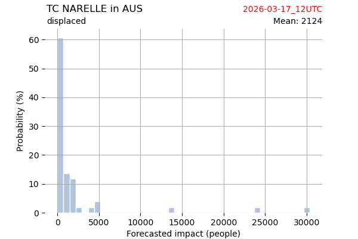

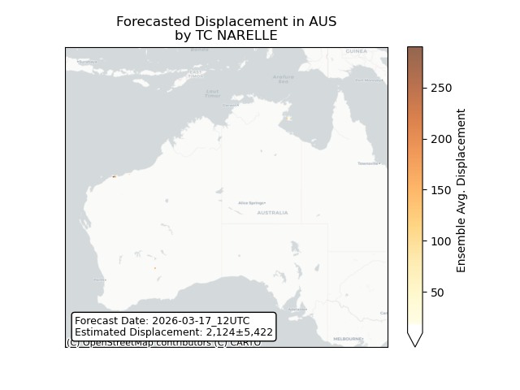

## NARELLE Papua New Guinea: areas affected

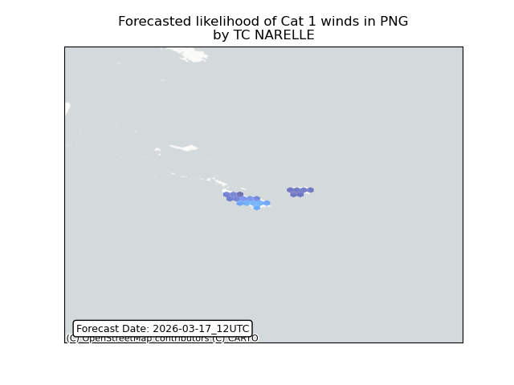

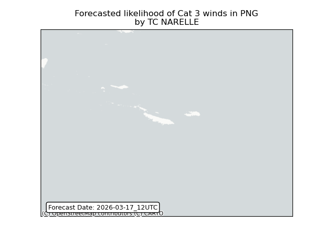

## NARELLE Papua New Guinea: people exposed

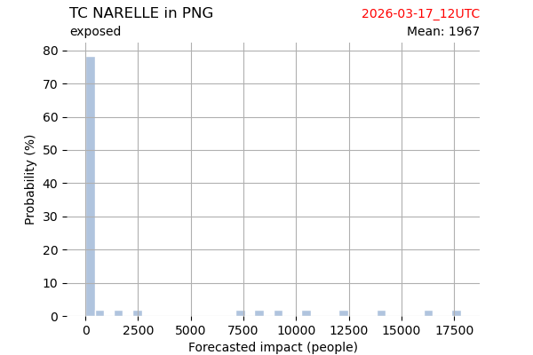

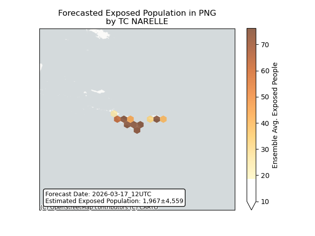

## NARELLE Papua New Guinea: people displaced

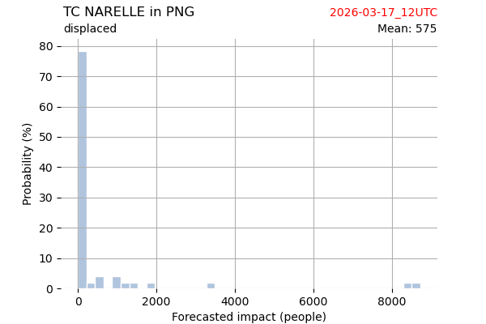

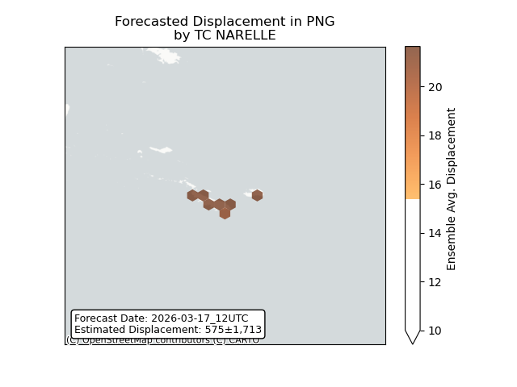

