# Displacement forecast

This is a WIP. All this is going to change, for now we're just dumping things here.

## Forecast for 2026-04-05 00:00 UTC

There are 2 active named storms.

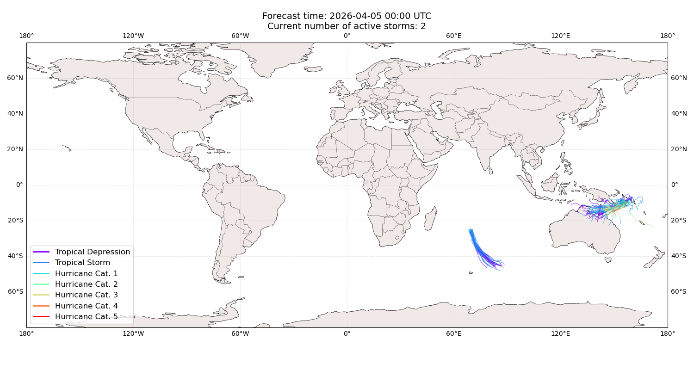

## MAILA Australia: areas affected

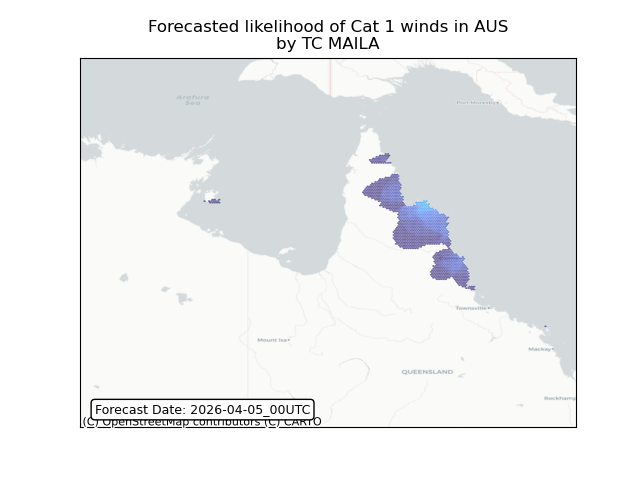

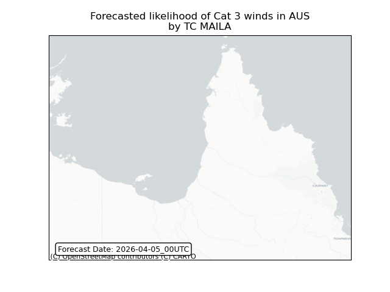

## MAILA Australia: people exposed

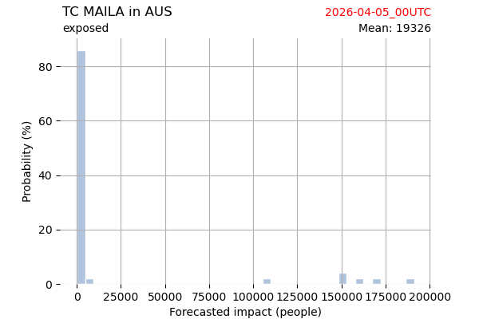

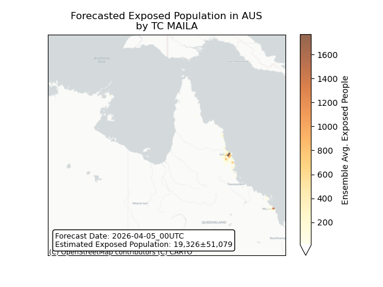

## MAILA Australia: people displaced

## MAILA New Caledonia: areas affected

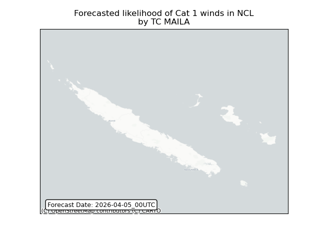

## MAILA New Caledonia: people exposed

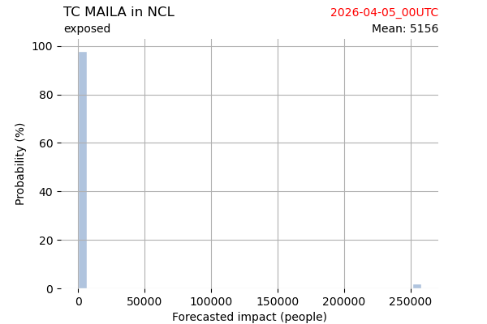

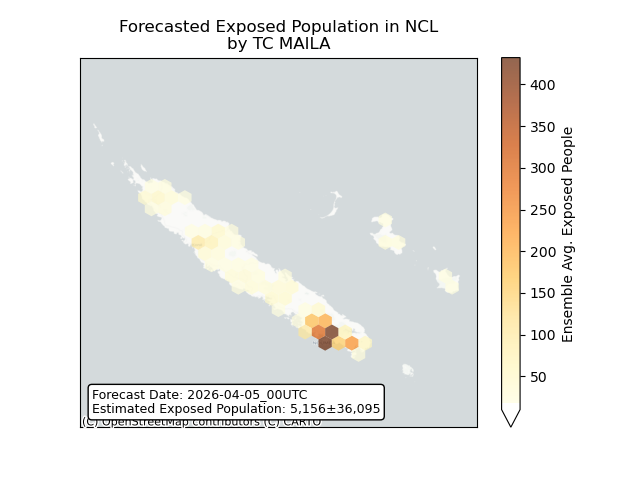

## MAILA New Caledonia: people displaced

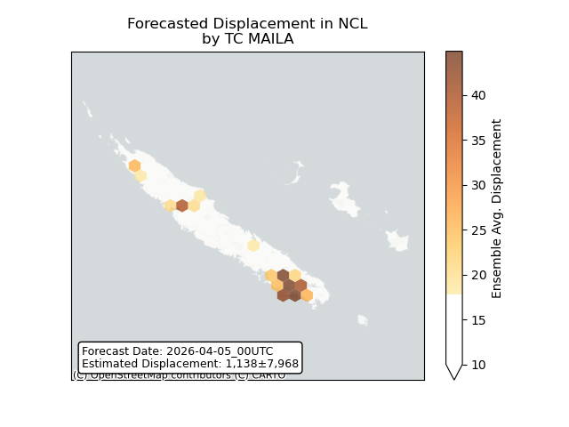

## MAILA Papua New Guinea: areas affected

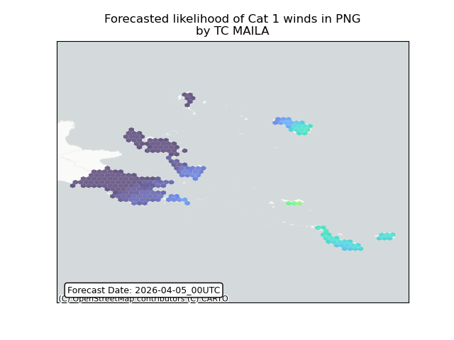

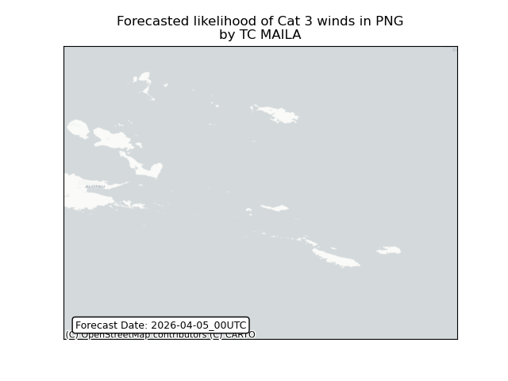

## MAILA Papua New Guinea: people exposed

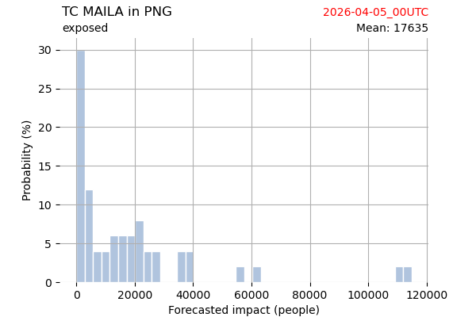

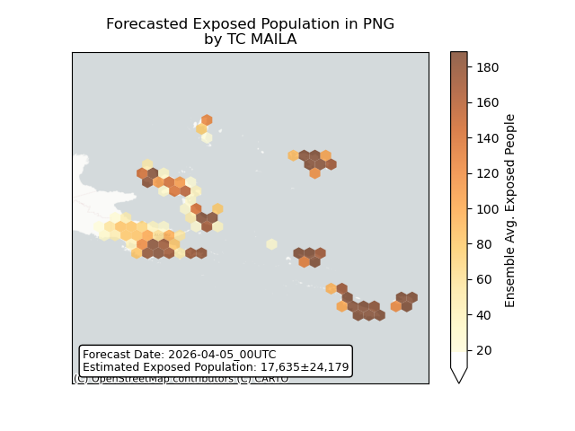

## MAILA Papua New Guinea: people displaced

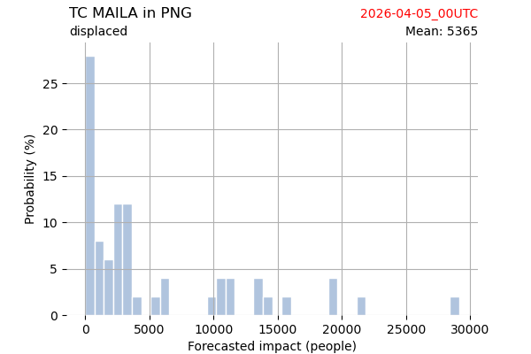

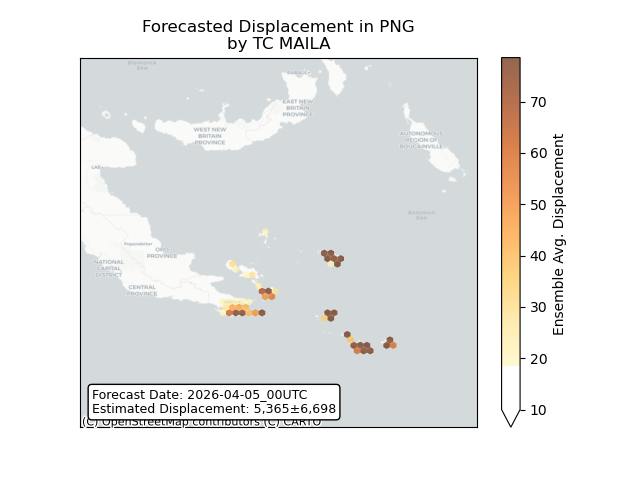

## MAILA Solomon Islands: areas affected

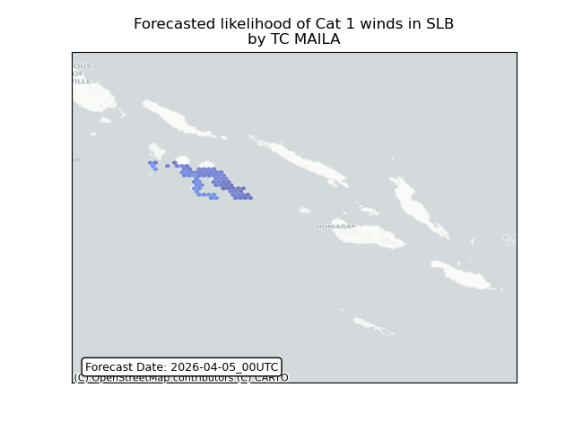

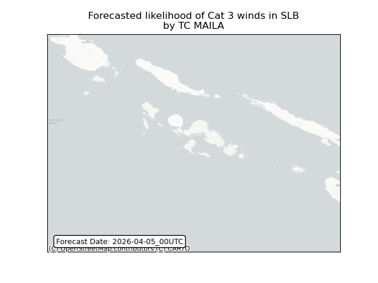

## MAILA Solomon Islands: people exposed

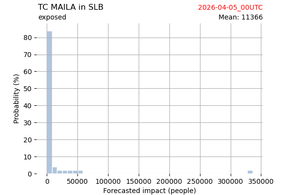

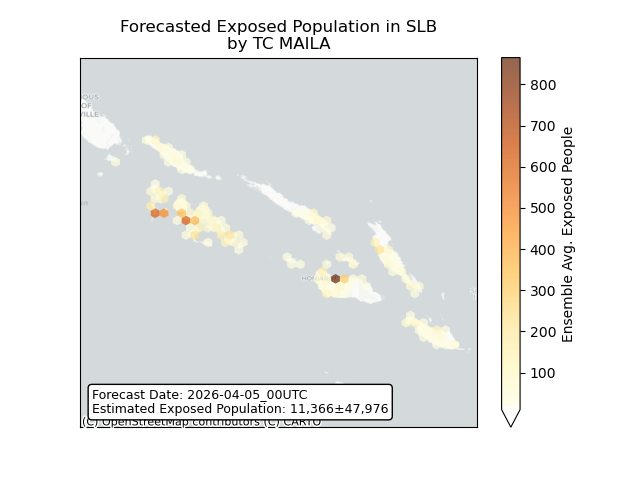

## MAILA Solomon Islands: people displaced

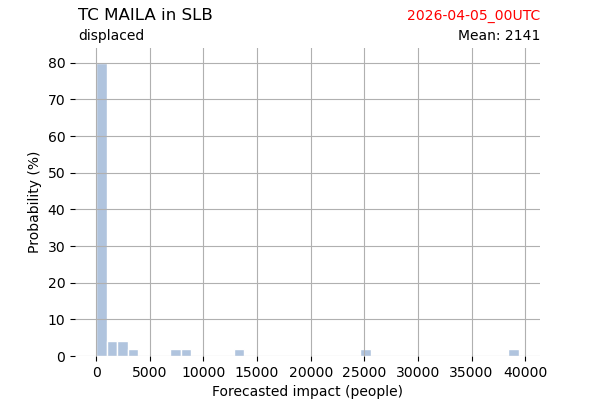

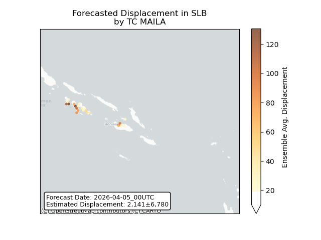

## INDUSA All countries: No forecast people exposed

Storm INDUSA is not forecast to affect people in All countries.

## INDUSA All countries: no forecast people displaced

Storm INDUSA is not forecast to displace people in All countries.

