# Displacement forecast

This is a WIP. All this is going to change, for now we're just dumping things here.

## Forecast for 2026-04-06 12:00 UTC

There are 2 active named storms.

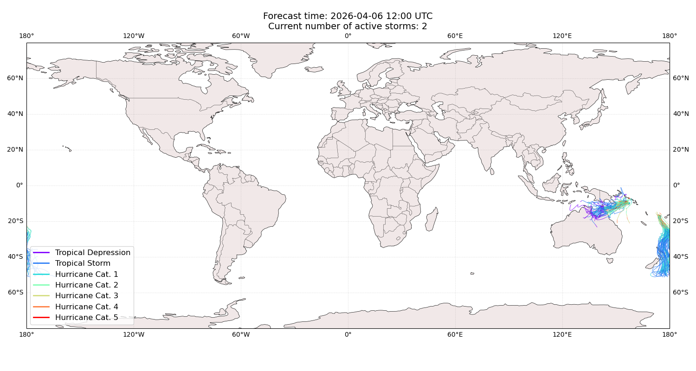

## VAIANU Fiji: areas affected

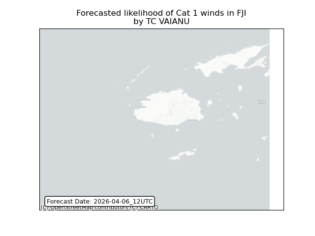

## VAIANU Fiji: people exposed

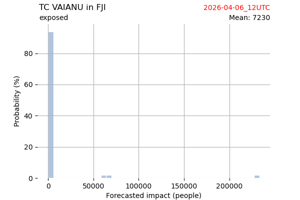

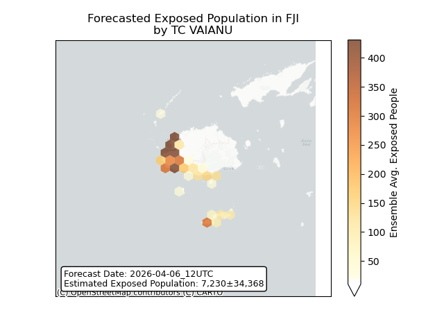

## VAIANU Fiji: people displaced

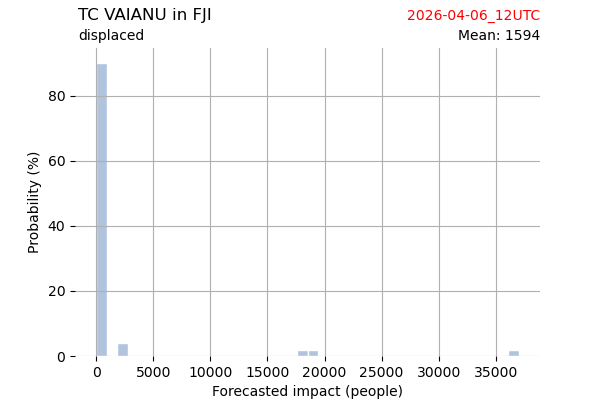

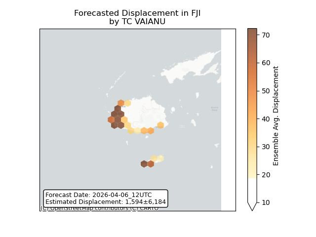

## VAIANU New Zealand: areas affected

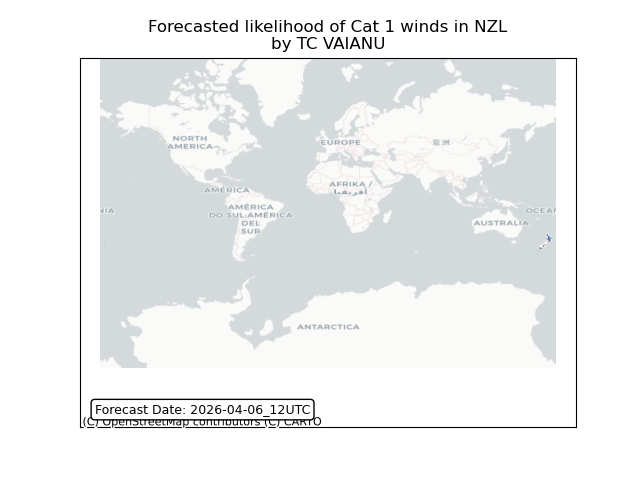

## VAIANU New Zealand: people exposed

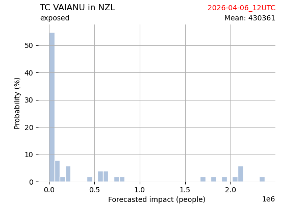

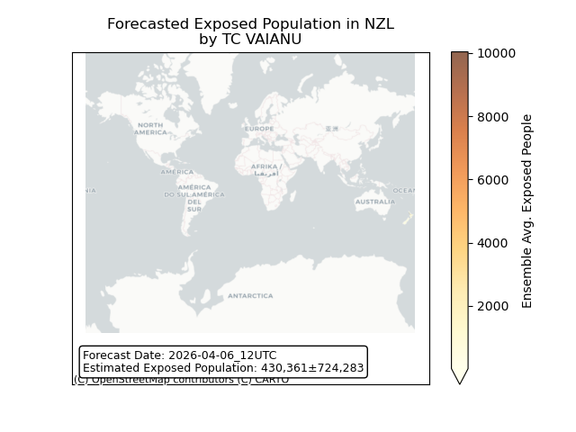

## VAIANU New Zealand: people displaced

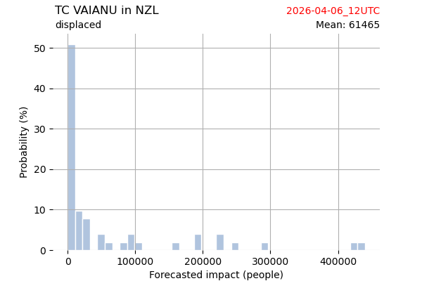

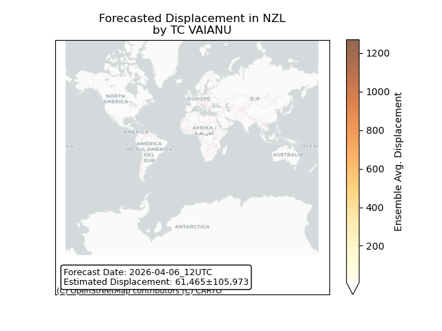

## MAILA Australia: areas affected

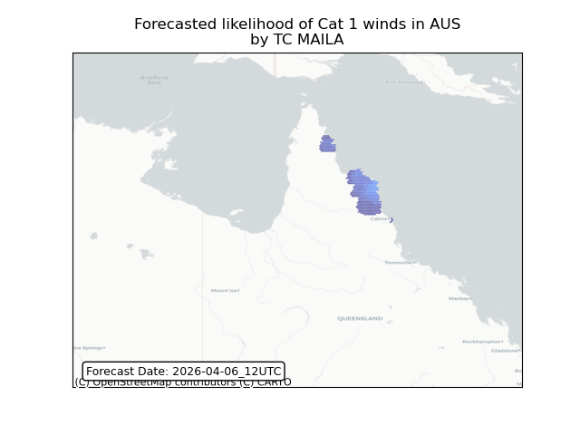

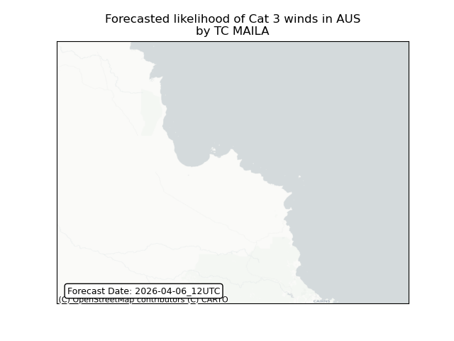

## MAILA Australia: people exposed

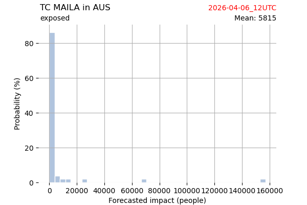

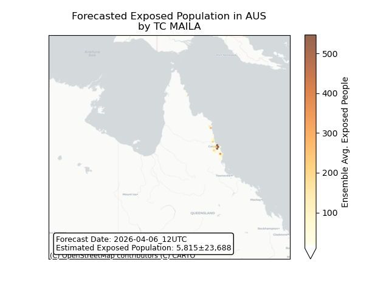

## MAILA Australia: people displaced

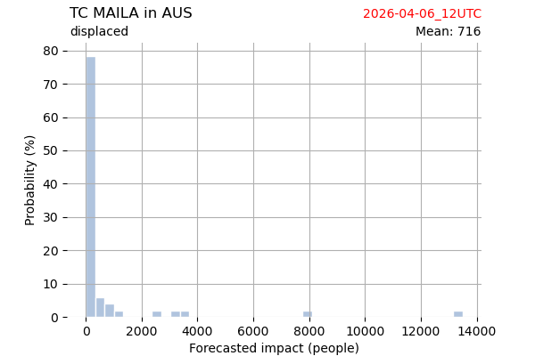

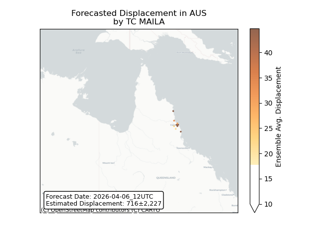

## MAILA Papua New Guinea: areas affected

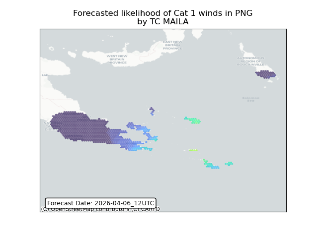

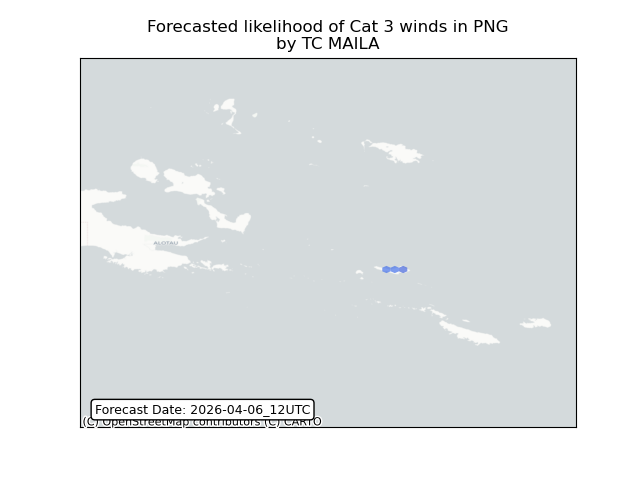

## MAILA Papua New Guinea: people exposed

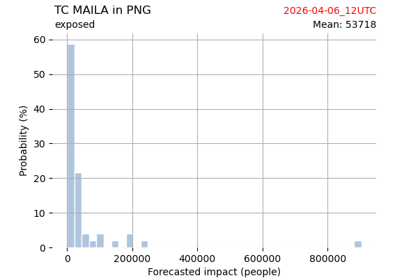

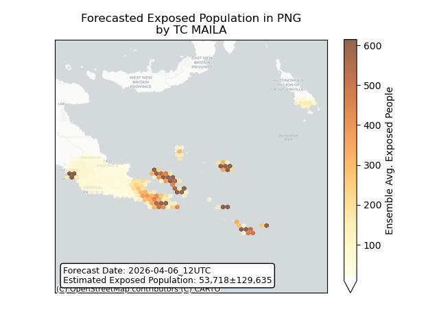

## MAILA Papua New Guinea: people displaced

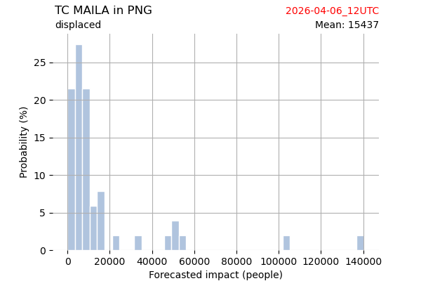

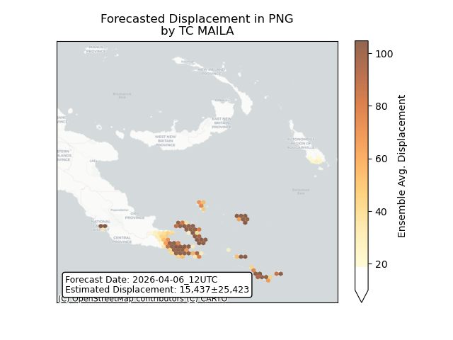

## MAILA Solomon Islands: areas affected

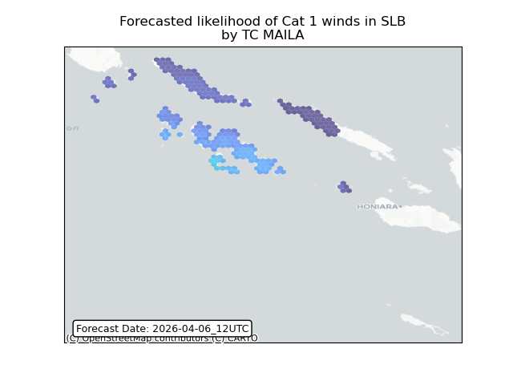

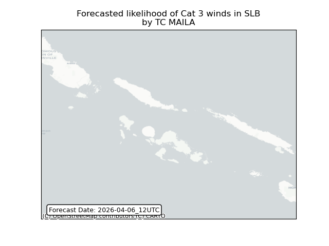

## MAILA Solomon Islands: people exposed

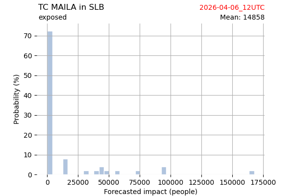

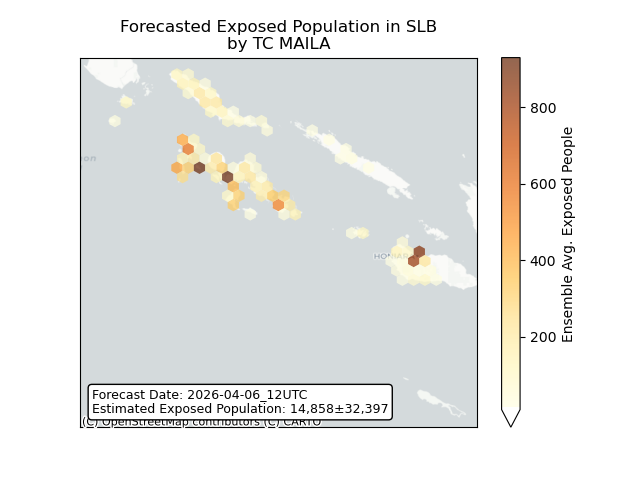

## MAILA Solomon Islands: people displaced

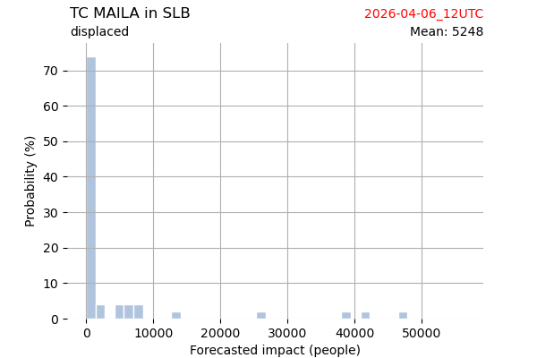

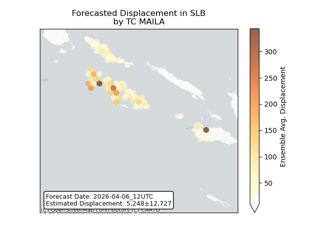

