# Displacement forecast

This is a WIP. All this is going to change, for now we're just dumping things here.

## Forecast for 2026-04-10 12:00 UTC

There are 2 active named storms.

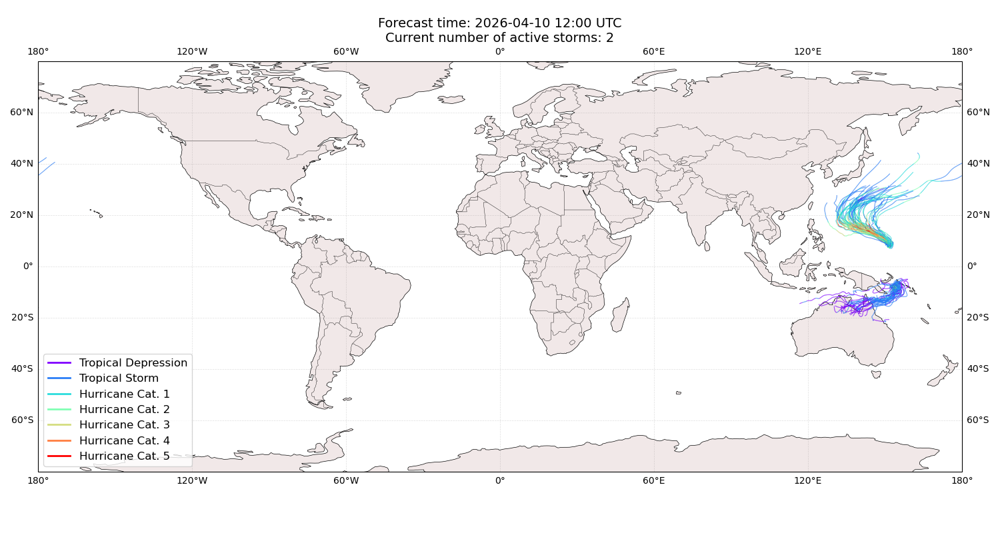

## SINLAKU Micronesia, Federated States of: areas affected

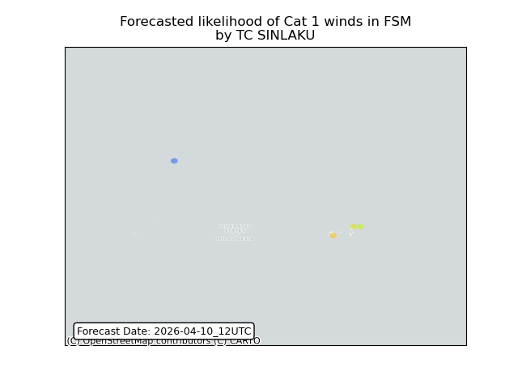

## SINLAKU Micronesia, Federated States of: people exposed

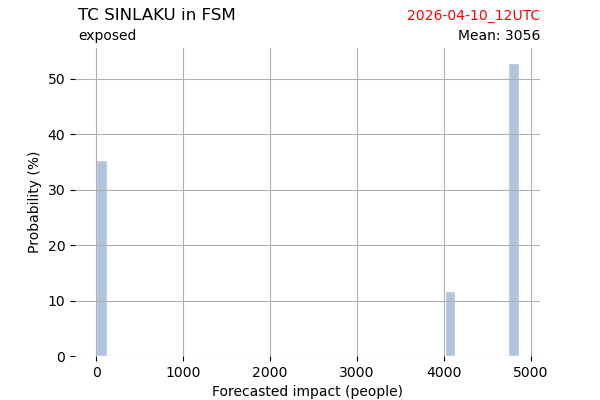

## SINLAKU Micronesia, Federated States of: people displaced

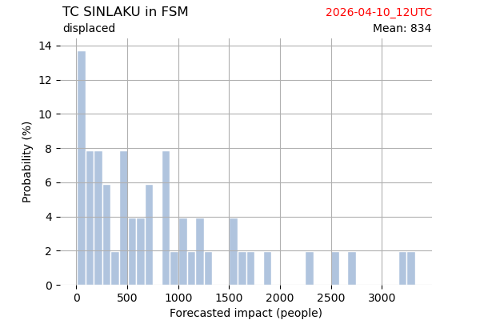

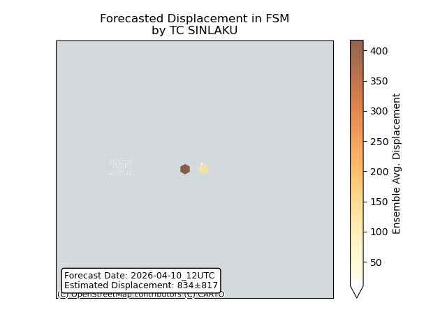

## SINLAKU Guam: areas affected

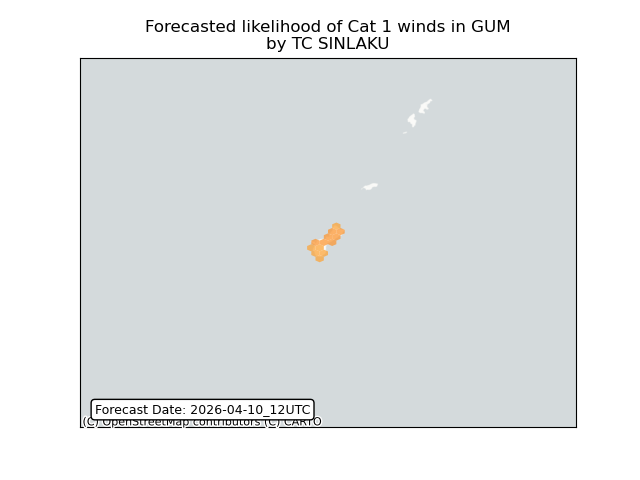

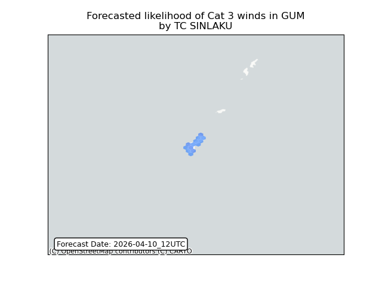

## SINLAKU Guam: people exposed

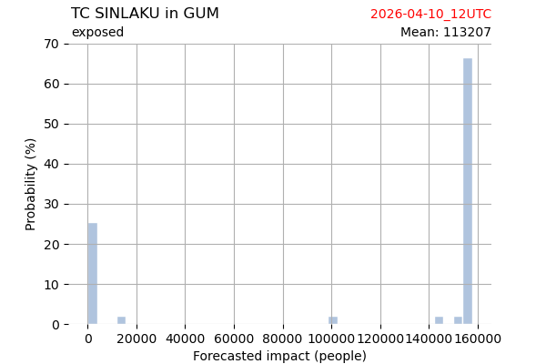

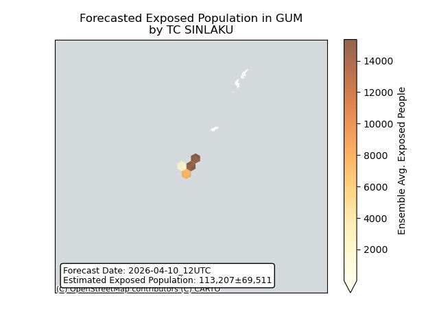

## SINLAKU Guam: people displaced

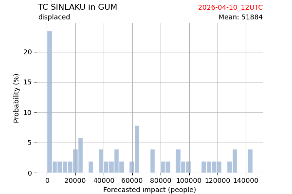

## SINLAKU Japan: areas affected

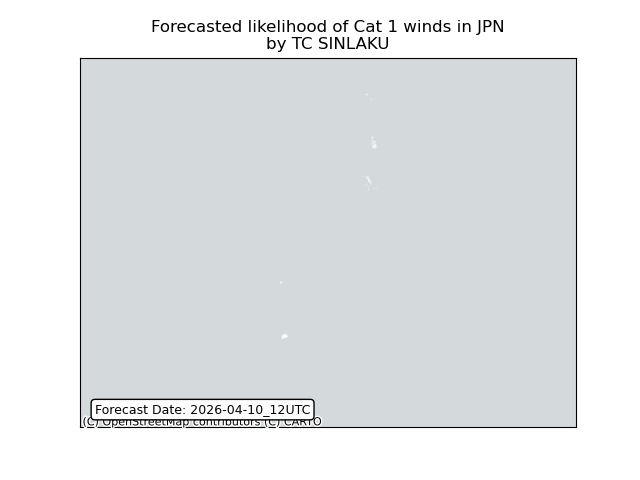

## SINLAKU Japan: people exposed

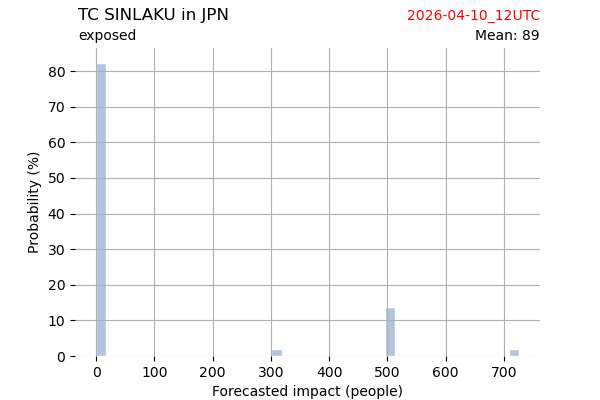

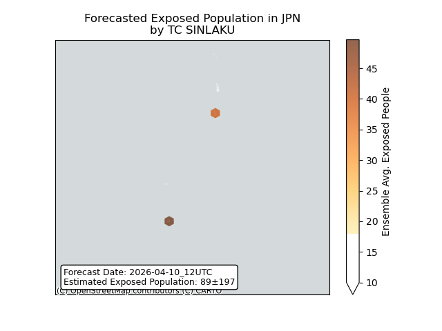

## SINLAKU Japan: people displaced

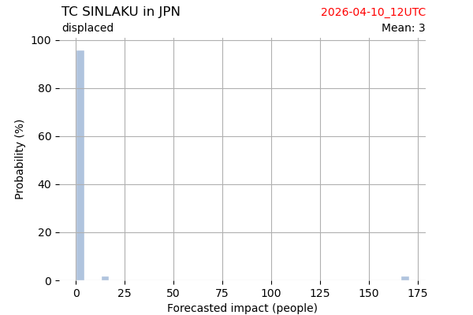

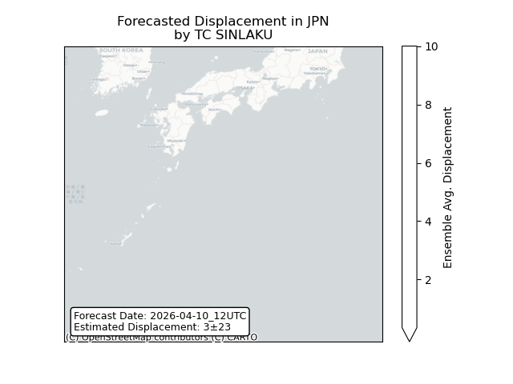

## SINLAKU Northern Mariana Islands: areas affected

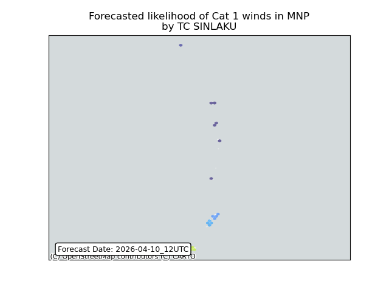

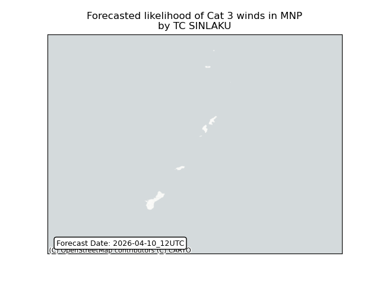

## SINLAKU Northern Mariana Islands: people exposed

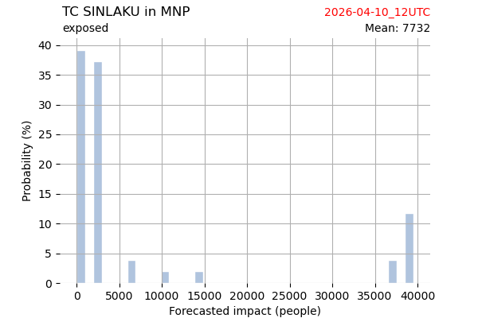

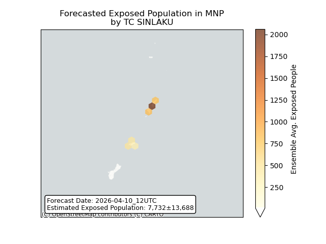

## SINLAKU Northern Mariana Islands: people displaced

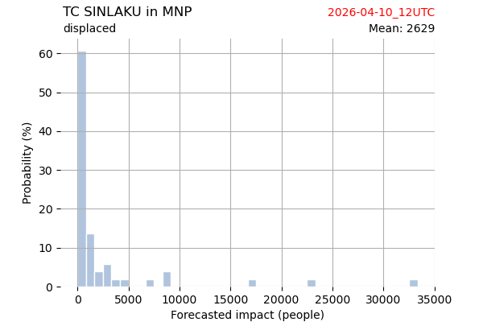

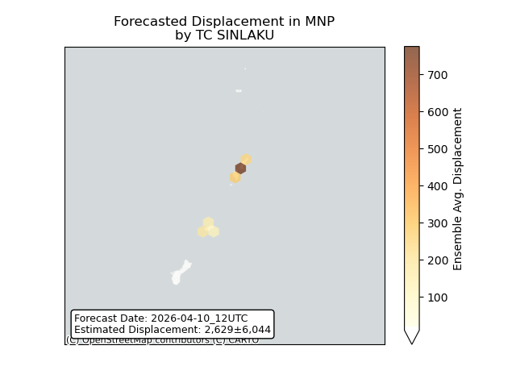

## MAILA Papua New Guinea: areas affected

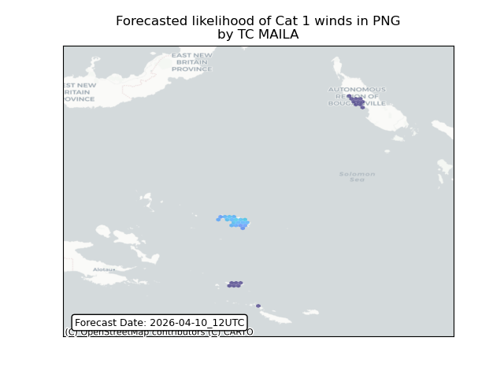

## MAILA Papua New Guinea: people exposed

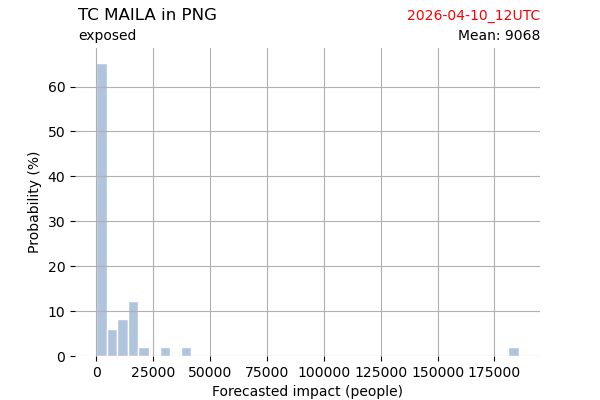

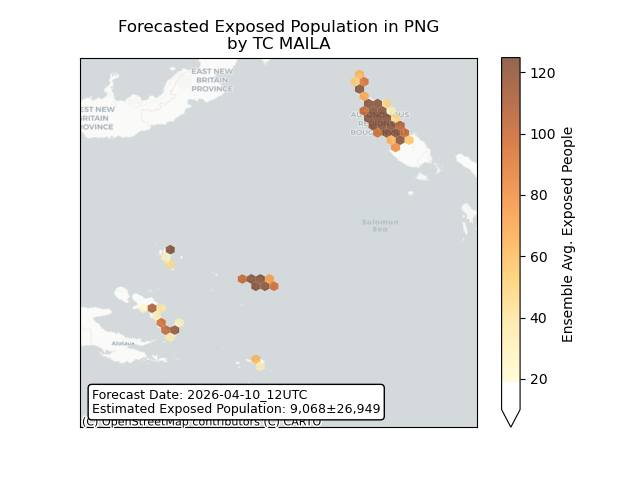

## MAILA Papua New Guinea: people displaced

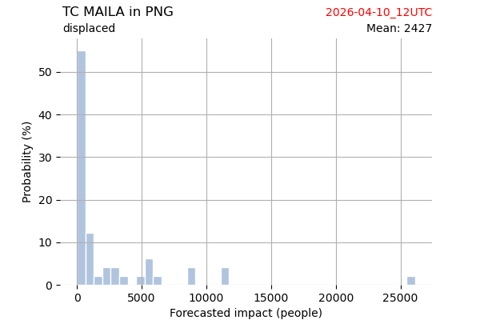

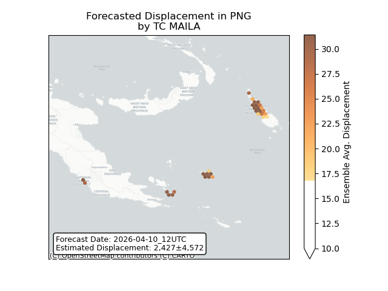

## MAILA Solomon Islands: areas affected

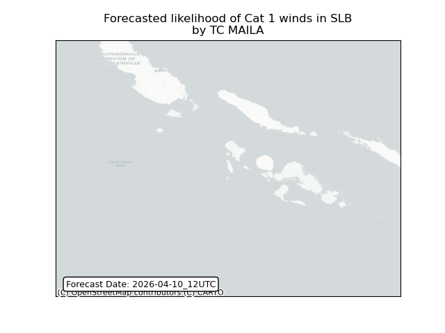

