# Displacement forecast

This is a WIP. All this is going to change, for now we're just dumping things here.

## Forecast for 2026-04-14 00:00 UTC

There are 1 active named storms.

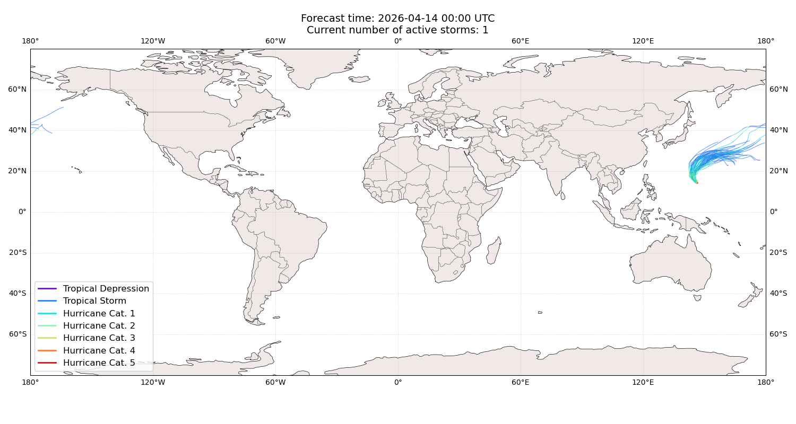

## SINLAKU Guam: areas affected

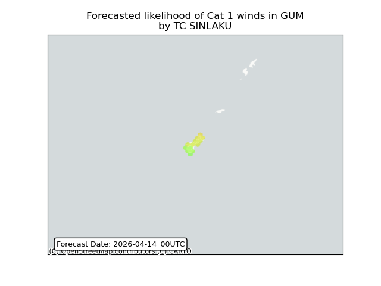

## SINLAKU Guam: people exposed

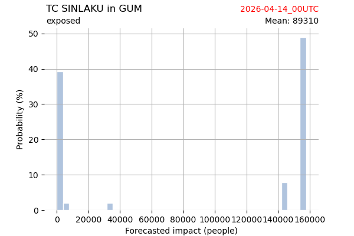

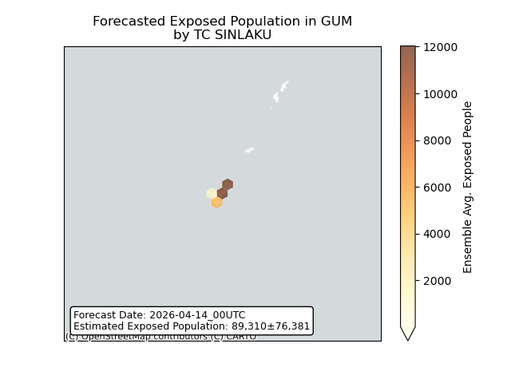

## SINLAKU Guam: people displaced

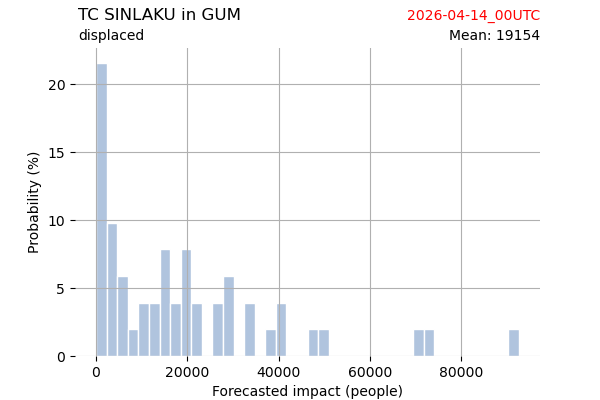

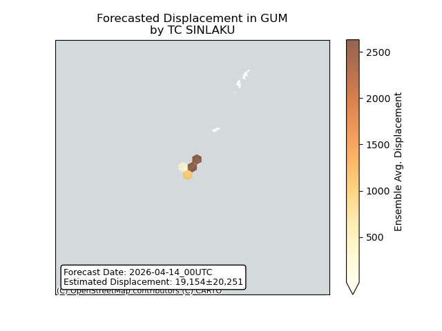

## SINLAKU Northern Mariana Islands: areas affected

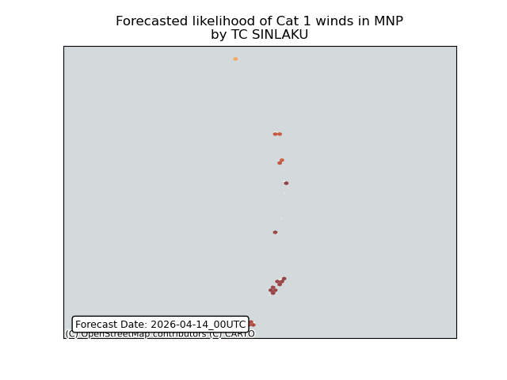

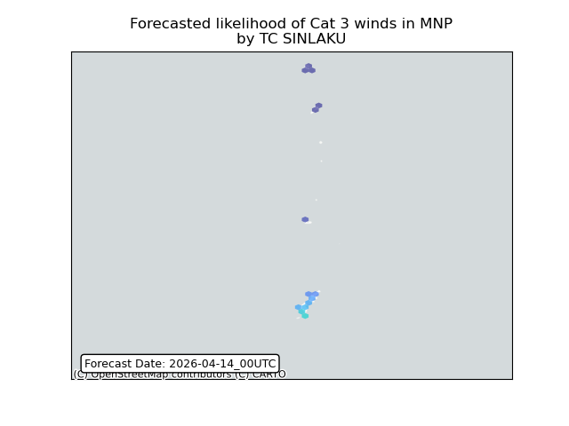

## SINLAKU Northern Mariana Islands: people exposed

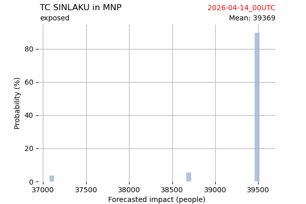

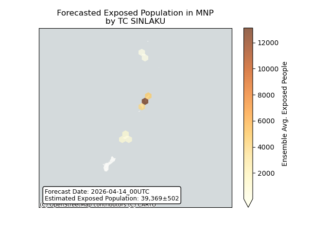

## SINLAKU Northern Mariana Islands: people displaced

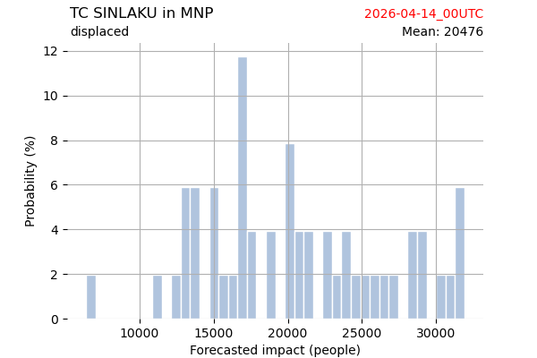

