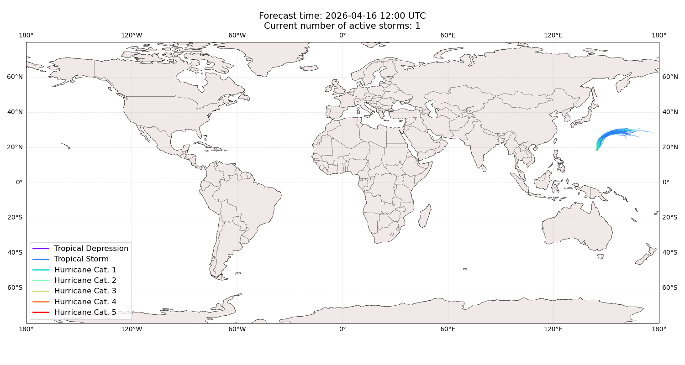
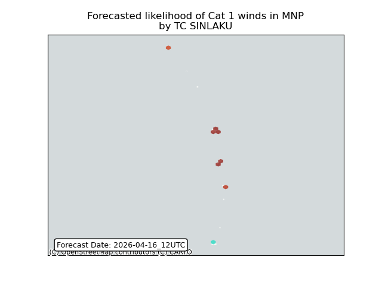
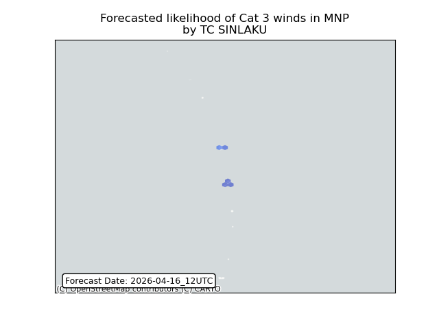

# Displacement forecast

This is a WIP. All this is going to change, for now we're just dumping things here.

## Forecast for 2026-04-16 12:00 UTC

There are 1 active named storms.

## SINLAKU Northern Mariana Islands: areas affected

