# Displacement forecast

This is a WIP. All this is going to change, for now we're just dumping things here.

## Forecast for 2026-05-07 12:00 UTC

There are 1 active named storms.

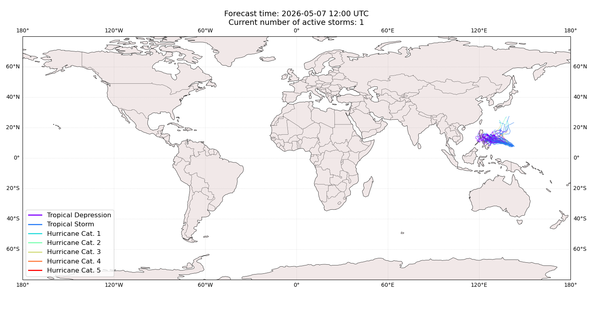

## HAGUPIT Micronesia, Federated States of: areas affected

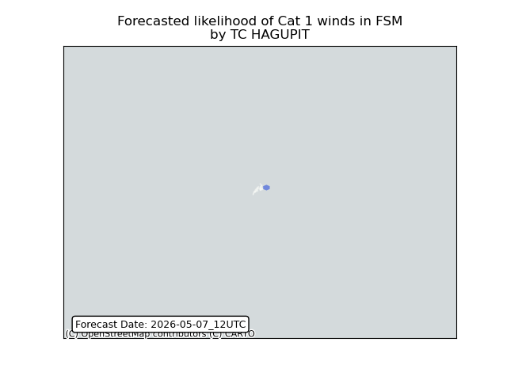

## HAGUPIT Micronesia, Federated States of: people exposed

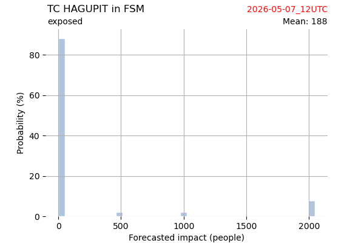

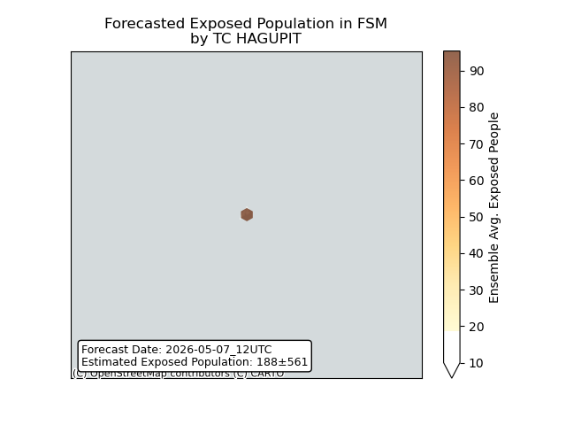

## HAGUPIT Micronesia, Federated States of: people displaced

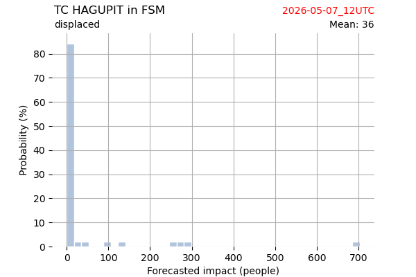

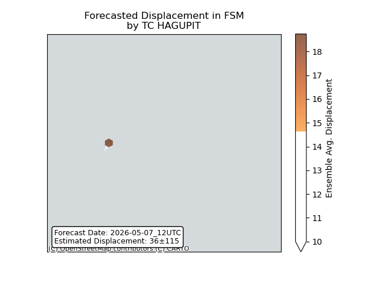

## HAGUPIT Philippines: areas affected

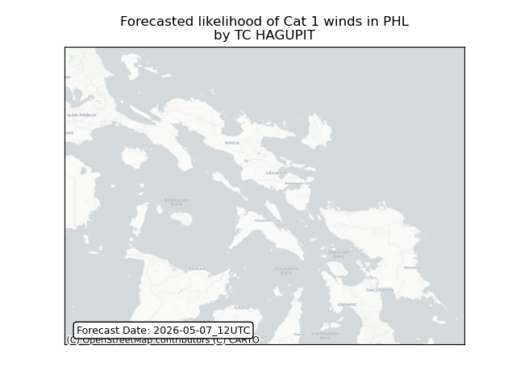

## HAGUPIT Philippines: people exposed

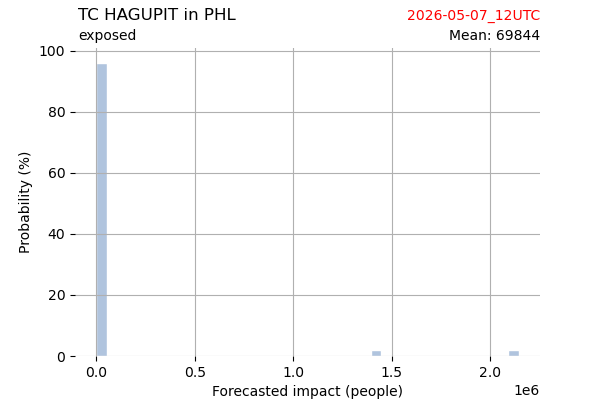

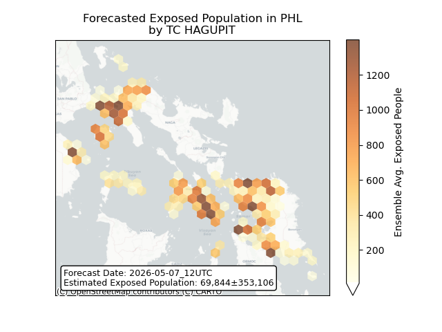

## HAGUPIT Philippines: people displaced

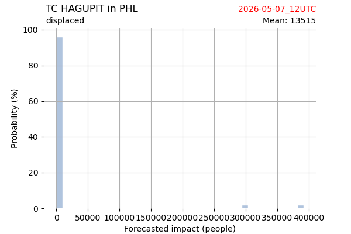

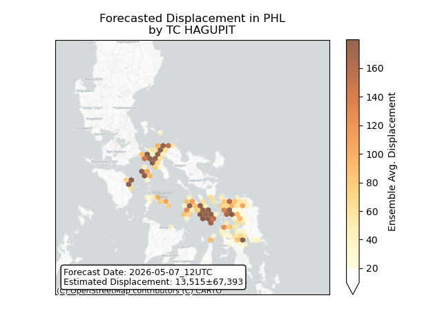

