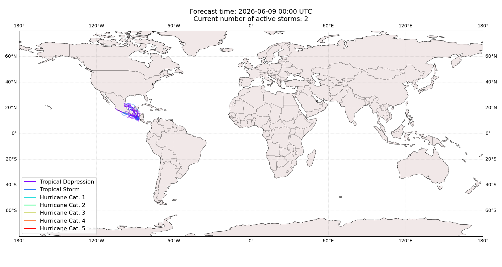
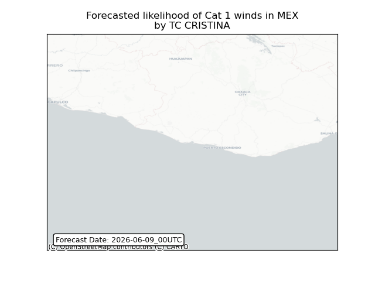
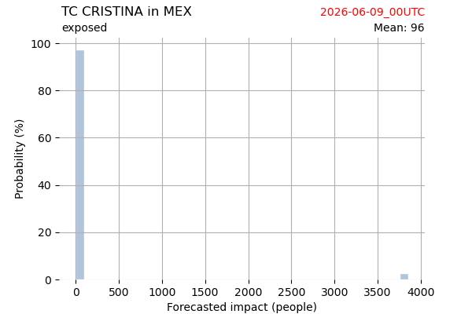
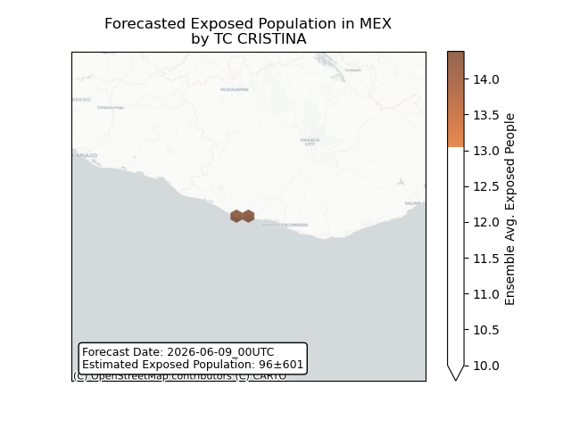
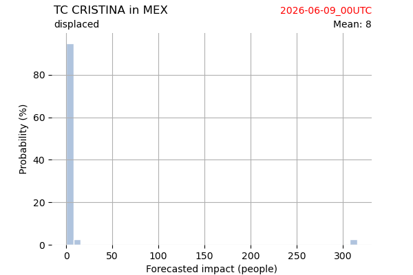
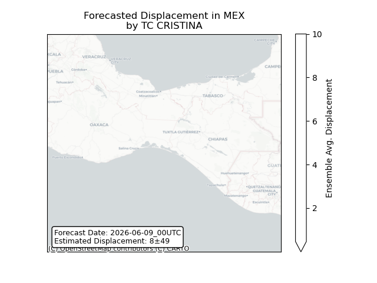

# Displacement forecast

This is a WIP. All this is going to change, for now we're just dumping things here.

## Forecast for 2026-06-09 00:00 UTC

There are 2 active named storms.

## BORIS All countries: No forecast people exposed

Storm BORIS is not forecast to affect people in All countries.

## BORIS All countries: no forecast people displaced

Storm BORIS is not forecast to displace people in All countries.

## CRISTINA Mexico: areas affected

## CRISTINA Mexico: people exposed

## CRISTINA Mexico: people displaced

