# Displacement forecast

This is a WIP. All this is going to change, for now we're just dumping things here.

## Forecast for 2026-06-22 00:00 UTC

There are 1 active named storms.

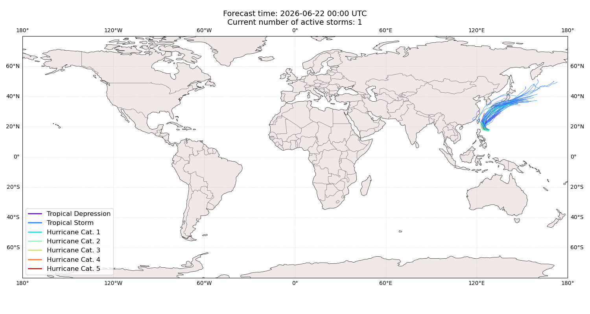

## MEKKHALA Japan: areas affected

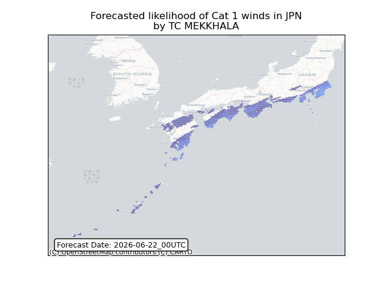

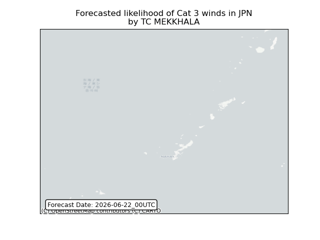

## MEKKHALA Japan: people exposed

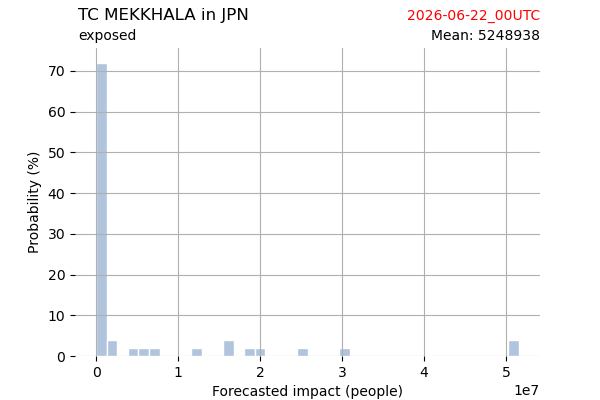

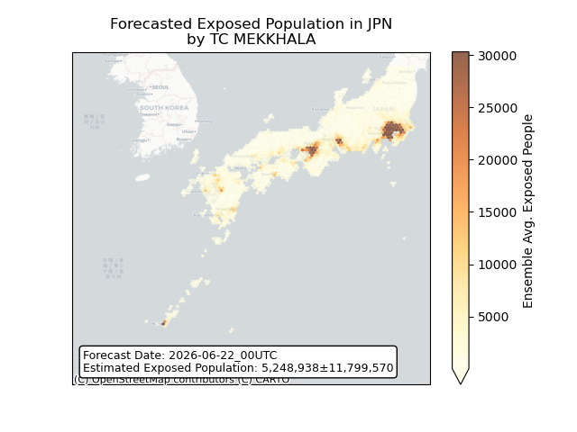

## MEKKHALA Japan: people displaced

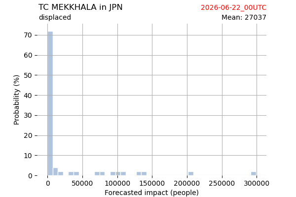

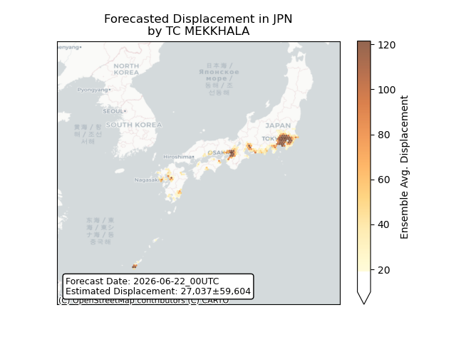

## MEKKHALA Korea, Republic of: areas affected

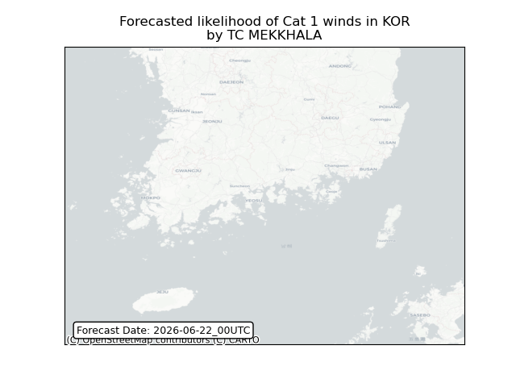

## MEKKHALA Korea, Republic of: people exposed

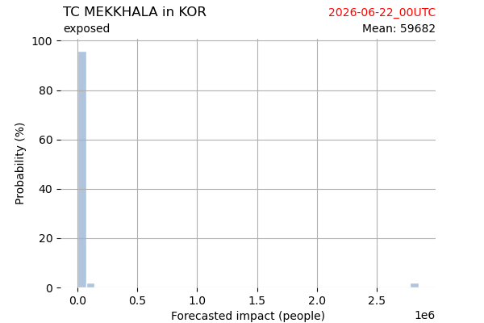

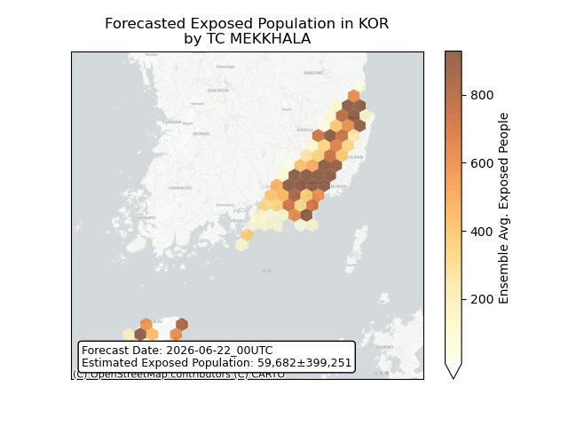

## MEKKHALA Korea, Republic of: people displaced

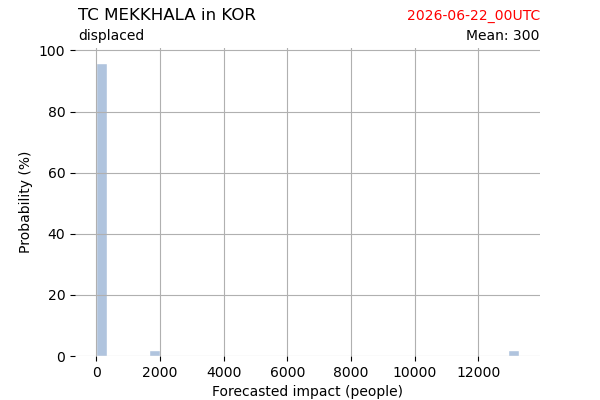

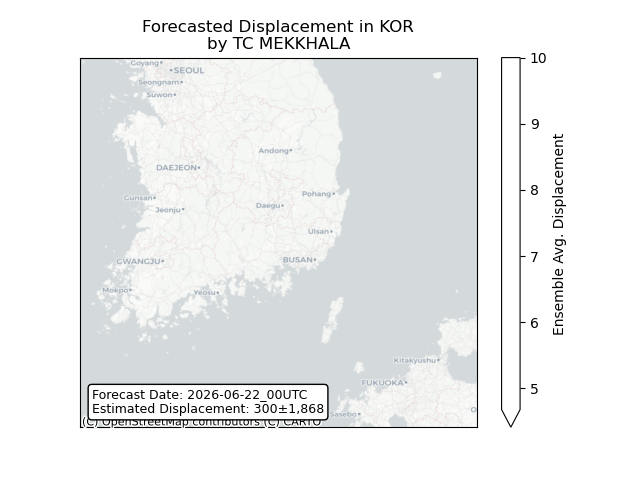

## MEKKHALA Philippines: areas affected

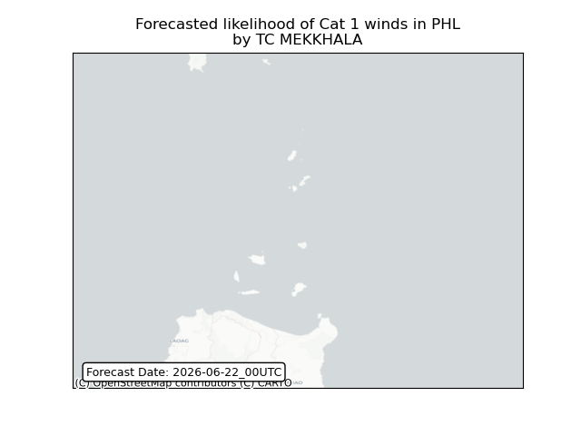

## MEKKHALA Philippines: people exposed

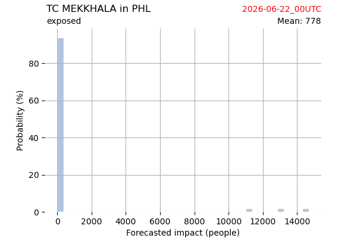

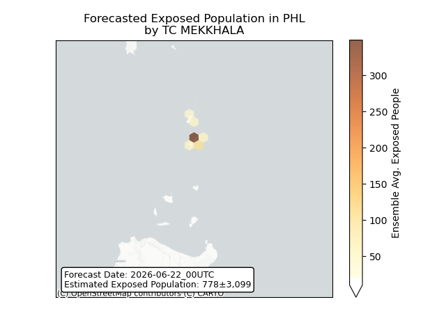

## MEKKHALA Philippines: people displaced

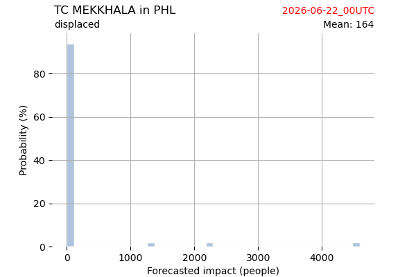

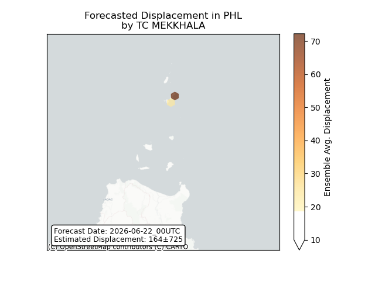

## MEKKHALA Taiwan, Province of China: areas affected

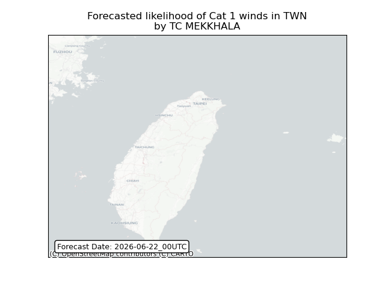

## MEKKHALA Taiwan, Province of China: people exposed

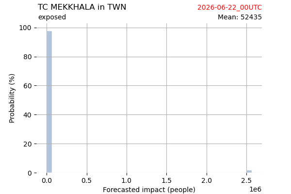

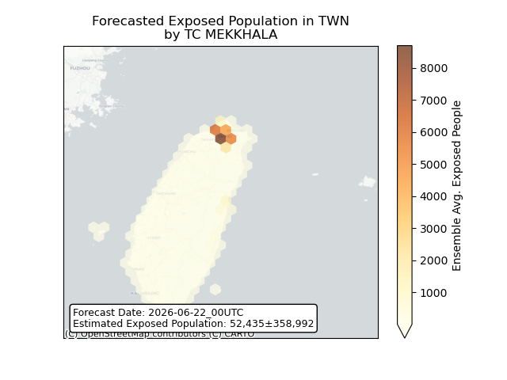

## MEKKHALA Taiwan, Province of China: people displaced

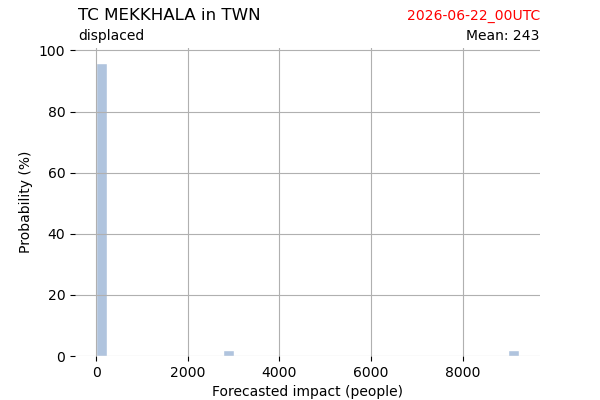

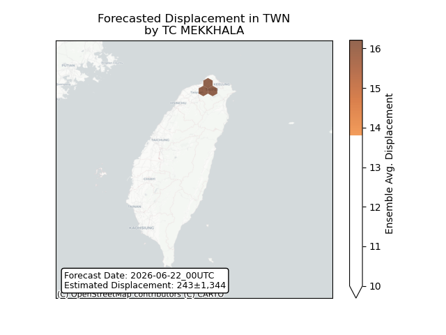

