# Displacement forecast

This is a WIP. All this is going to change, for now we're just dumping things here.

## Forecast for 2026-06-23 00:00 UTC

There are 2 active named storms.

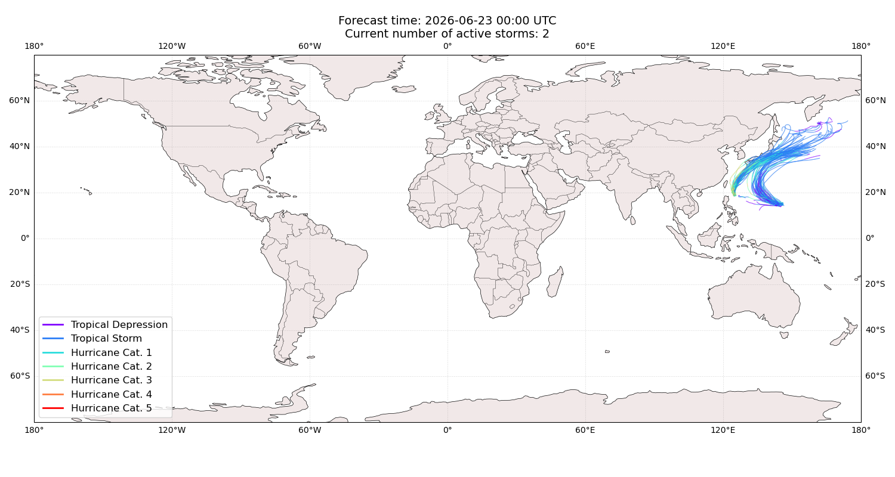

## MEKKHALA Japan: areas affected

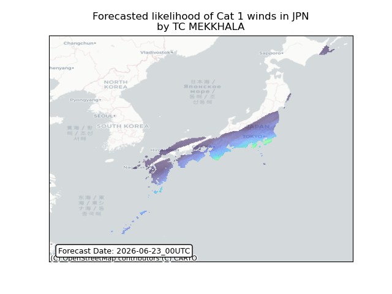

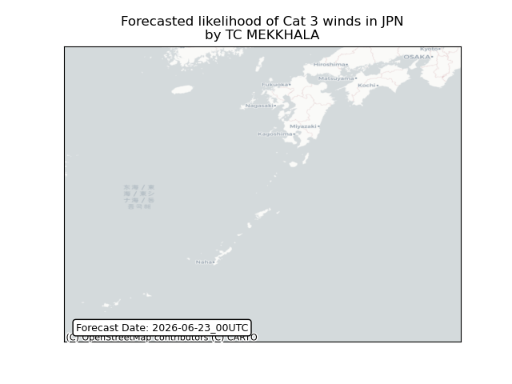

## MEKKHALA Japan: people exposed

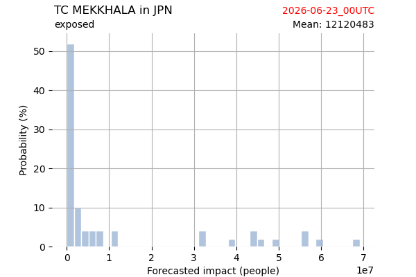

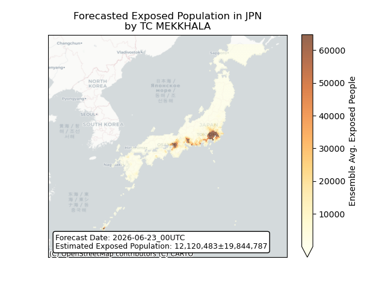

## MEKKHALA Japan: people displaced

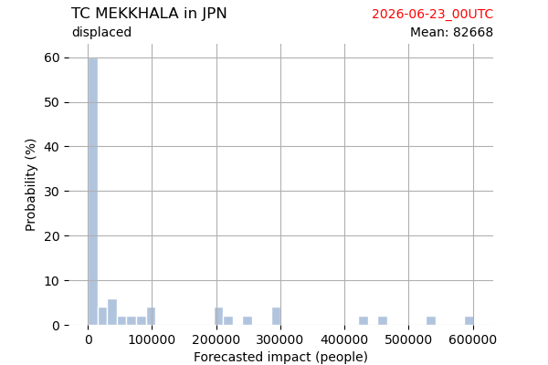

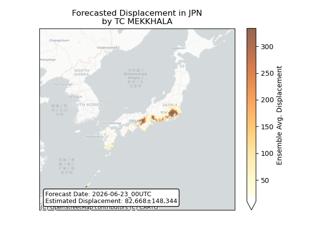

## MEKKHALA Russian Federation: areas affected

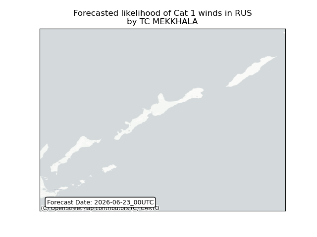

## MEKKHALA Russian Federation: people exposed

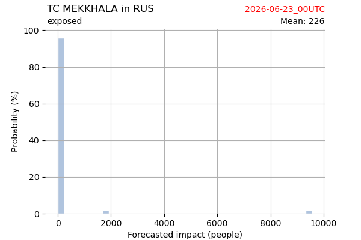

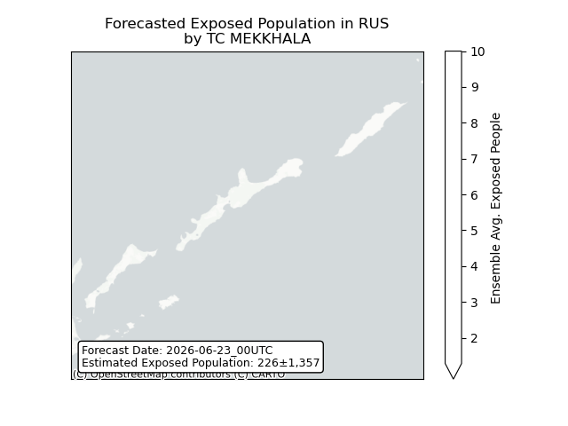

## MEKKHALA Russian Federation: people displaced

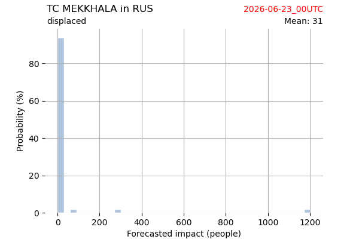

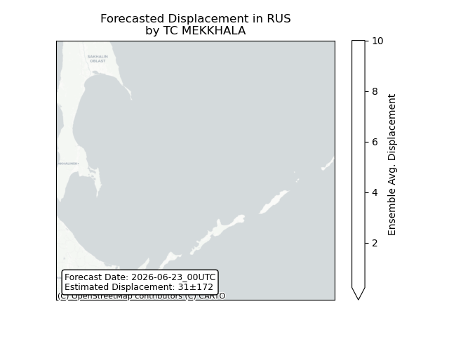

## MEKKHALA Taiwan, Province of China: areas affected

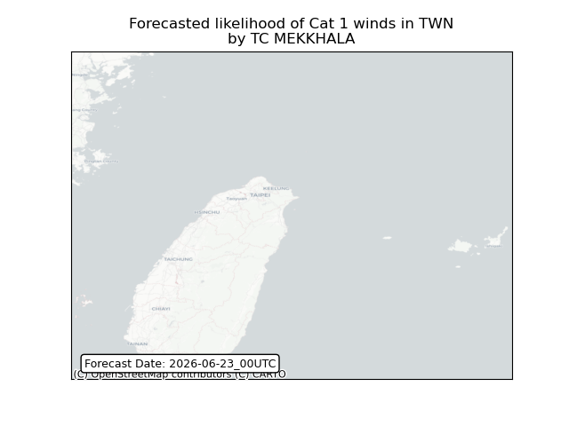

## MEKKHALA Taiwan, Province of China: people exposed

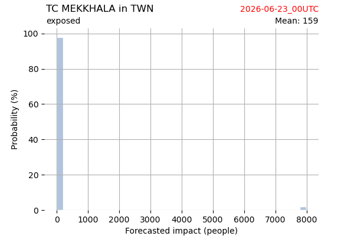

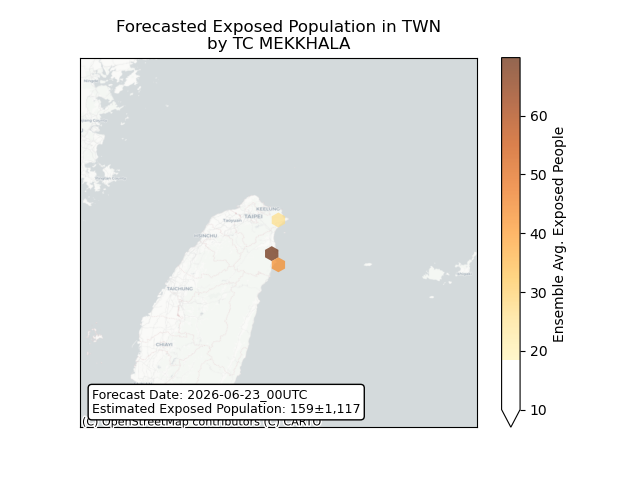

## MEKKHALA Taiwan, Province of China: people displaced

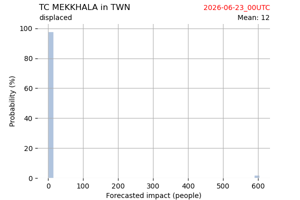

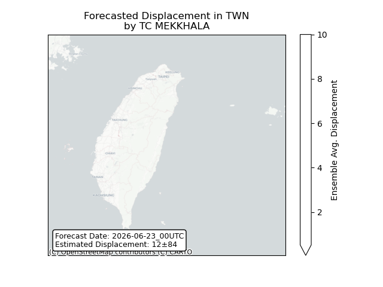

## HIGOS Japan: areas affected

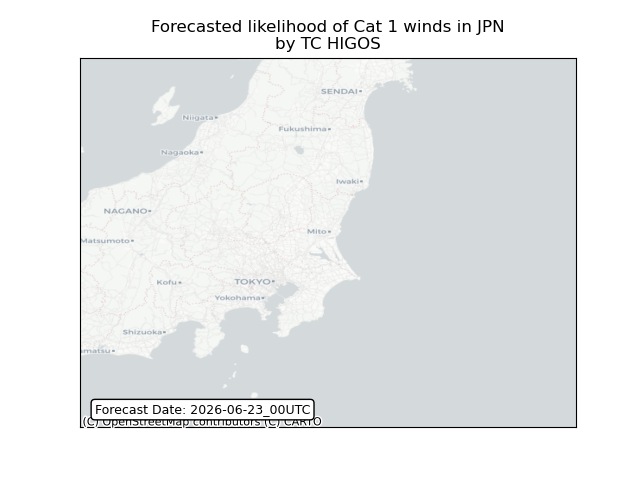

## HIGOS Japan: people exposed

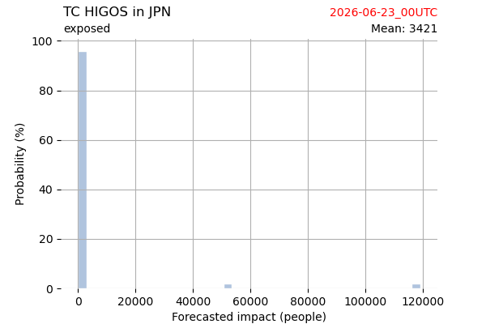

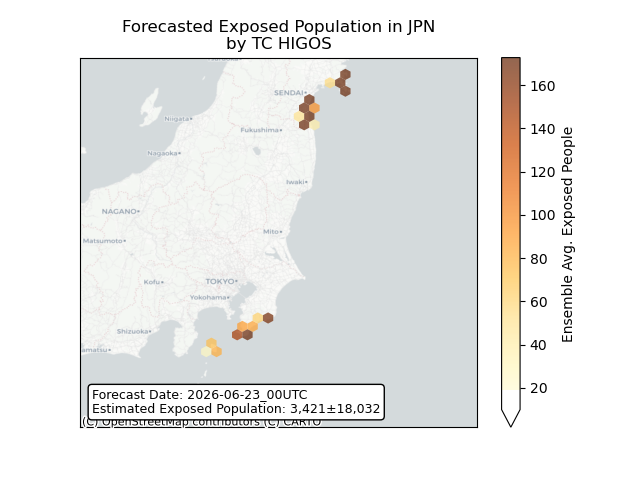

## HIGOS Japan: people displaced

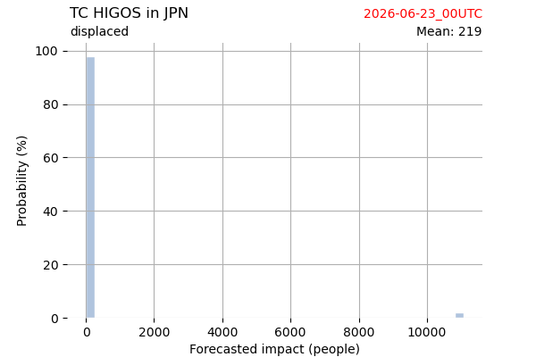

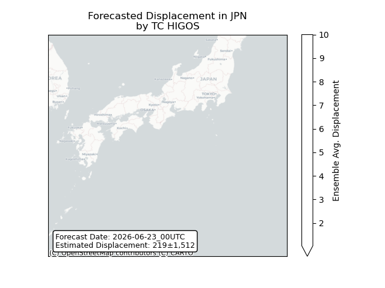

## HIGOS Northern Mariana Islands: areas affected

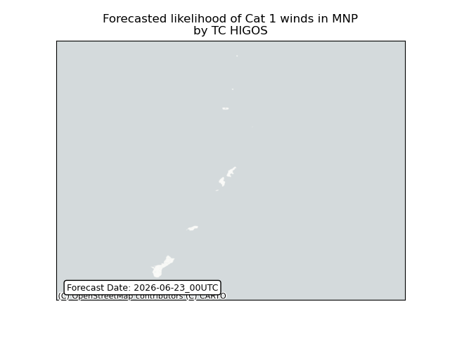

## HIGOS Northern Mariana Islands: people exposed

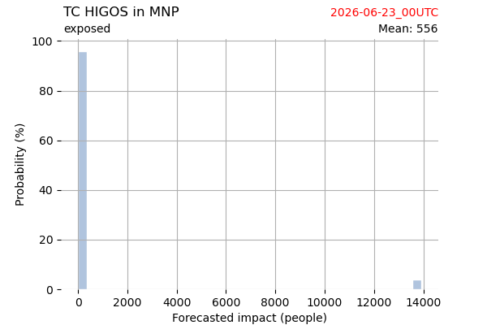

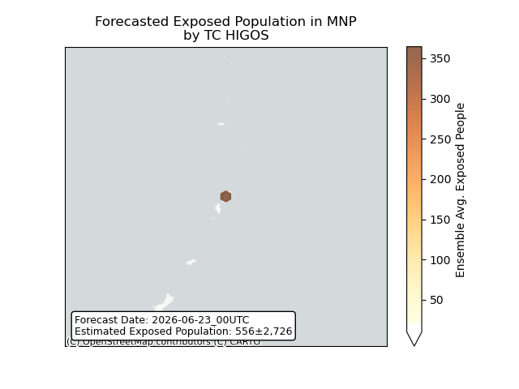

## HIGOS Northern Mariana Islands: people displaced

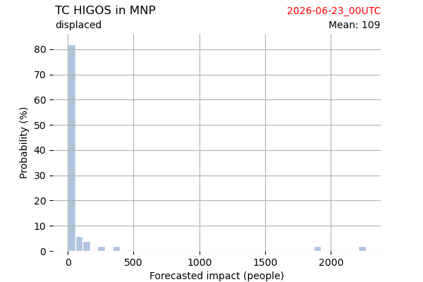

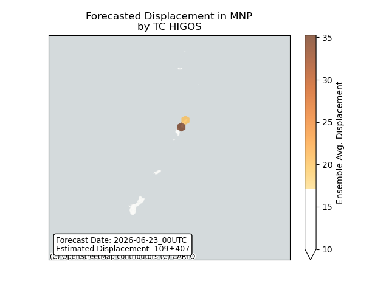

