# Displacement forecast

This is a WIP. All this is going to change, for now we're just dumping things here.

## Forecast for 2026-07-13 00:00 UTC

There are 2 active named storms.

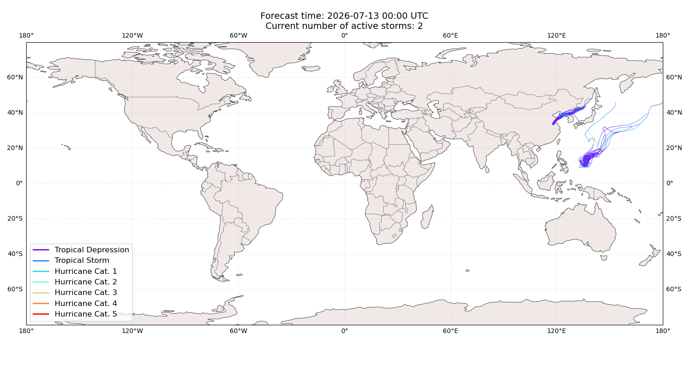

## HAISHEN Japan: areas affected

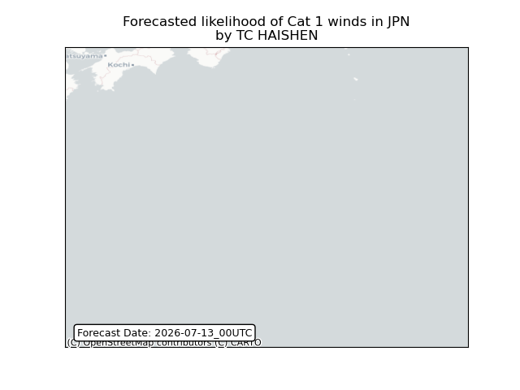

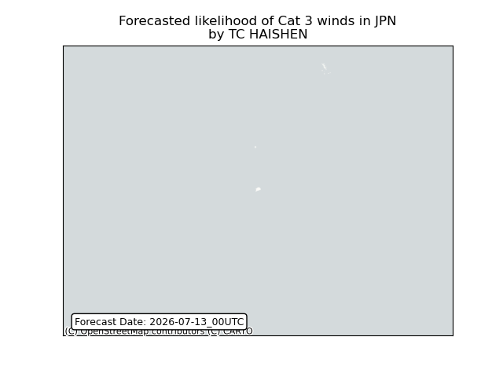

## HAISHEN Japan: people exposed

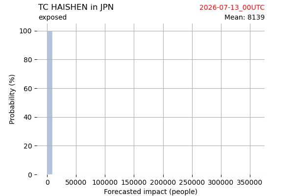

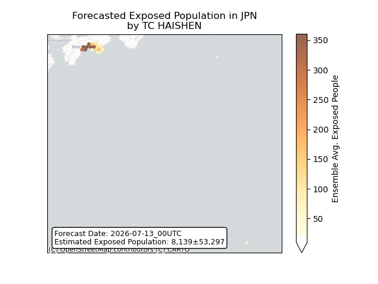

## HAISHEN Japan: people displaced

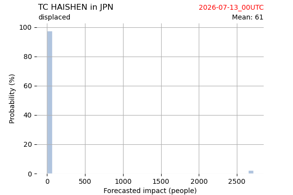

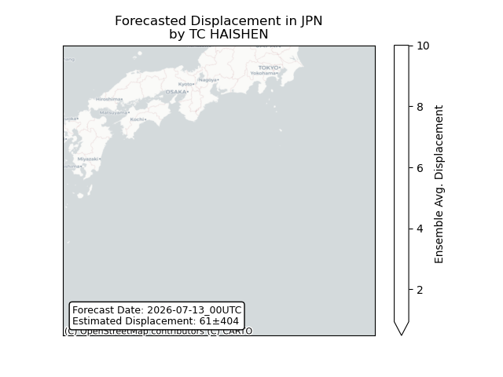

## BAVI China: areas affected

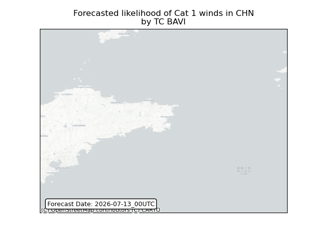

## BAVI China: people exposed

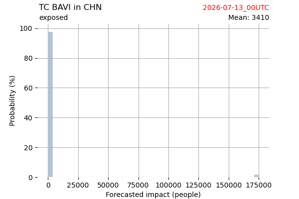

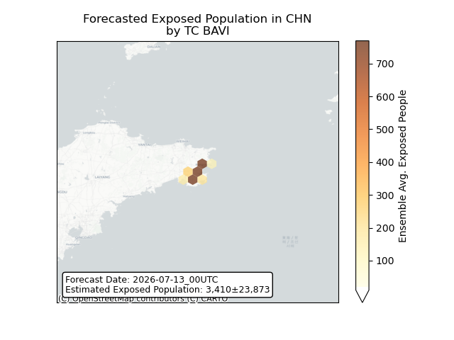

## BAVI China: people displaced

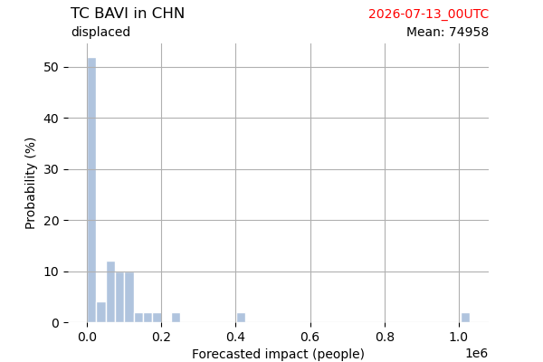

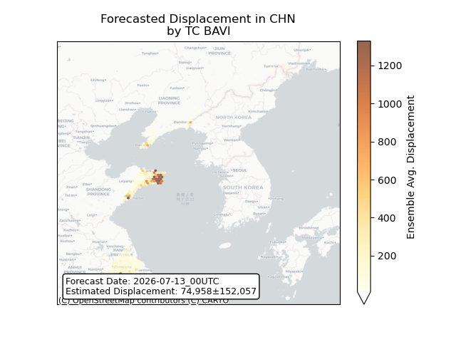

## BAVI Korea, Republic of: areas affected

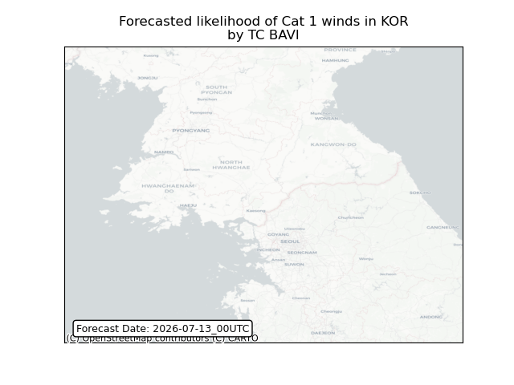

## BAVI Korea, Republic of: people exposed

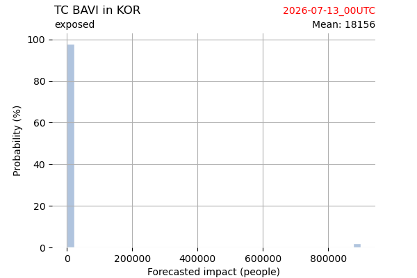

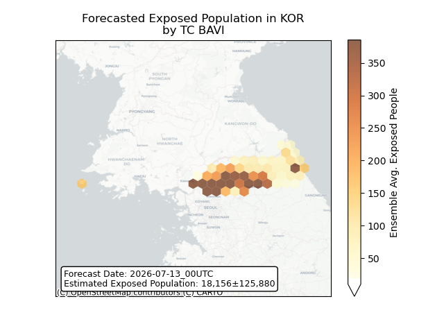

## BAVI Korea, Republic of: people displaced

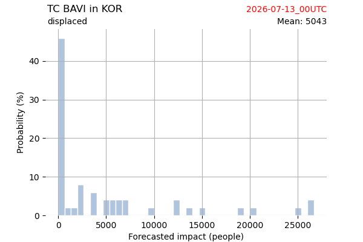

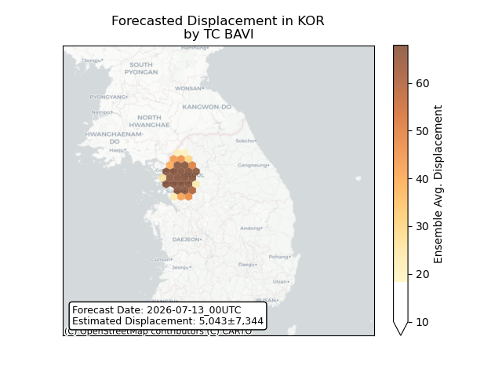

## BAVI Korea, Democratic People's Republic of: areas affected

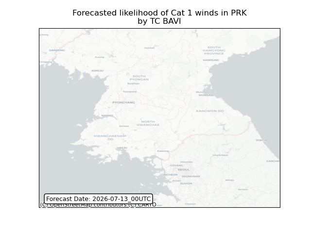

## BAVI Korea, Democratic People's Republic of: people exposed

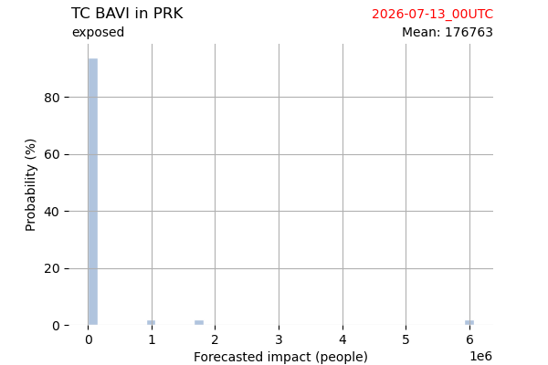

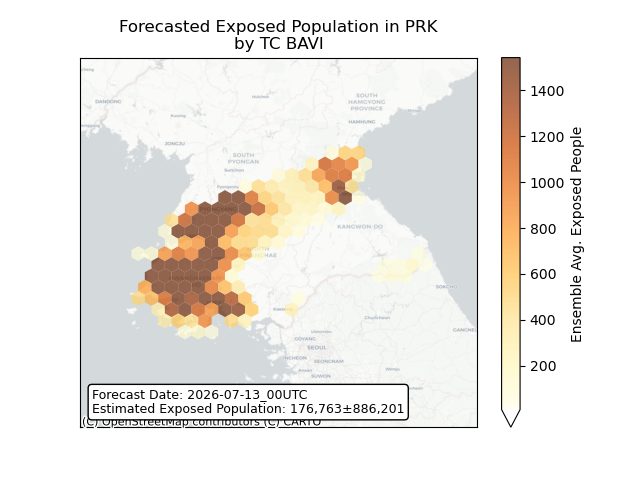

## BAVI Korea, Democratic People's Republic of: people displaced

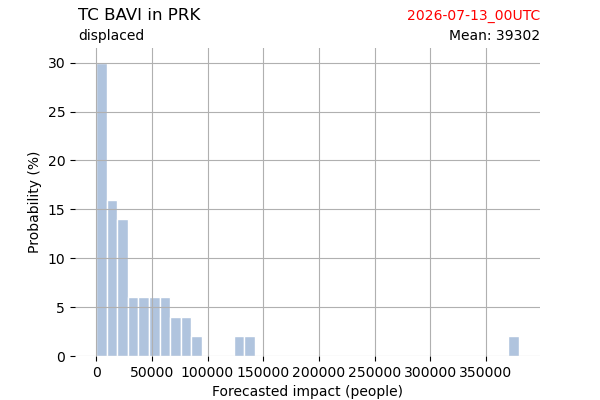

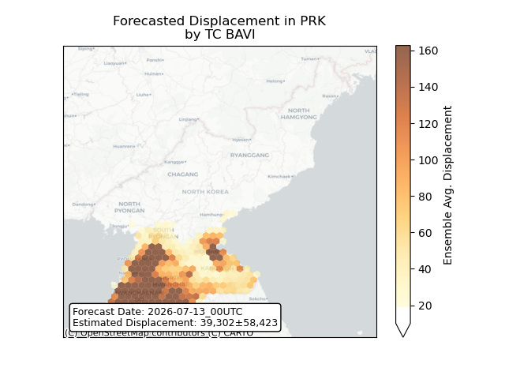

