# Displacement forecast

This is a WIP. All this is going to change, for now we're just dumping things here.

## Forecast for 2026-07-14 12:00 UTC

There are 1 active named storms.

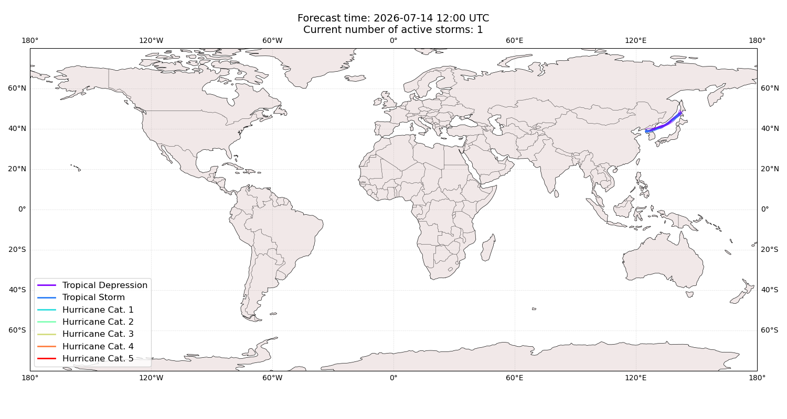

## BAVI Japan: areas affected

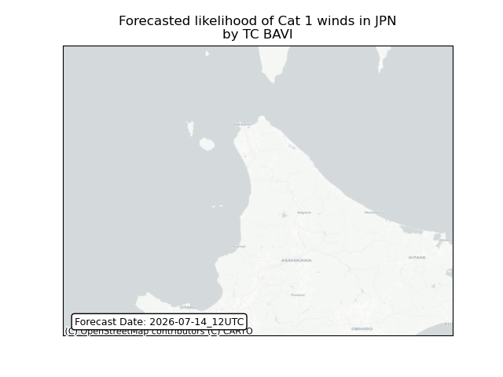

## BAVI Japan: people exposed

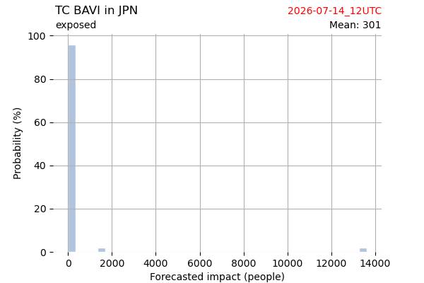

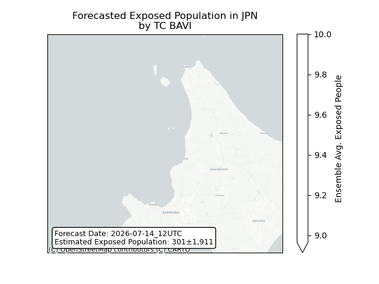

## BAVI Japan: people displaced

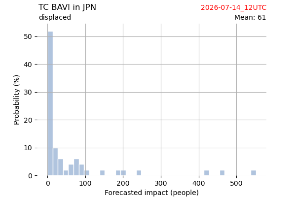

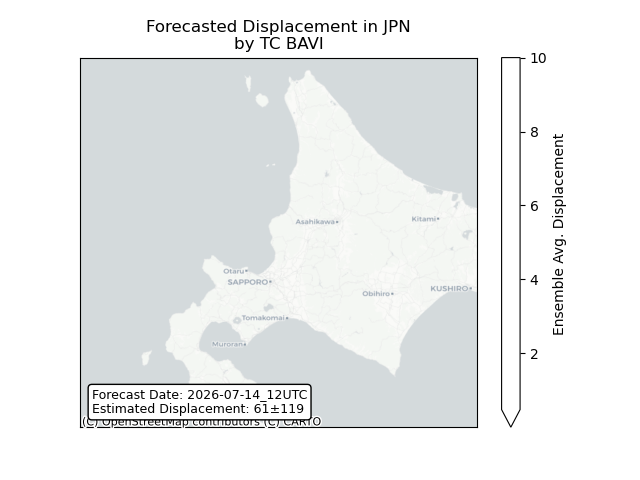

## BAVI Korea, Republic of: areas affected

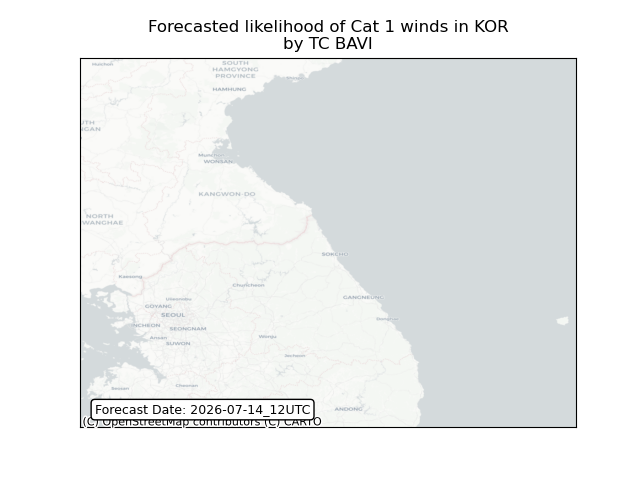

## BAVI Korea, Republic of: people exposed

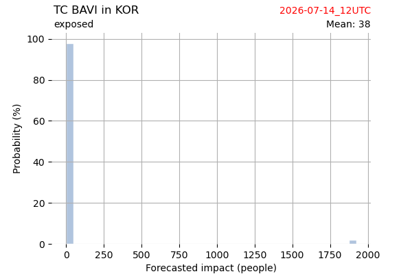

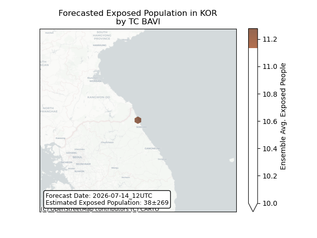

## BAVI Korea, Republic of: people displaced

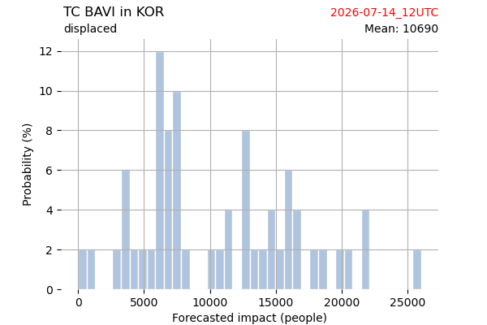

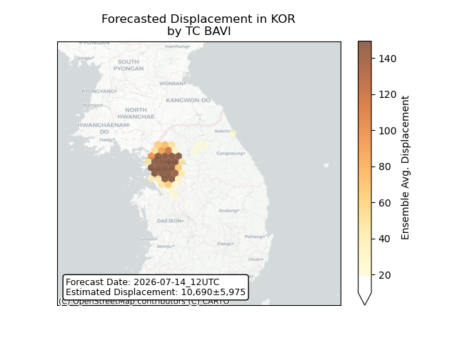

## BAVI Korea, Democratic People's Republic of: areas affected

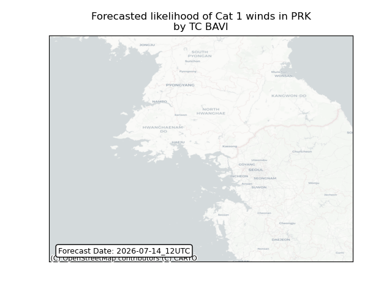

## BAVI Korea, Democratic People's Republic of: people exposed

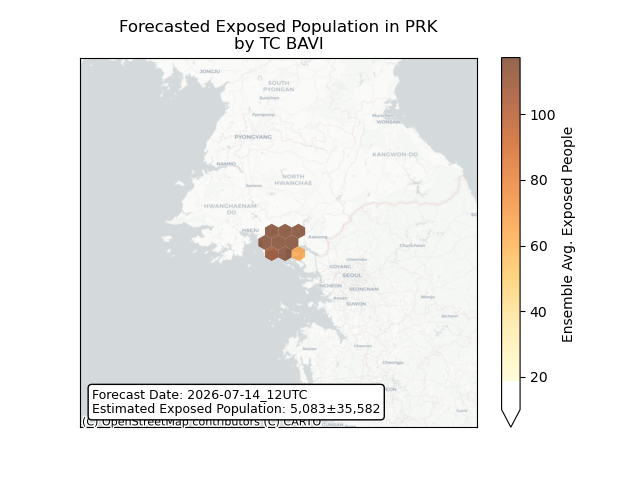

## BAVI Korea, Democratic People's Republic of: people displaced

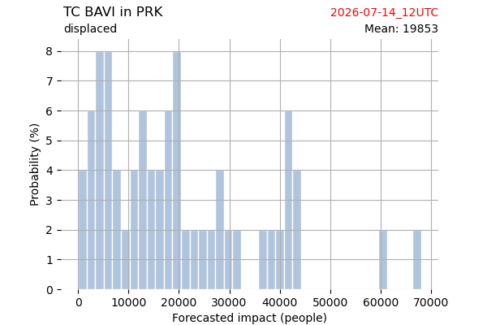

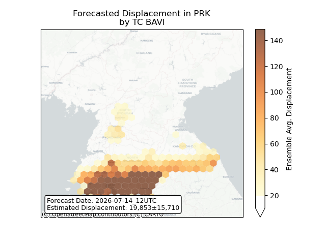

## BAVI Russian Federation: areas affected

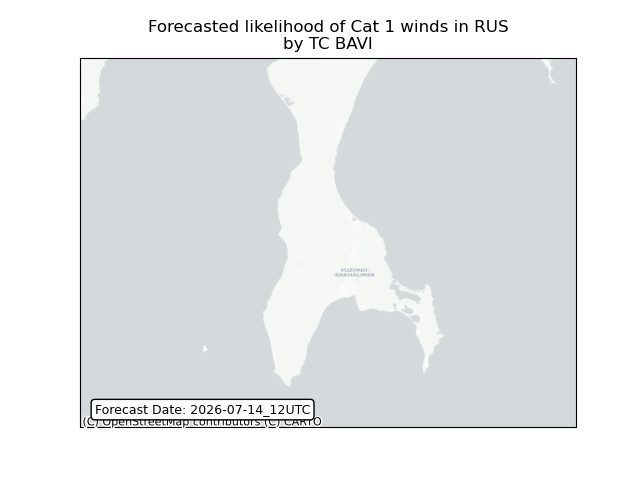

## BAVI Russian Federation: people exposed

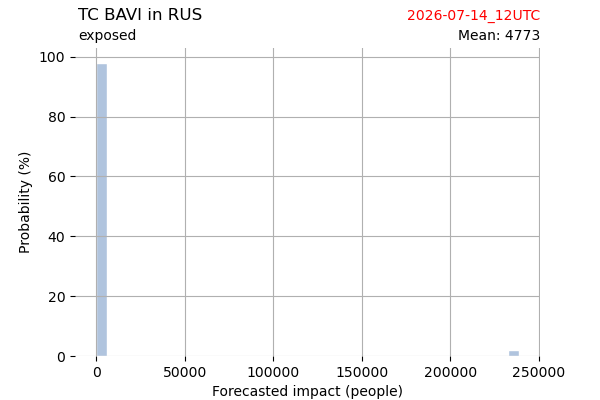

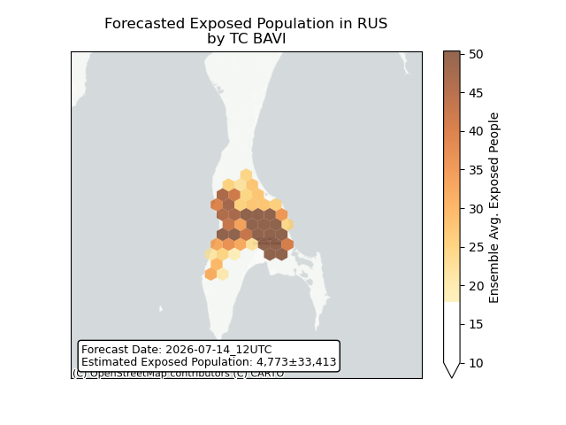

## BAVI Russian Federation: people displaced

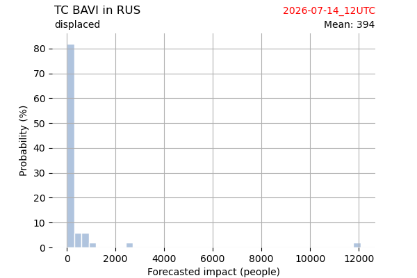

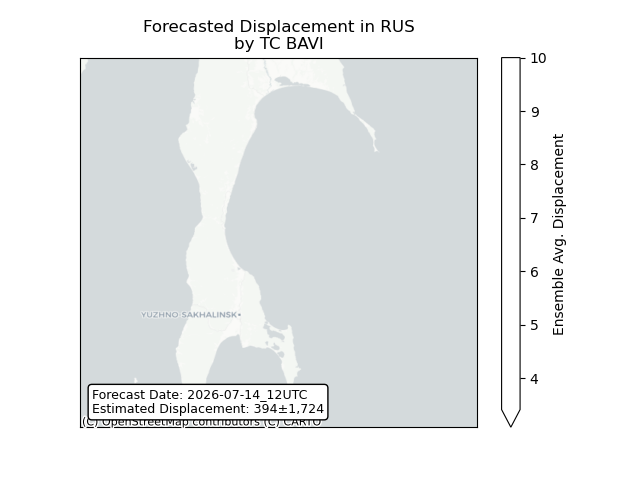

