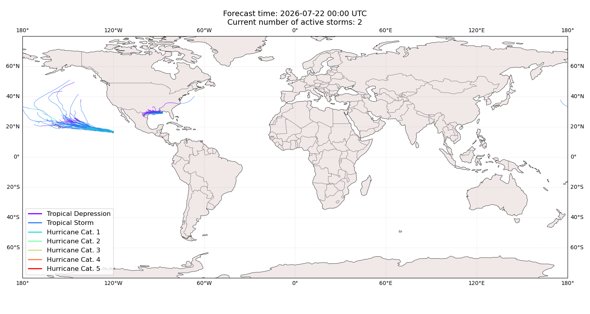
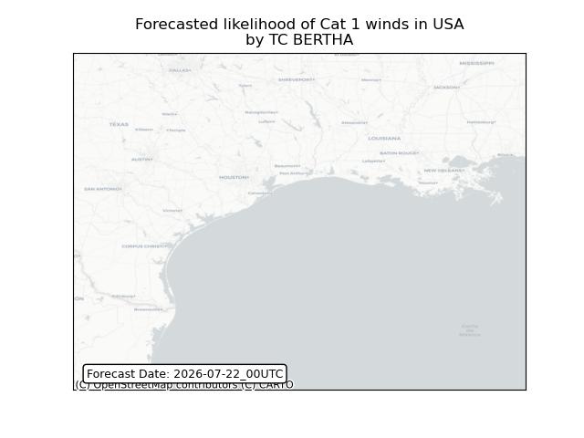
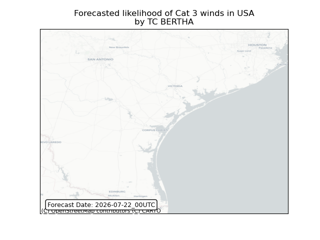
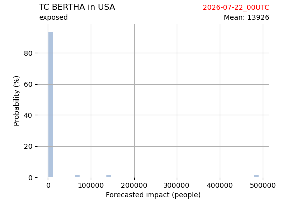
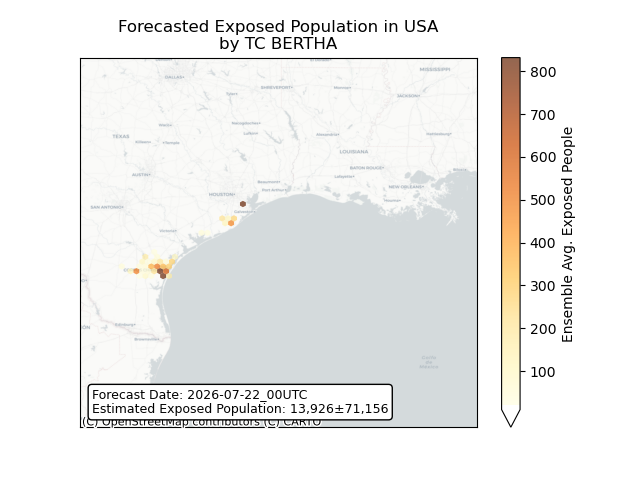
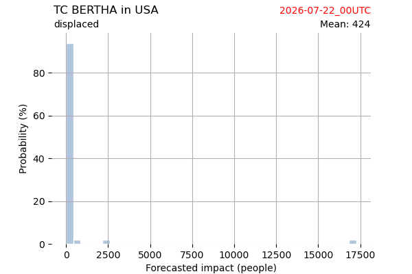
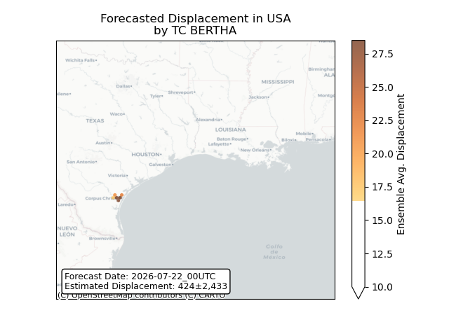

# Displacement forecast

This is a WIP. All this is going to change, for now we're just dumping things here.

## Forecast for 2026-07-22 00:00 UTC

There are 2 active named storms.

## BERTHA United States: areas affected

## BERTHA United States: people exposed

## BERTHA United States: people displaced

## FAUSTO All countries: No forecast people exposed

Storm FAUSTO is not forecast to affect people in All countries.

## FAUSTO All countries: no forecast people displaced

Storm FAUSTO is not forecast to displace people in All countries.

