# Displacement forecast

This is a WIP. All this is going to change, for now we're just dumping things here.

## Forecast for 2026-07-28 00:00 UTC

There are 3 active named storms.

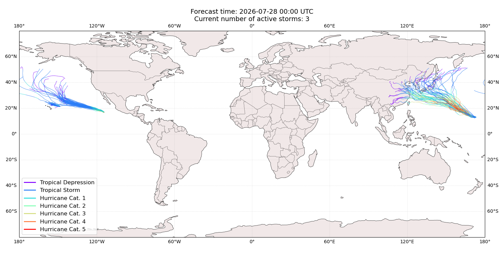

## FAUSTO All countries: No forecast people exposed

Storm FAUSTO is not forecast to affect people in All countries.

## FAUSTO All countries: no forecast people displaced

Storm FAUSTO is not forecast to displace people in All countries.

## GENEVIEVE Mexico: areas affected

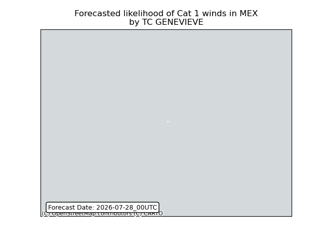

## DOLPHIN China: no forecast people displaced

Storm DOLPHIN is not forecast to displace people in China.

## DOLPHIN China: areas affected

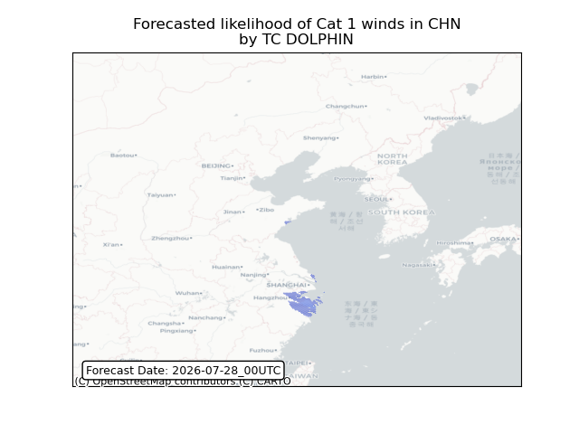

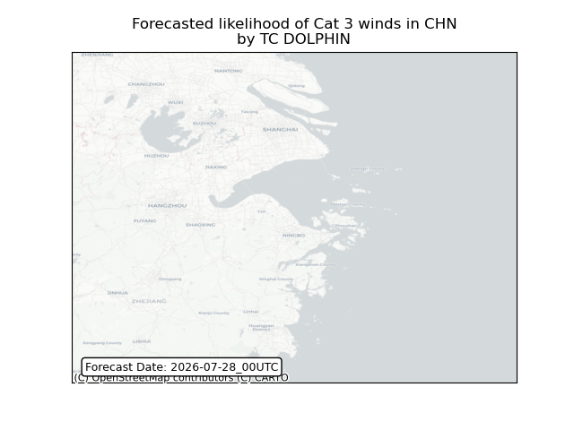

## DOLPHIN China: people exposed

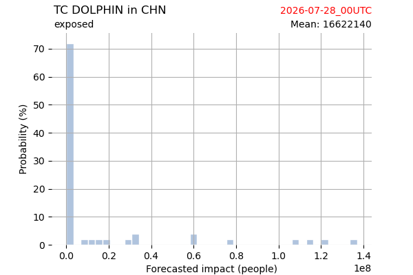

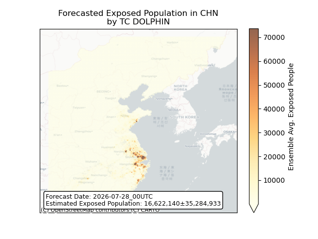

## DOLPHIN China: people displaced

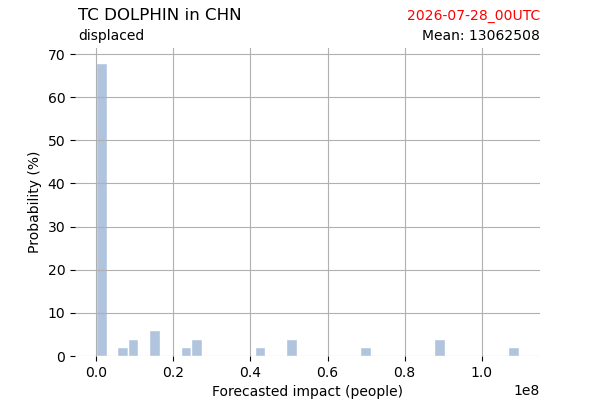

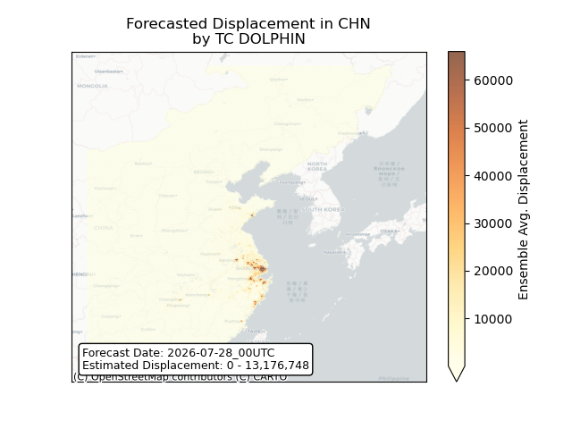

## DOLPHIN Japan: areas affected

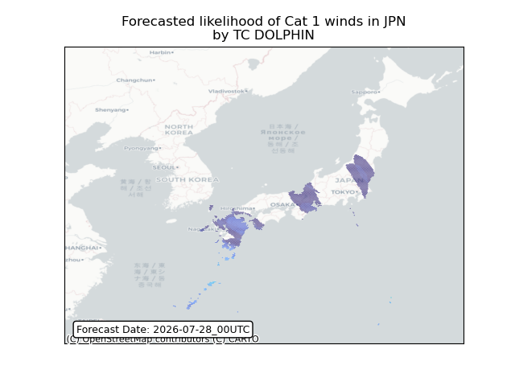

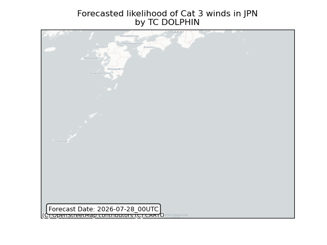

## DOLPHIN Japan: people exposed

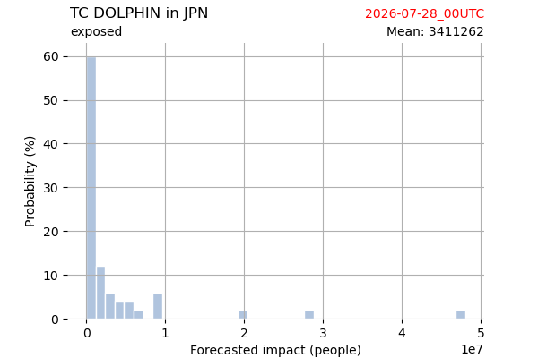

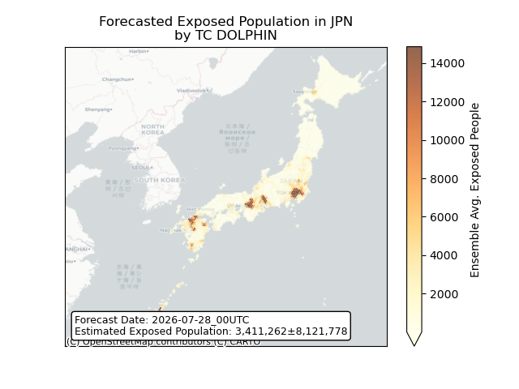

## DOLPHIN Japan: people displaced

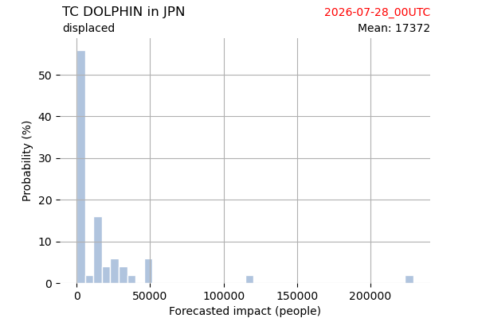

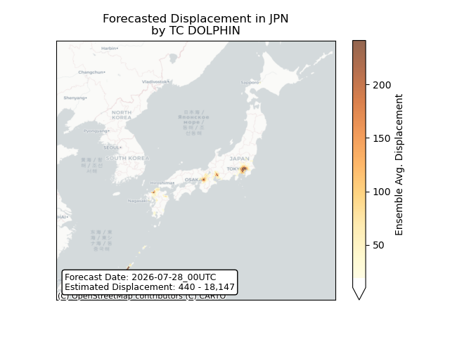

## DOLPHIN Korea, Republic of: areas affected

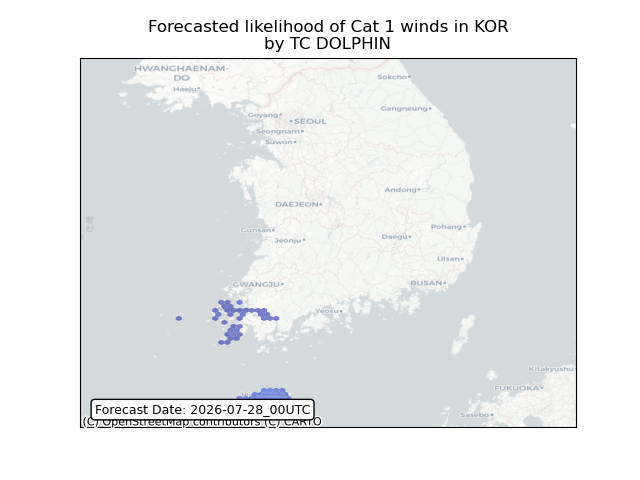

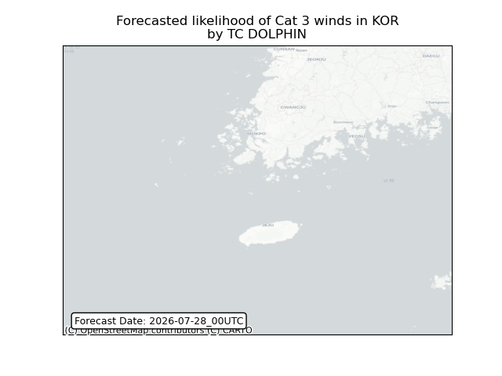

## DOLPHIN Korea, Republic of: people exposed

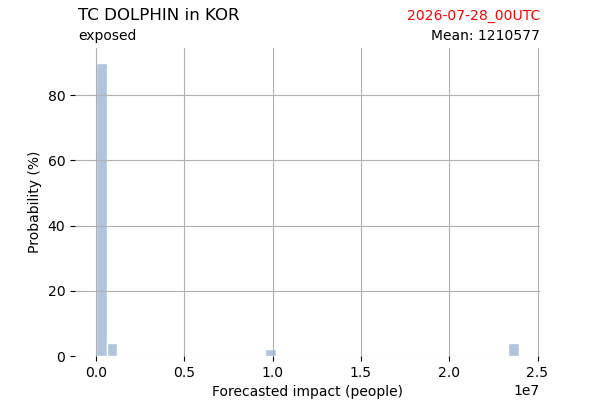

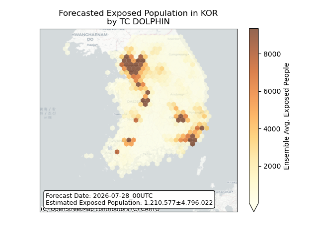

## DOLPHIN Korea, Republic of: people displaced

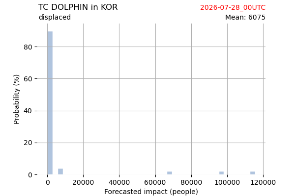

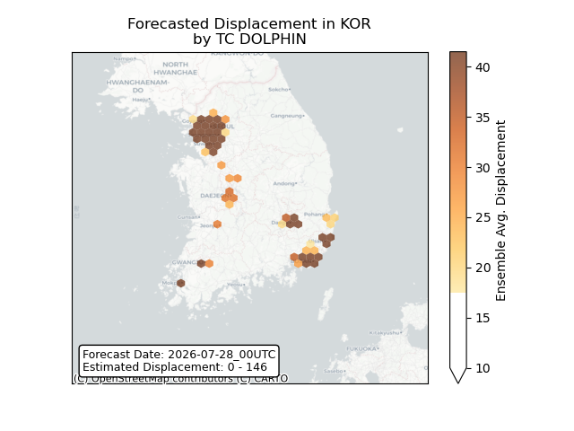

## DOLPHIN Korea, Democratic People's Republic of: areas affected

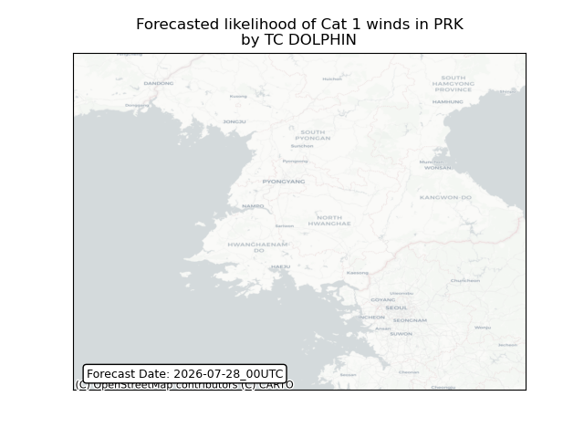

## DOLPHIN Korea, Democratic People's Republic of: people exposed

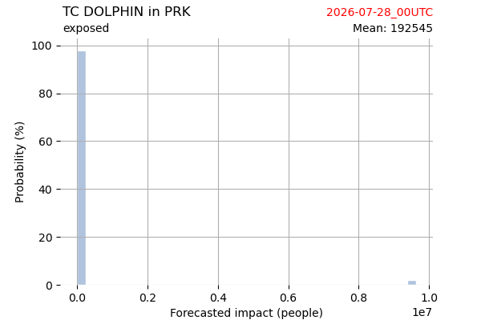

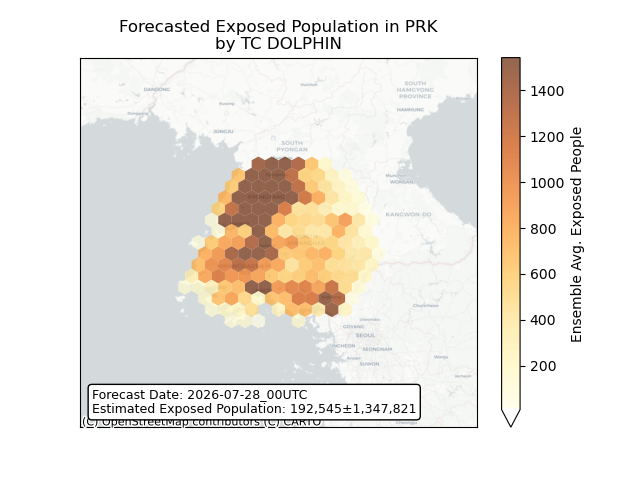

## DOLPHIN Korea, Democratic People's Republic of: people displaced

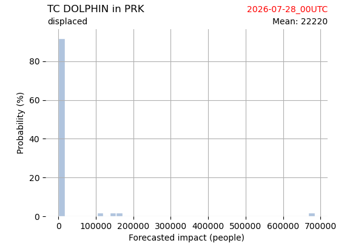

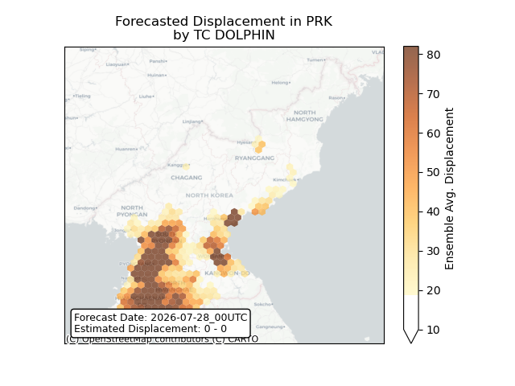

## DOLPHIN Russian Federation: areas affected

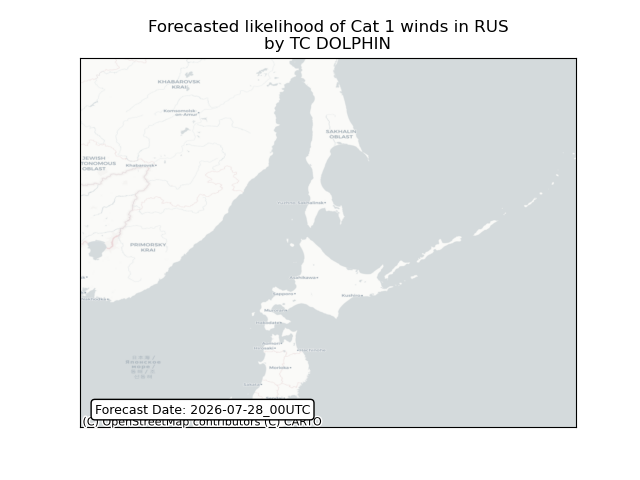

## DOLPHIN Russian Federation: people exposed

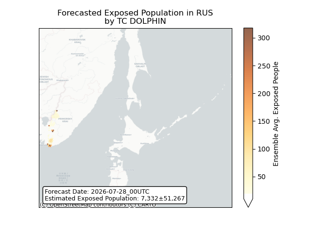

## DOLPHIN Russian Federation: people displaced

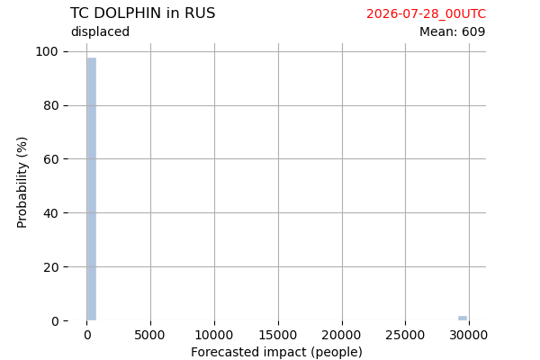

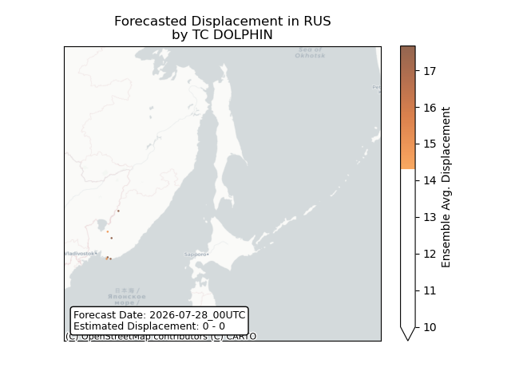

## DOLPHIN Taiwan, Province of China: areas affected

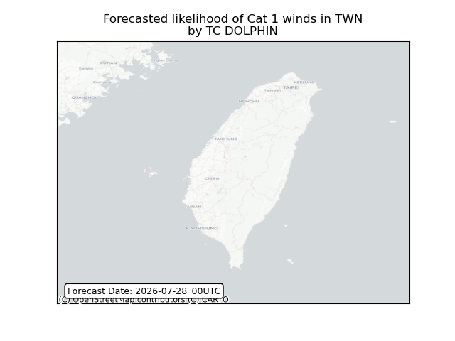

## DOLPHIN Taiwan, Province of China: people exposed

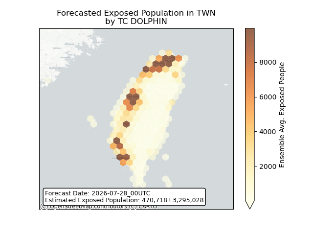

## DOLPHIN Taiwan, Province of China: people displaced

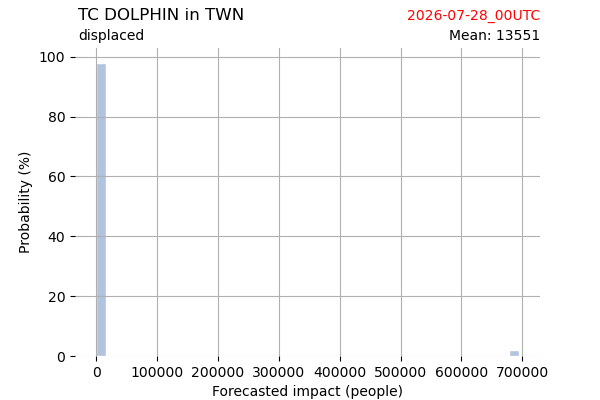

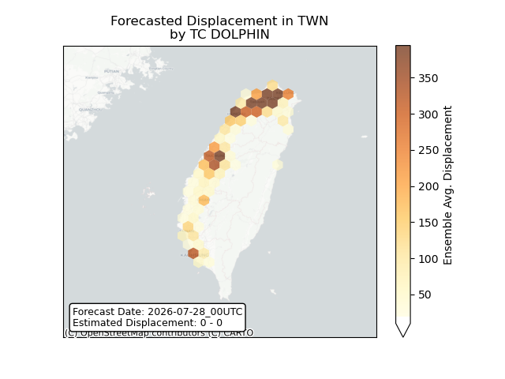

