# Displacement forecast

This is a WIP. All this is going to change, for now we're just dumping things here.

## Forecast for 2026-08-05 00:00 UTC

There are 2 active named storms.

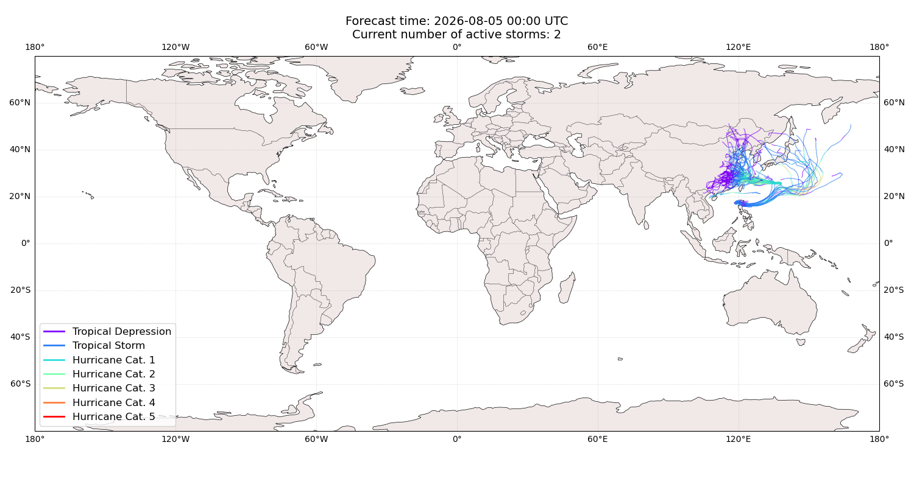

## DOLPHIN All countries: No forecast people exposed

Storm DOLPHIN is not forecast to affect people in All countries.

## DOLPHIN All countries: no forecast people displaced

Storm DOLPHIN is not forecast to displace people in All countries.

## KUJIRA Japan: areas affected

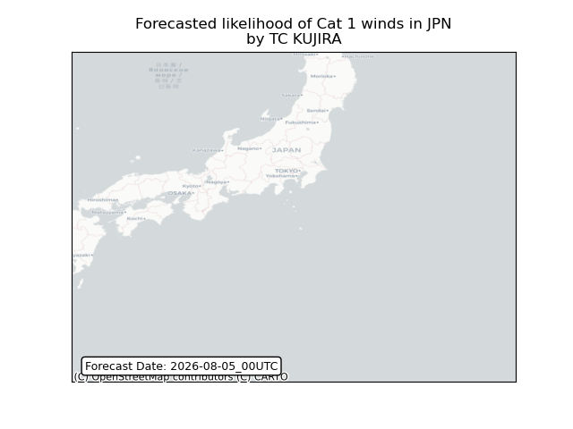

## KUJIRA Japan: people exposed

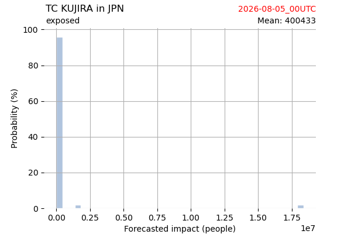

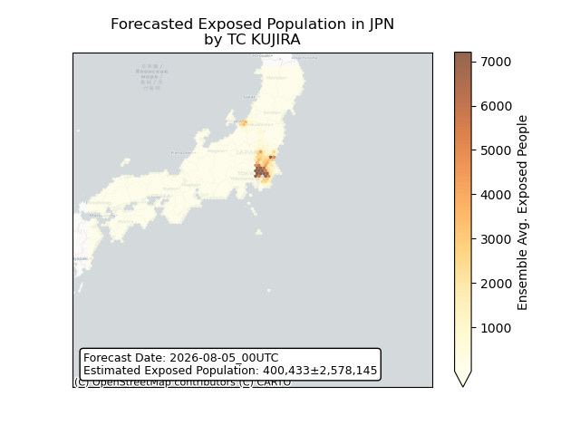

## KUJIRA Japan: people displaced

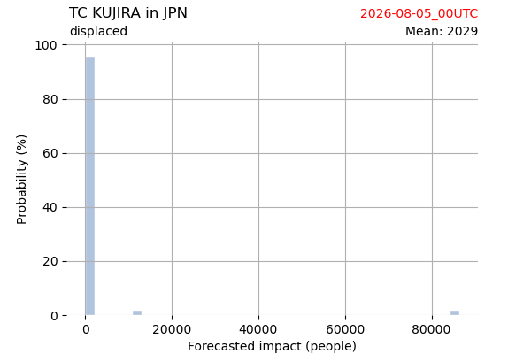

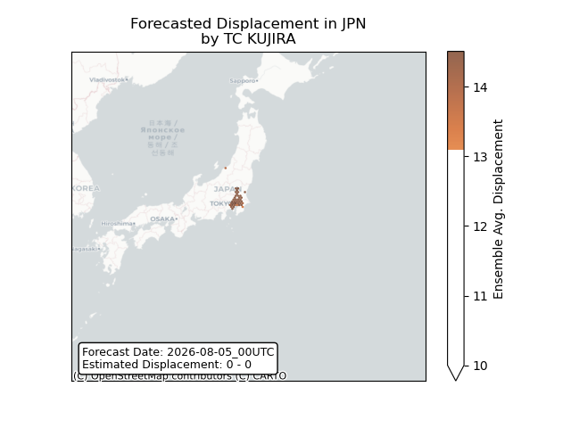

## KUJIRA Northern Mariana Islands: areas affected

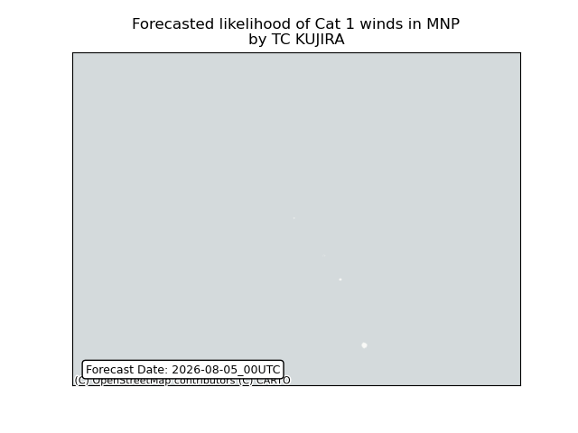

## KUJIRA Philippines: no forecast people displaced

Storm KUJIRA is not forecast to displace people in Philippines.

## KUJIRA Philippines: areas affected

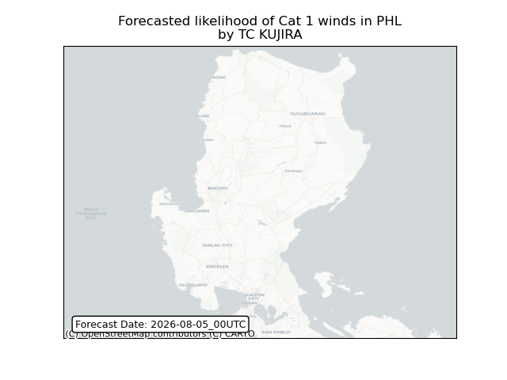

## KUJIRA Philippines: people exposed

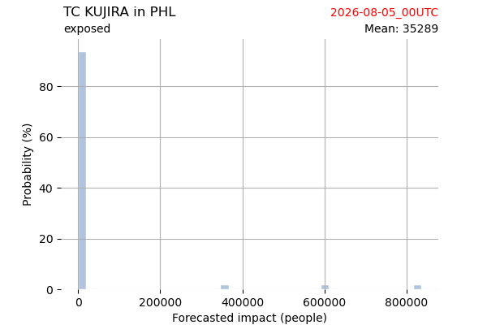

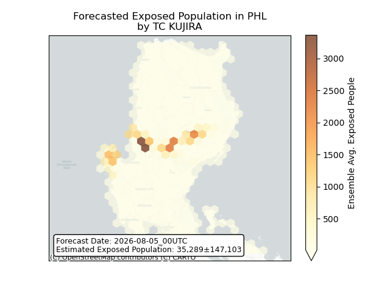

## KUJIRA Philippines: people displaced

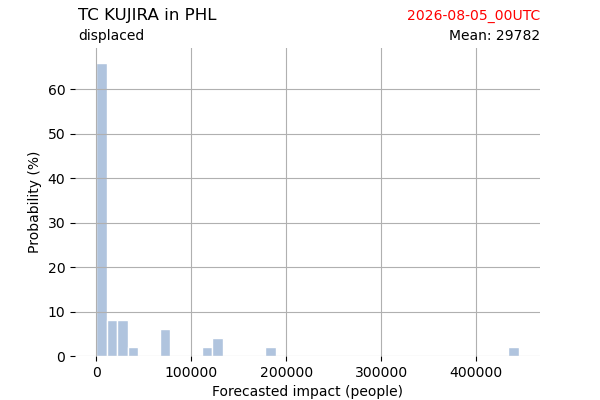

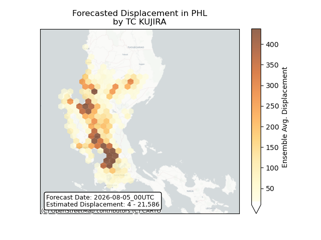

## KUJIRA Russian Federation: areas affected

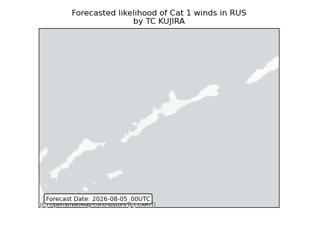

## KUJIRA Russian Federation: people exposed

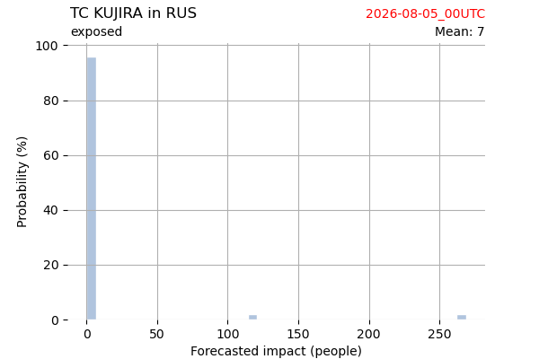

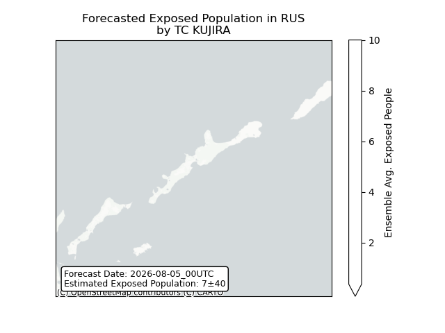

## KUJIRA Russian Federation: people displaced

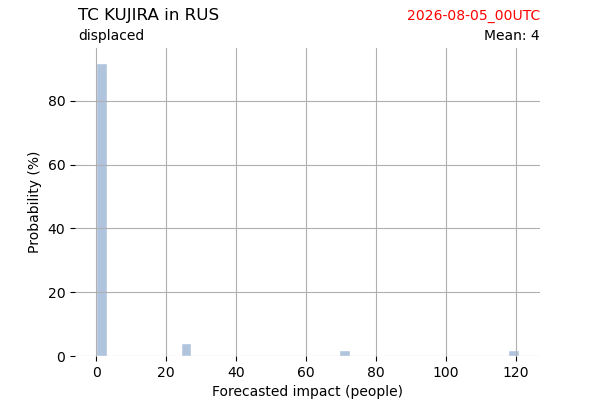

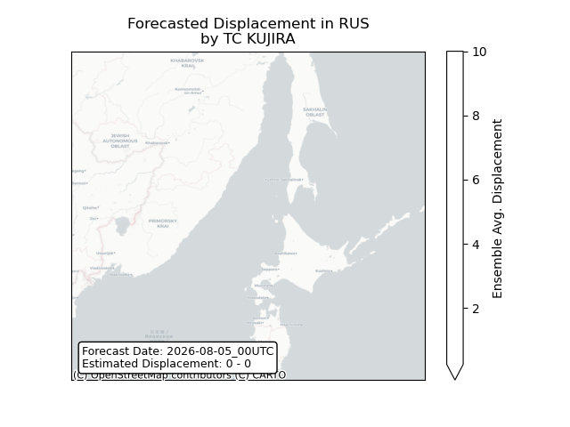

