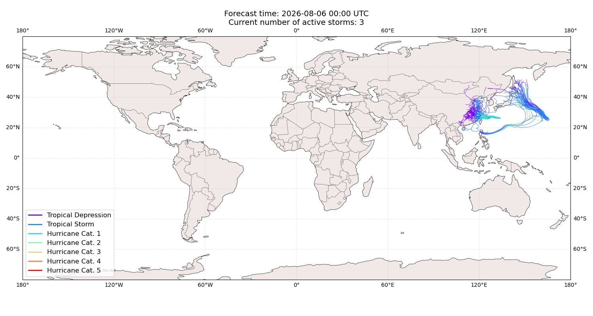
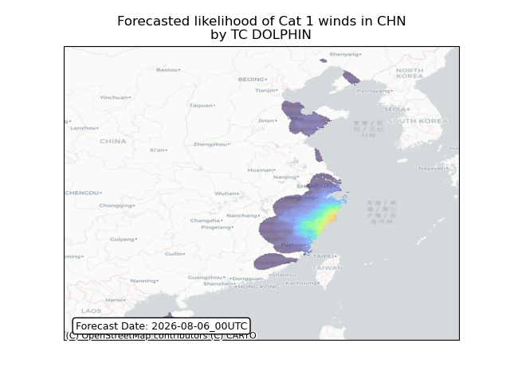
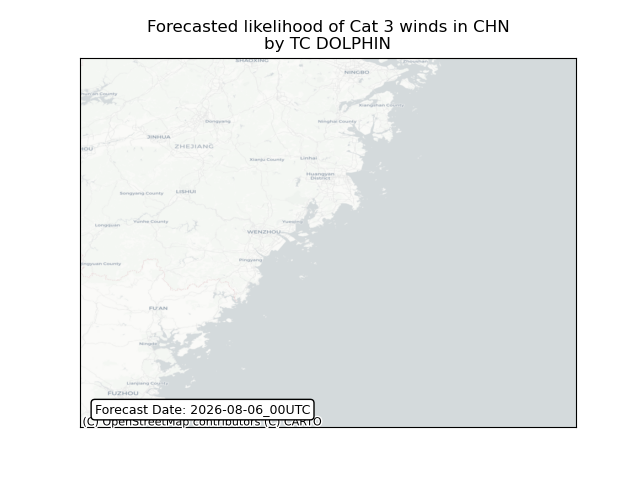

# Displacement forecast

This is a WIP. All this is going to change, for now we're just dumping things here.

## Forecast for 2026-08-06 00:00 UTC

There are 3 active named storms.

## KUJIRA All countries: No forecast people exposed

Storm KUJIRA is not forecast to affect people in All countries.

## KUJIRA All countries: no forecast people displaced

Storm KUJIRA is not forecast to displace people in All countries.

## DOLPHIN China: areas affected

## CHAN-HOM All countries: no forecast people displaced

Storm CHAN-HOM is not forecast to displace people in All countries.

## CHAN-HOM All countries: No forecast people exposed

Storm CHAN-HOM is not forecast to affect people in All countries.

## CHAN-HOM All countries: no forecast people displaced

Storm CHAN-HOM is not forecast to displace people in All countries.

