# Displacement forecast

This is a WIP. All this is going to change, for now we're just dumping things here.

## Forecast for 2026-08-09 00:00 UTC

There are 2 active named storms.

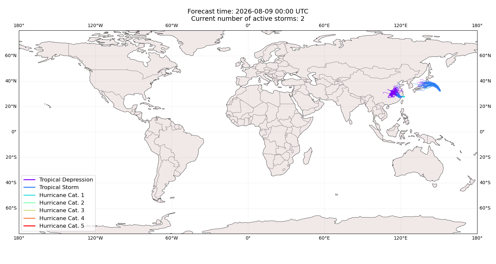

## DOLPHIN China: areas affected

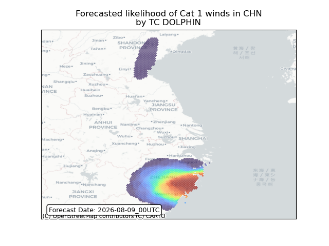

## DOLPHIN China: people exposed

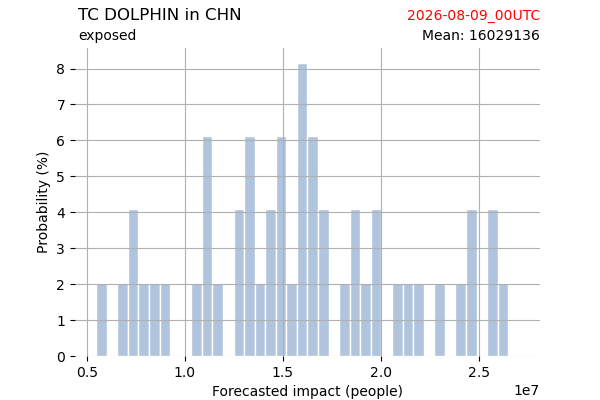

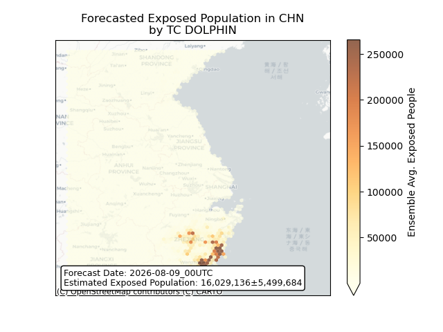

## DOLPHIN China: people displaced

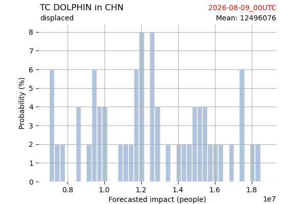

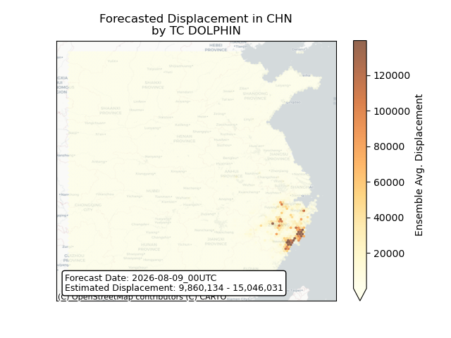

## CHAN-HOM Japan: areas affected

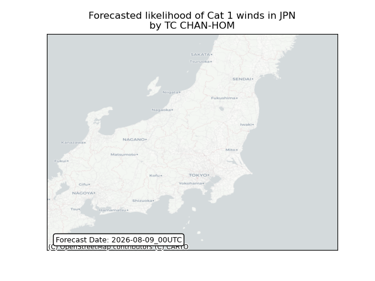

## CHAN-HOM Japan: people exposed

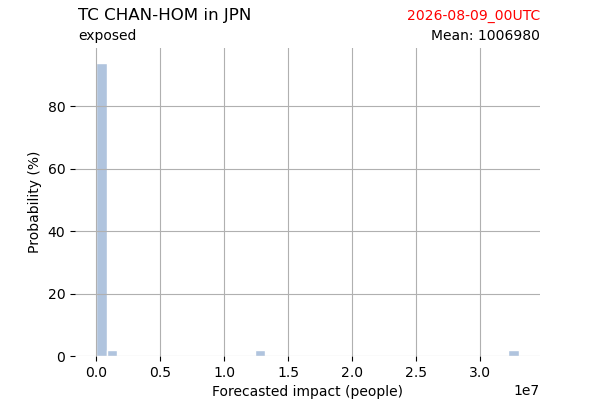

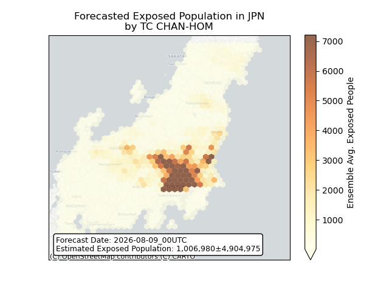

## CHAN-HOM Japan: people displaced

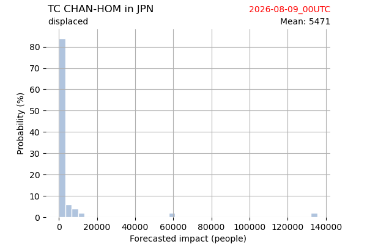

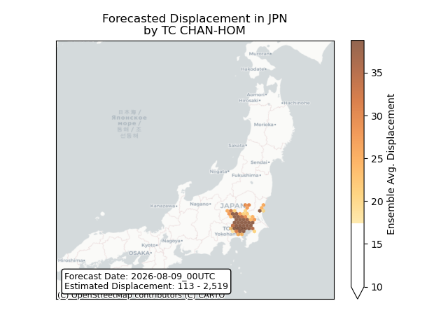

