# Displacement forecast

This is a WIP. All this is going to change, for now we're just dumping things here.

## Forecast for 2026-08-11 00:00 UTC

There are 3 active named storms.

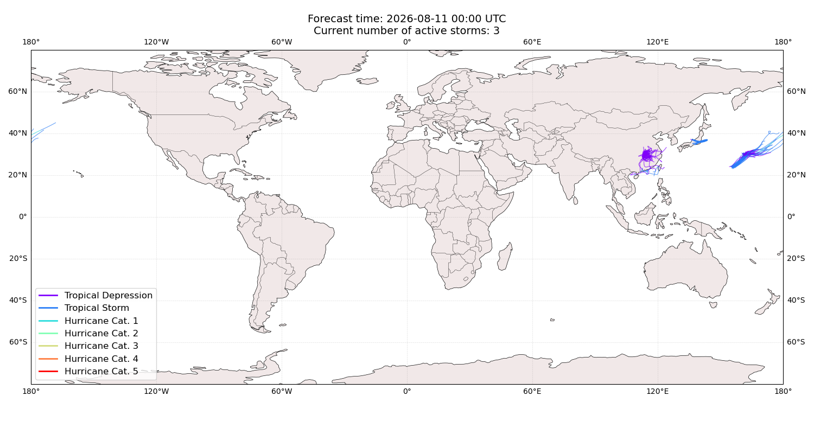

## CHAN-HOM Japan: areas affected

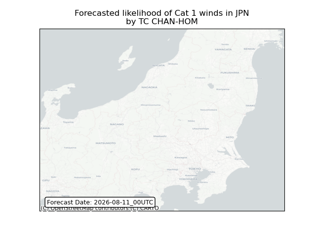

## CHAN-HOM Japan: people exposed

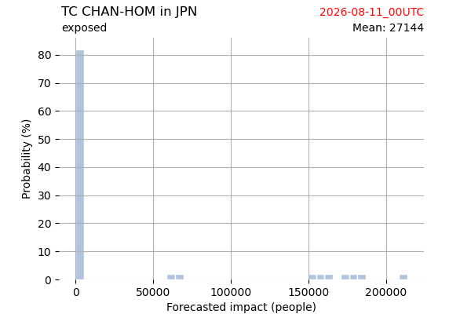

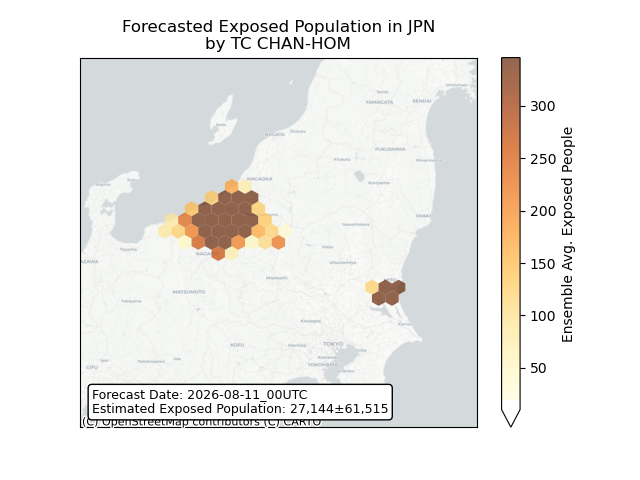

## CHAN-HOM Japan: people displaced

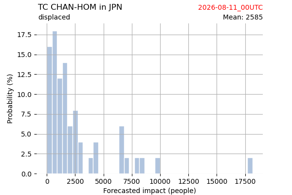

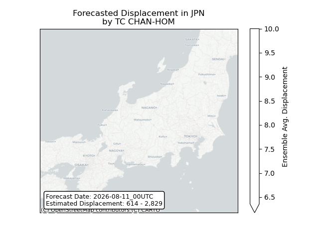

## PEILOU All countries: No forecast people exposed

Storm PEILOU is not forecast to affect people in All countries.

## PEILOU All countries: no forecast people displaced

Storm PEILOU is not forecast to displace people in All countries.

## DOLPHIN Taiwan, Province of China: areas affected

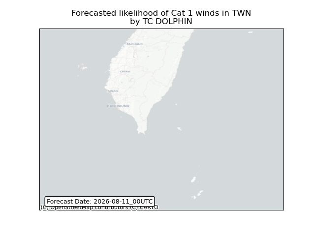

## DOLPHIN Taiwan, Province of China: people exposed

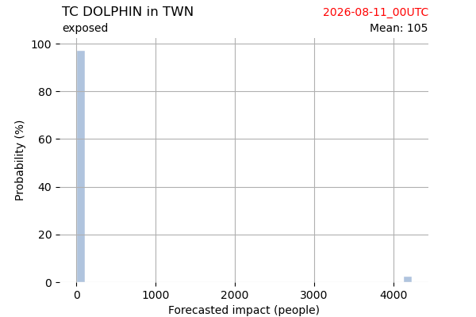

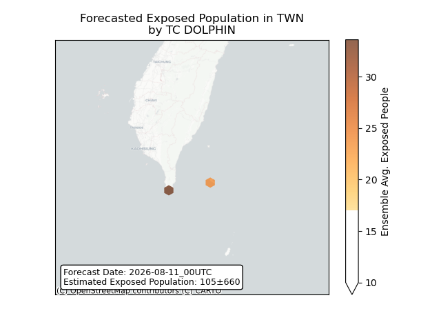

## DOLPHIN Taiwan, Province of China: people displaced

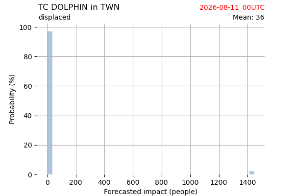

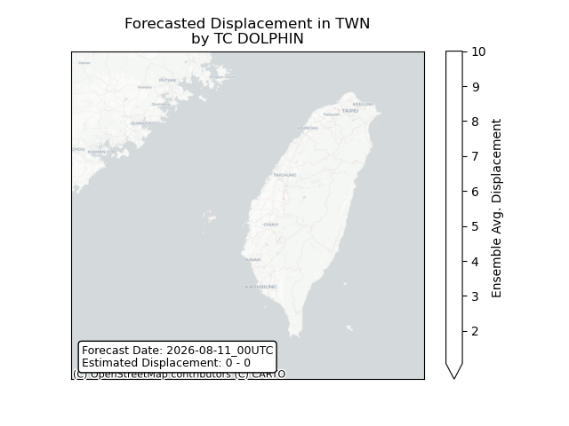

