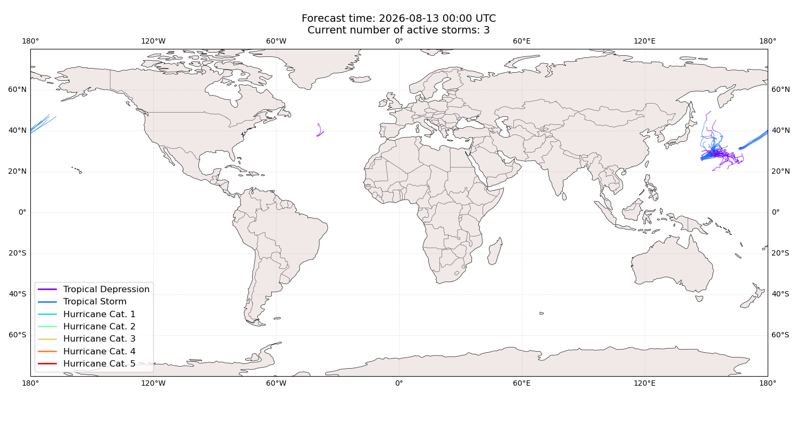

# Displacement forecast

This is a WIP. All this is going to change, for now we're just dumping things here.

## Forecast for 2026-08-13 00:00 UTC

There are 3 active named storms.

## PEILOU All countries: No forecast people exposed

Storm PEILOU is not forecast to affect people in All countries.

## PEILOU All countries: no forecast people displaced

Storm PEILOU is not forecast to displace people in All countries.

## CRISTOBAL All countries: No forecast people exposed

Storm CRISTOBAL is not forecast to affect people in All countries.

## CRISTOBAL All countries: no forecast people displaced

Storm CRISTOBAL is not forecast to displace people in All countries.

## NANGKA All countries: No forecast people exposed

Storm NANGKA is not forecast to affect people in All countries.

## NANGKA All countries: no forecast people displaced

Storm NANGKA is not forecast to displace people in All countries.

