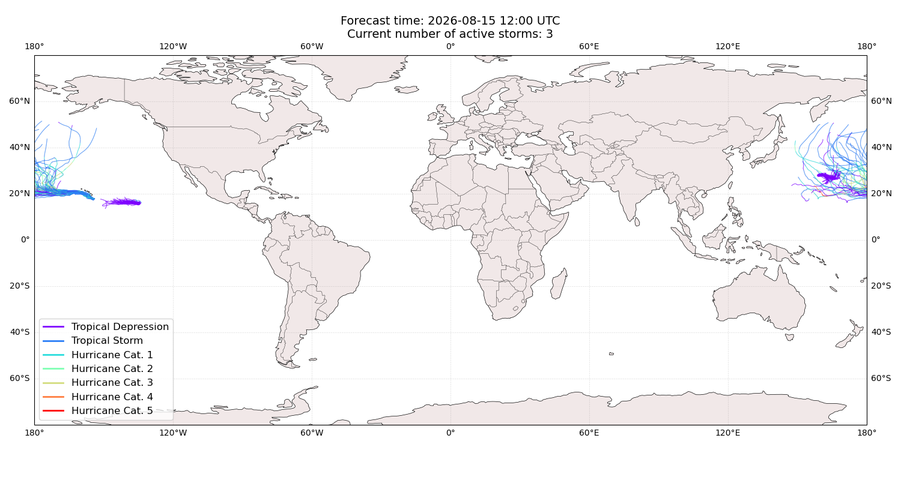
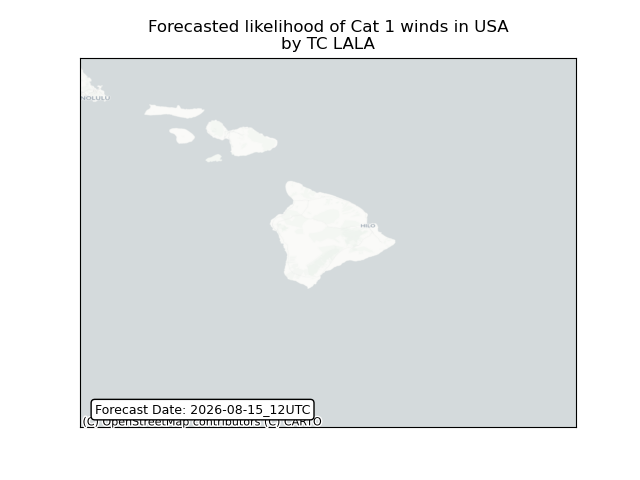
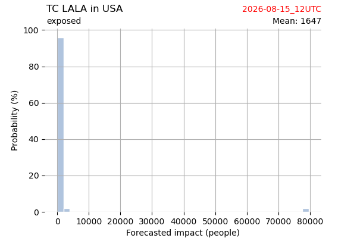
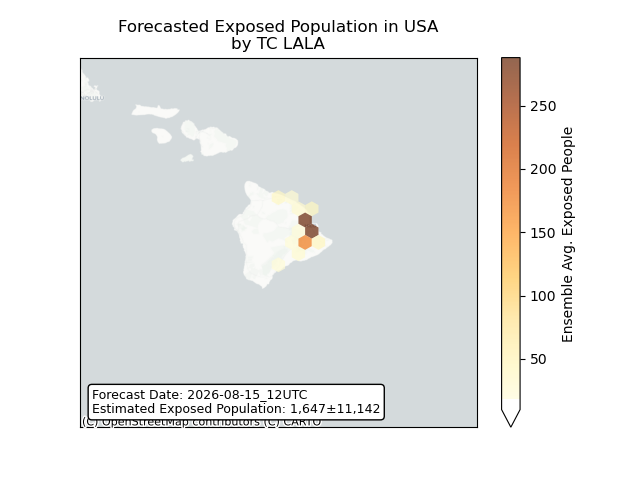
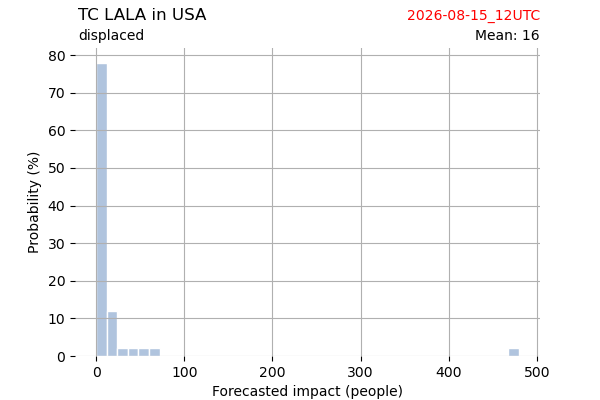
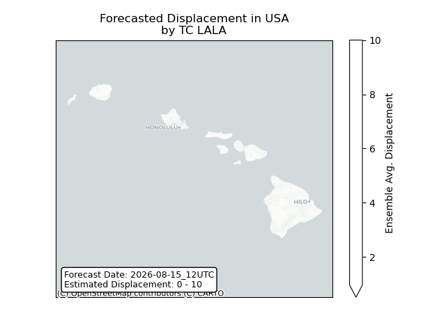

# Displacement forecast

This is a WIP. All this is going to change, for now we're just dumping things here.

## Forecast for 2026-08-15 12:00 UTC

There are 3 active named storms.

## NANGKA All countries: No forecast people exposed

Storm NANGKA is not forecast to affect people in All countries.

## NANGKA All countries: no forecast people displaced

Storm NANGKA is not forecast to displace people in All countries.

## HERNAN All countries: No forecast people exposed

Storm HERNAN is not forecast to affect people in All countries.

## HERNAN All countries: no forecast people displaced

Storm HERNAN is not forecast to displace people in All countries.

## LALA United States: no forecast people displaced

Storm LALA is not forecast to displace people in United States.

## LALA United States: areas affected

## LALA United States: people exposed

## LALA United States: people displaced

