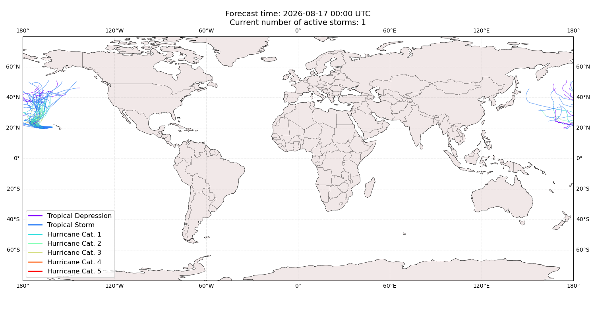

# Displacement forecast

This is a WIP. All this is going to change, for now we're just dumping things here.

## Forecast for 2026-08-17 00:00 UTC

There are 1 active named storms.

## LALA United States Minor Outlying Islands: no forecast people displaced

Storm LALA is not forecast to displace people in United States Minor Outlying Islands.

