# Displacement forecast

This is a WIP. All this is going to change, for now we're just dumping things here.

## Forecast for 2026-08-24 12:00 UTC

There are 7 active named storms.

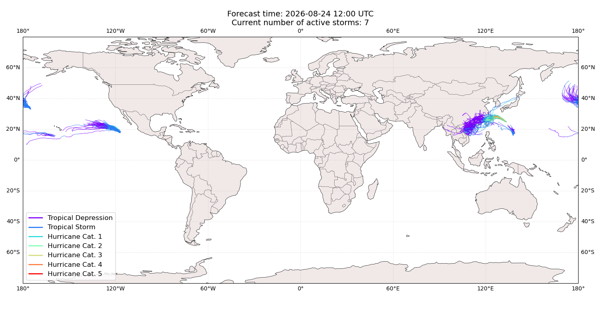

## SAUDEL China: areas affected

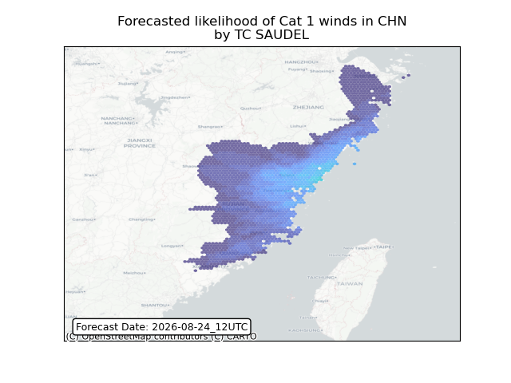

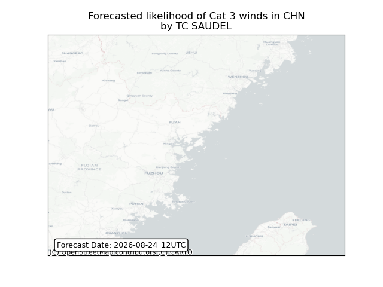

## SAUDEL China: people exposed

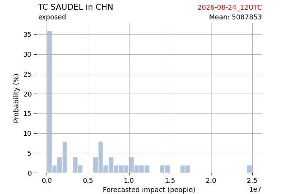

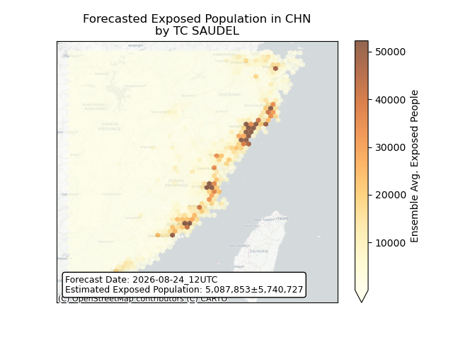

## SAUDEL China: people displaced

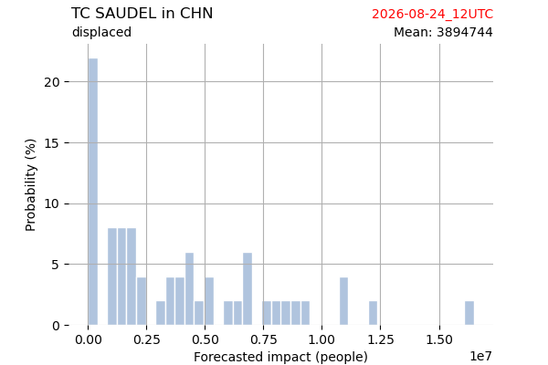

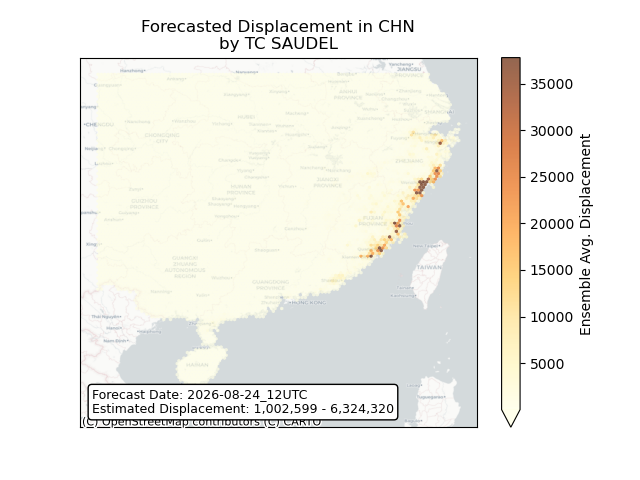

## SAUDEL Japan: areas affected

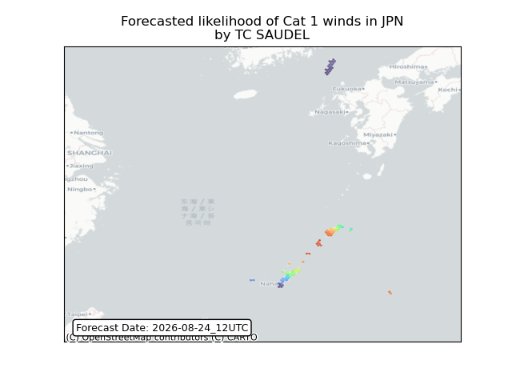

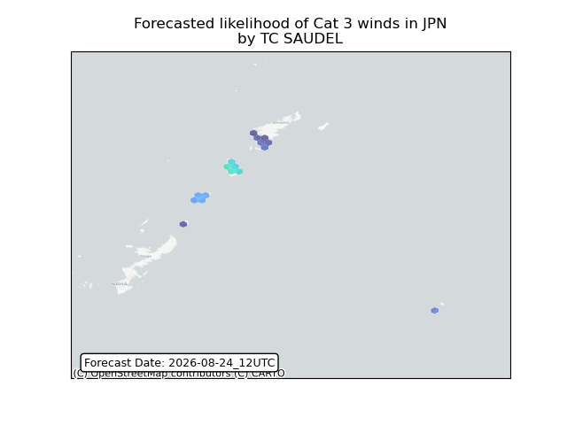

## SAUDEL Japan: people exposed

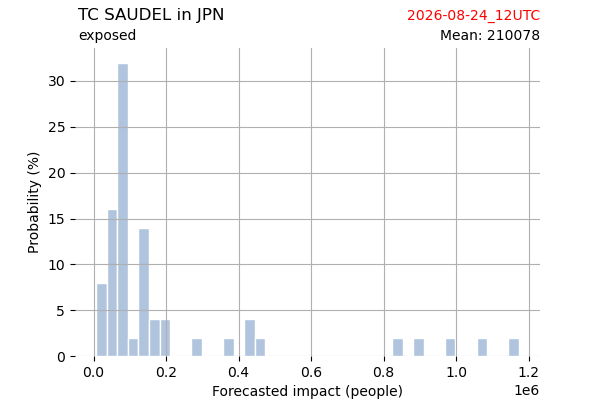

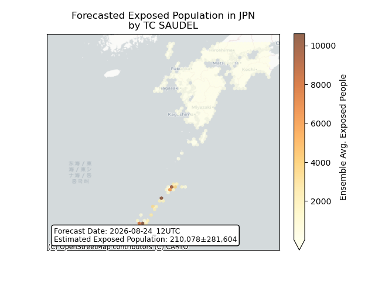

## SAUDEL Japan: people displaced

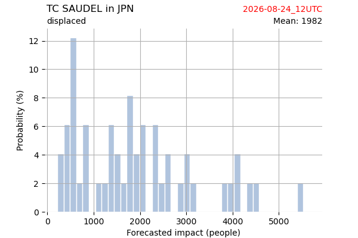

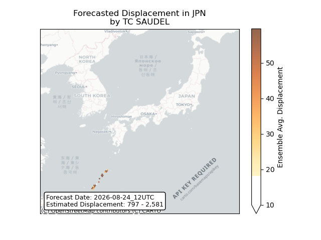

## SAUDEL Taiwan, Province of China: areas affected

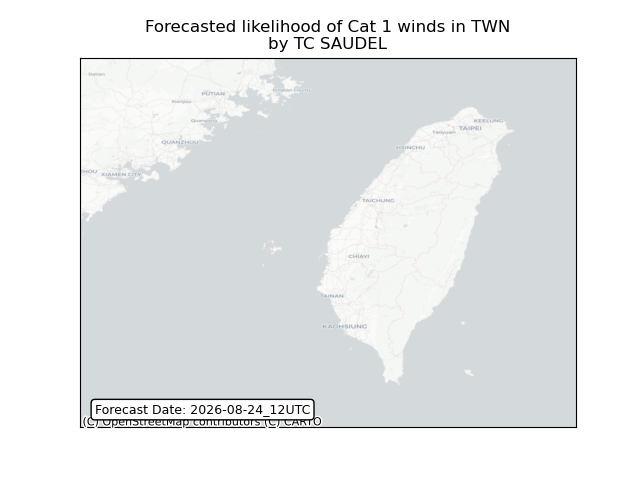

## SAUDEL Taiwan, Province of China: people exposed

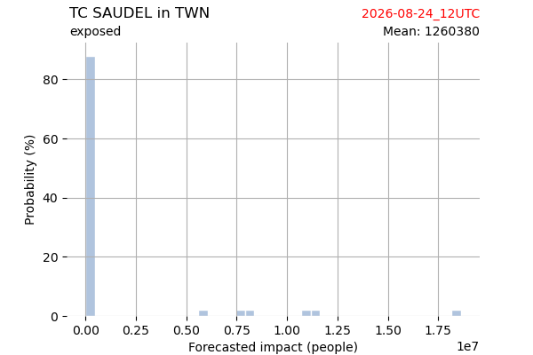

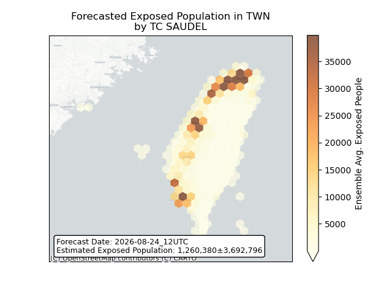

## SAUDEL Taiwan, Province of China: people displaced

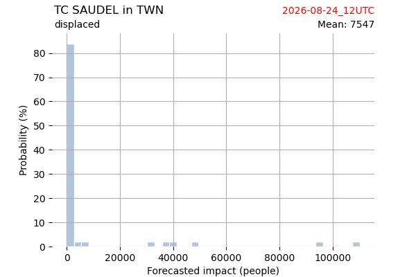

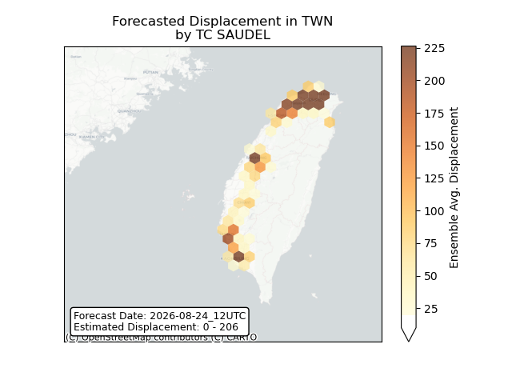

## GAENARI All countries: No forecast people exposed

Storm GAENARI is not forecast to affect people in All countries.

## GAENARI All countries: no forecast people displaced

Storm GAENARI is not forecast to displace people in All countries.

## MOKE All countries: No forecast people exposed

Storm MOKE is not forecast to affect people in All countries.

## MOKE All countries: no forecast people displaced

Storm MOKE is not forecast to displace people in All countries.

## ATSANI Japan: areas affected

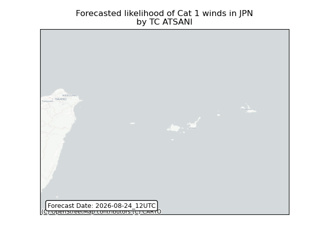

## ATSANI Japan: people exposed

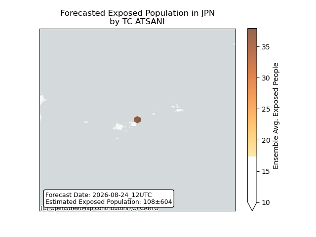

## ATSANI Japan: people displaced

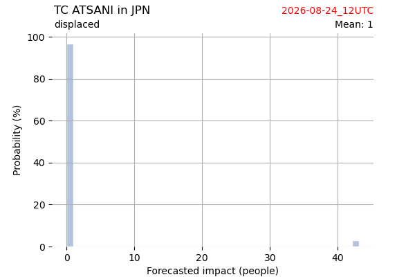

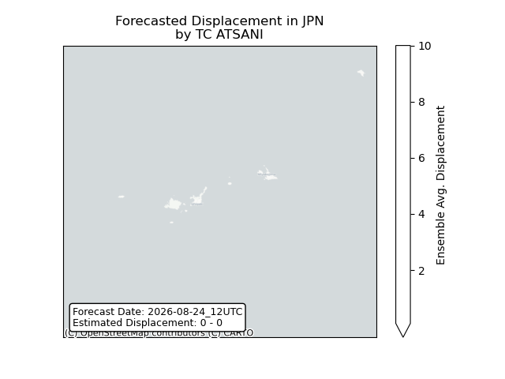

## ATSANI Korea, Republic of: areas affected

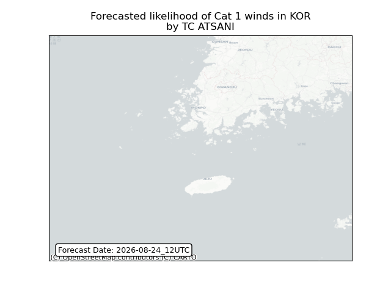

## ATSANI Korea, Republic of: people exposed

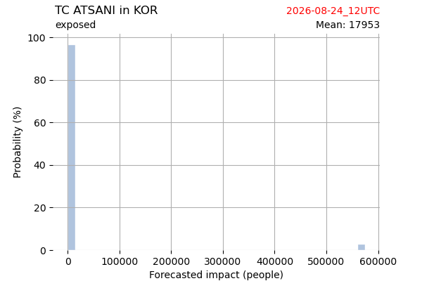

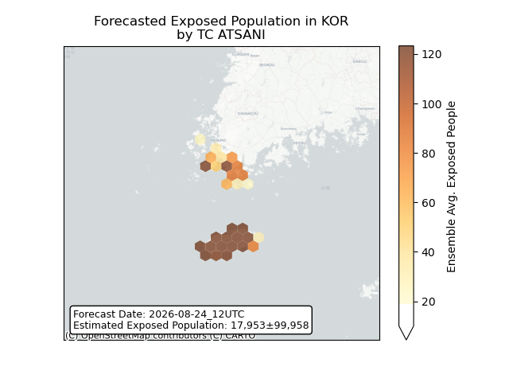

## ATSANI Korea, Republic of: people displaced

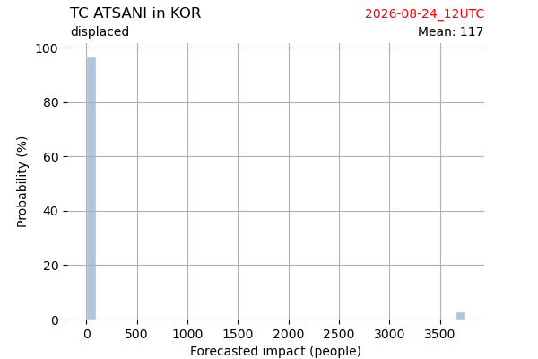

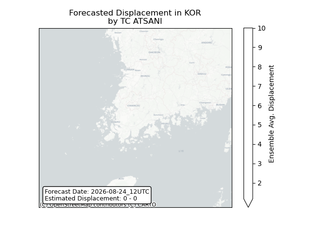

## NARRA All countries: No forecast people exposed

Storm NARRA is not forecast to affect people in All countries.

## NARRA All countries: no forecast people displaced

Storm NARRA is not forecast to displace people in All countries.

## ISELLE All countries: No forecast people exposed

Storm ISELLE is not forecast to affect people in All countries.

## ISELLE All countries: no forecast people displaced

Storm ISELLE is not forecast to displace people in All countries.

## LALA All countries: No forecast people exposed

Storm LALA is not forecast to affect people in All countries.

## LALA All countries: no forecast people displaced

Storm LALA is not forecast to displace people in All countries.

