# Displacement forecast

This is a WIP. All this is going to change, for now we're just dumping things here.

## Forecast for 2026-08-29 00:00 UTC

There are 4 active named storms.

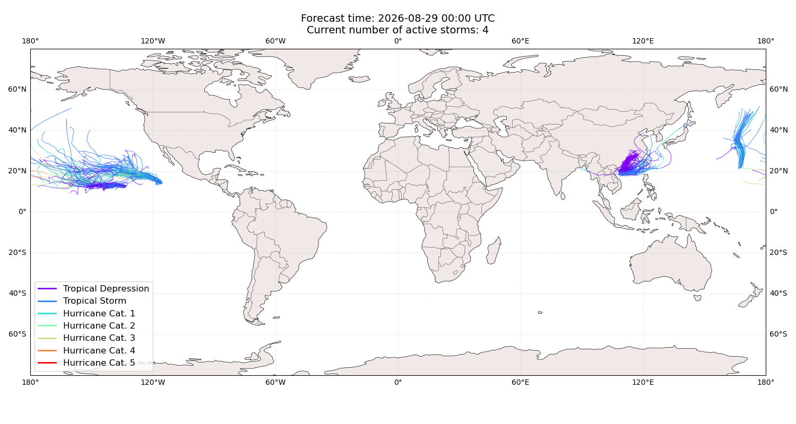

## KARINA United States: areas affected

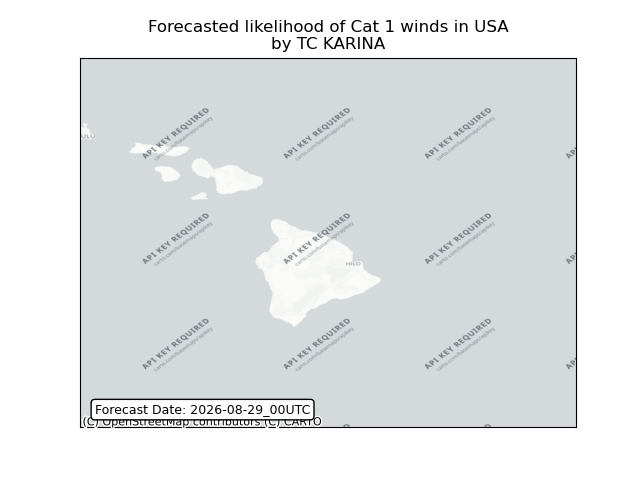

## KARINA United States: people exposed

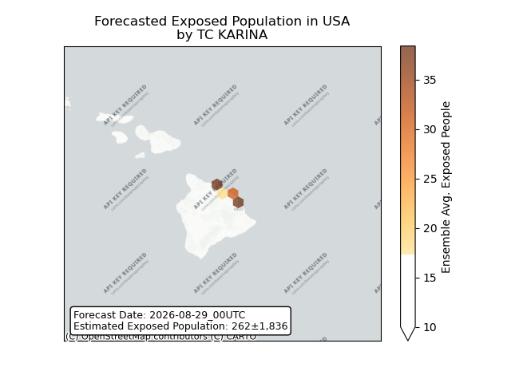

## KARINA United States: people displaced

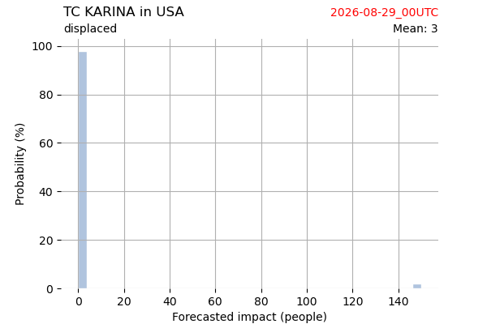

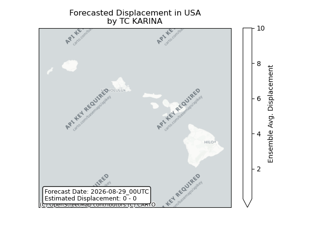

## BANG-LANG All countries: No forecast people exposed

Storm BANG-LANG is not forecast to affect people in All countries.

## BANG-LANG All countries: no forecast people displaced

Storm BANG-LANG is not forecast to displace people in All countries.

## LOWELL United States: areas affected

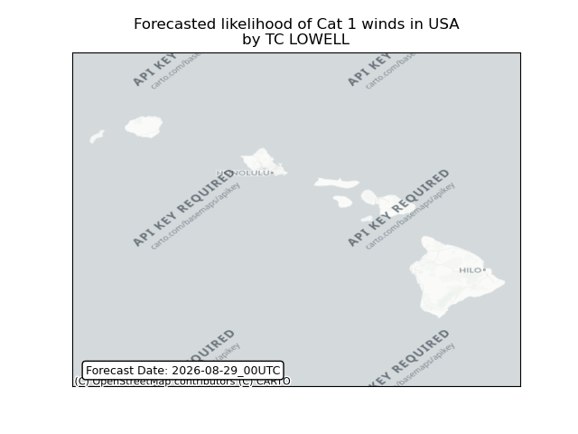

## LOWELL United States: people exposed

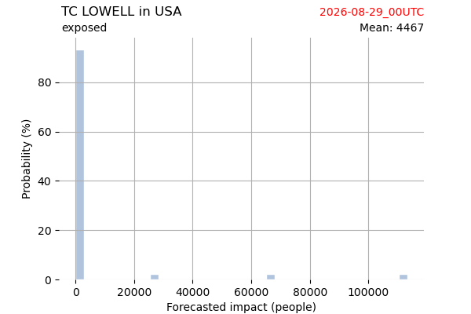

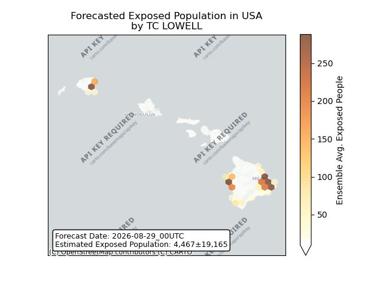

## LOWELL United States: people displaced

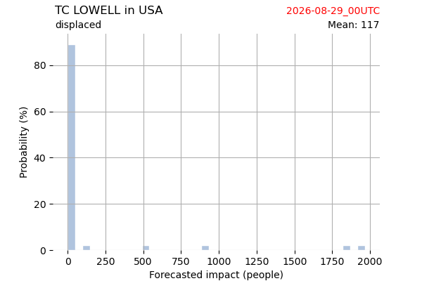

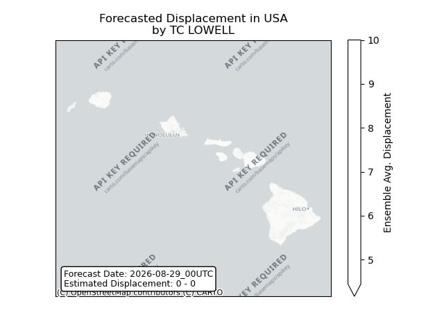

## SAUDEL Japan: areas affected

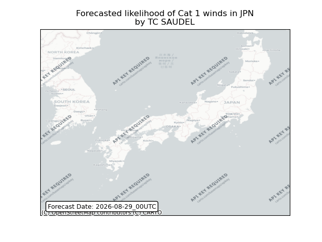

## SAUDEL Japan: people exposed

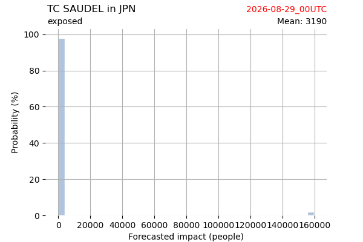

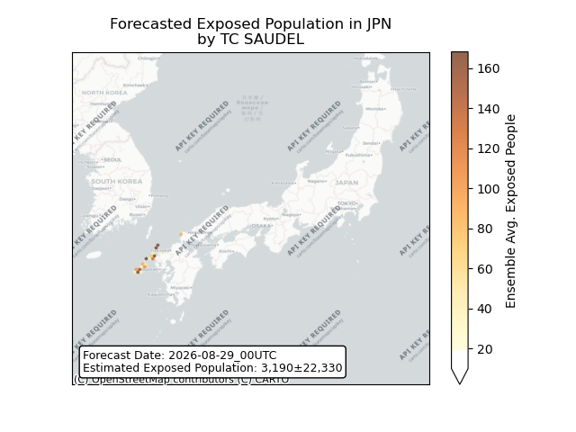

## SAUDEL Japan: people displaced

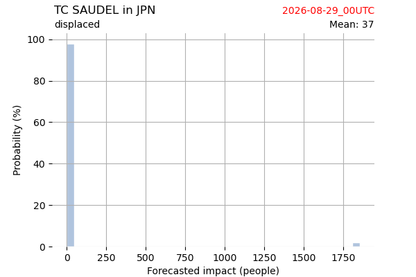

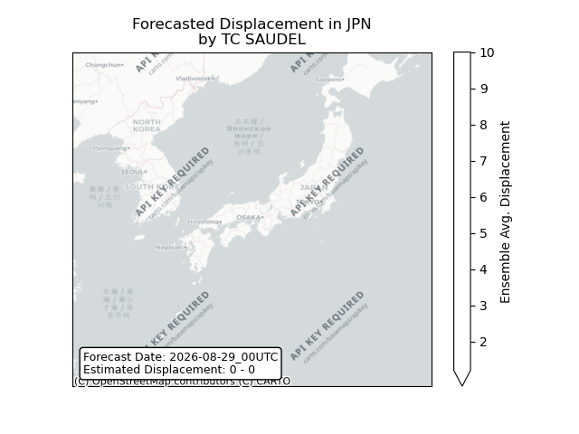

## SAUDEL Philippines: areas affected

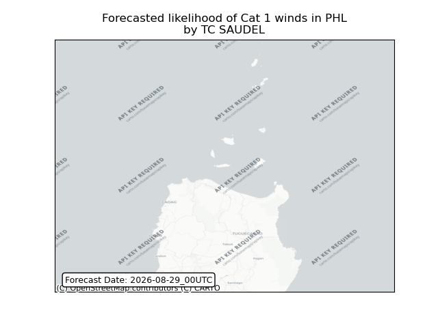

## SAUDEL Philippines: people exposed

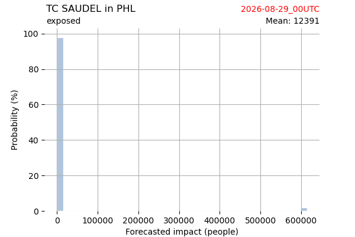

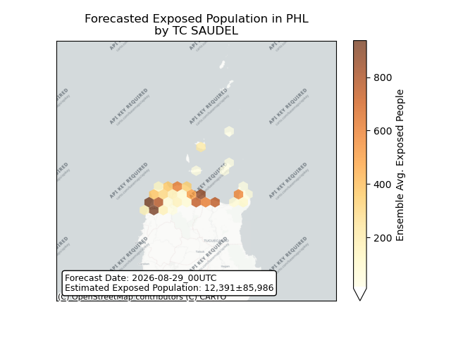

## SAUDEL Philippines: people displaced

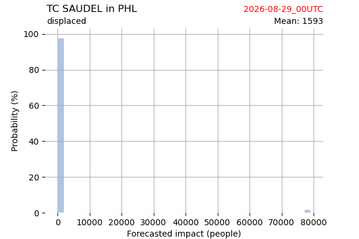

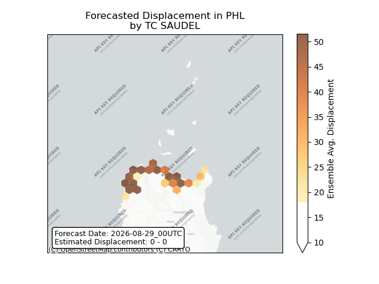

## SAUDEL Taiwan, Province of China: areas affected

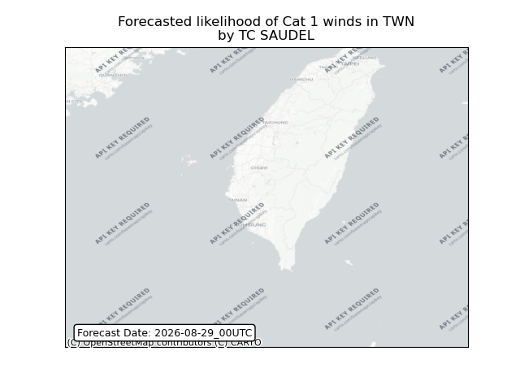

## SAUDEL Taiwan, Province of China: people exposed

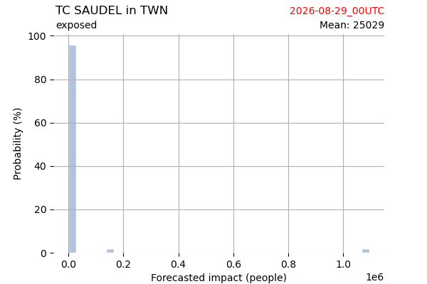

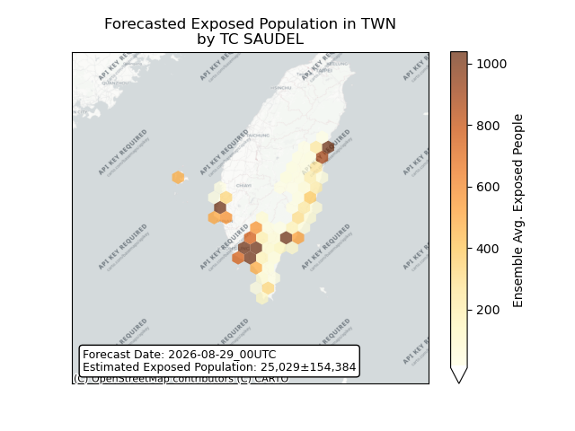

## SAUDEL Taiwan, Province of China: people displaced

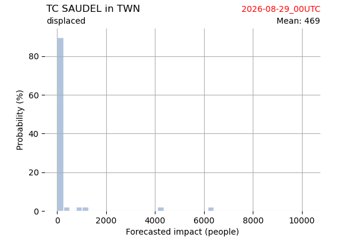

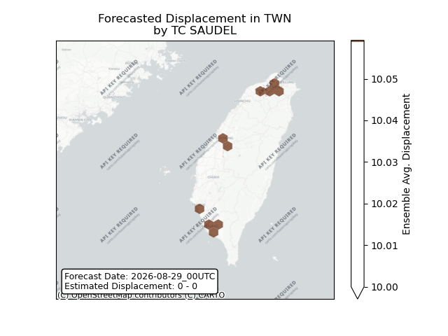

