# Displacement forecast

This is a WIP. All this is going to change, for now we're just dumping things here.

## Forecast for 2026-08-30 00:00 UTC

There are 3 active named storms.

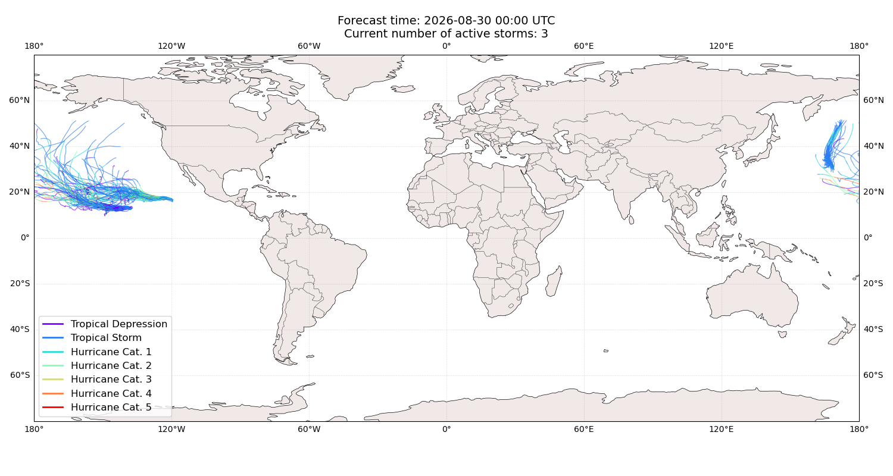

## LOWELL United States: areas affected

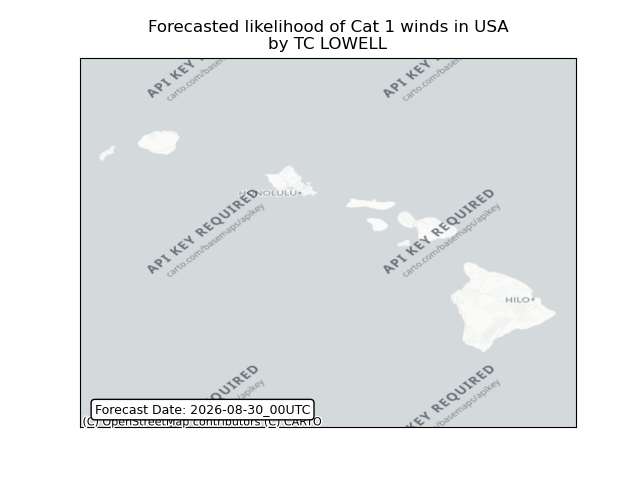

## LOWELL United States: people exposed

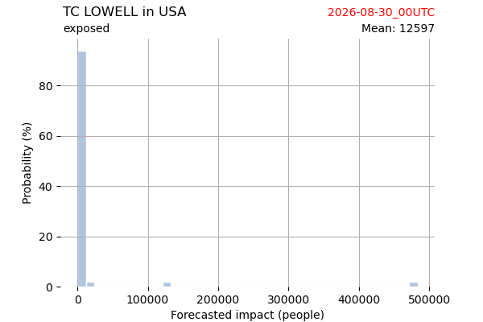

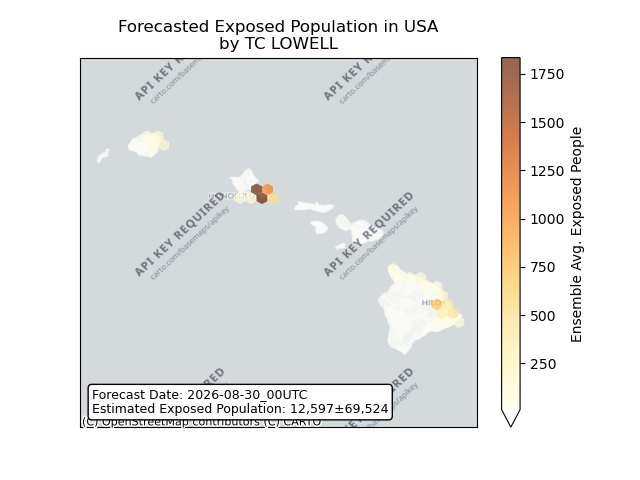

## LOWELL United States: people displaced

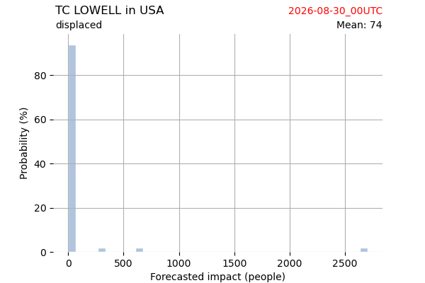

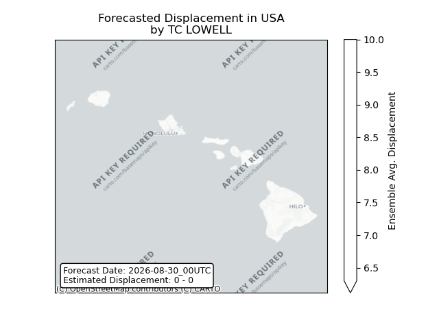

## BANG-LANG United States: areas affected

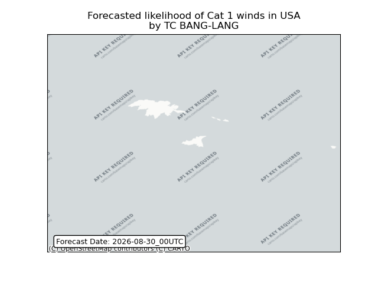

## KARINA United States: no forecast people displaced

Storm KARINA is not forecast to displace people in United States.

## KARINA United States: areas affected

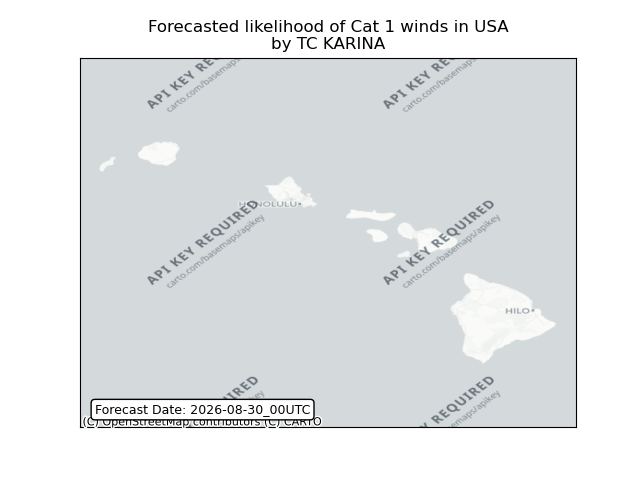

## KARINA United States: people exposed

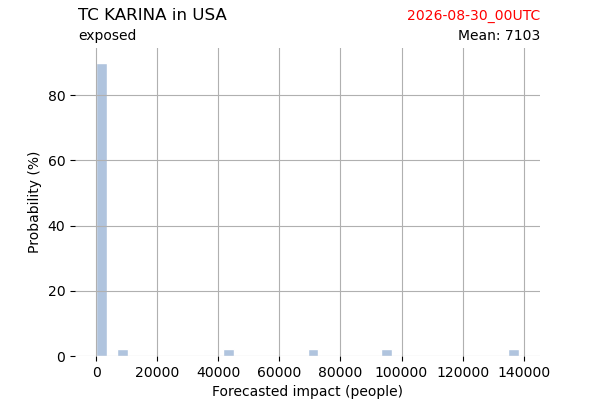

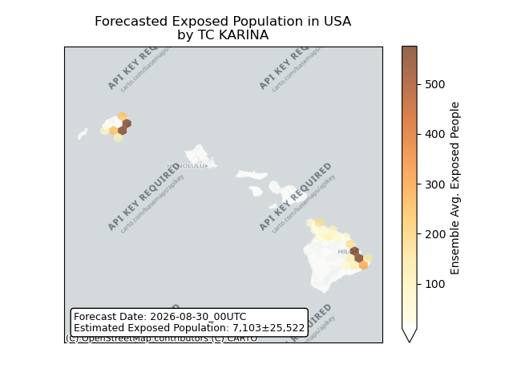

## KARINA United States: people displaced

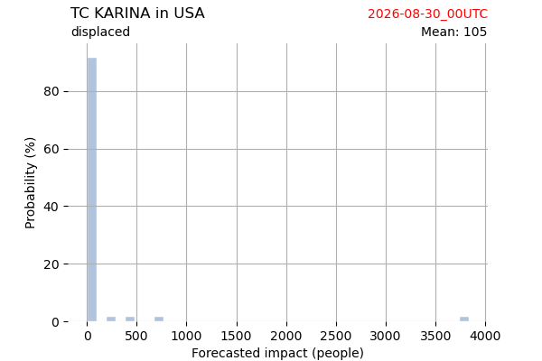

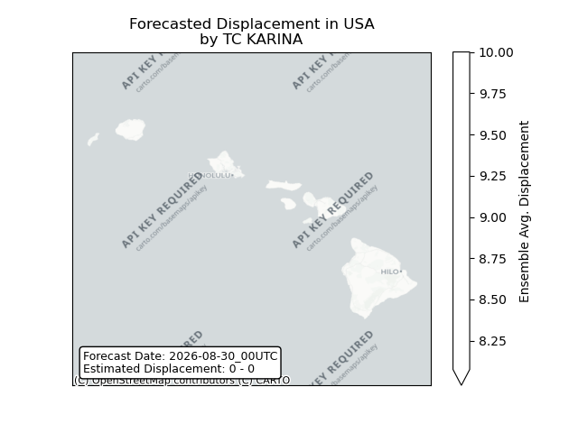

