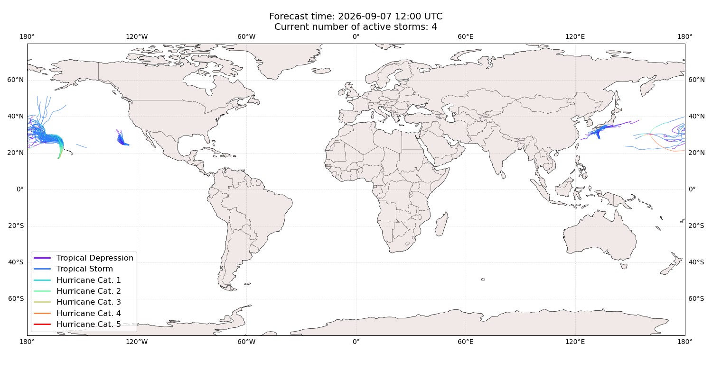
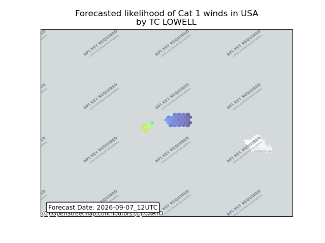
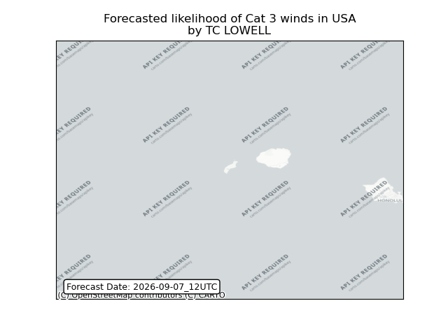
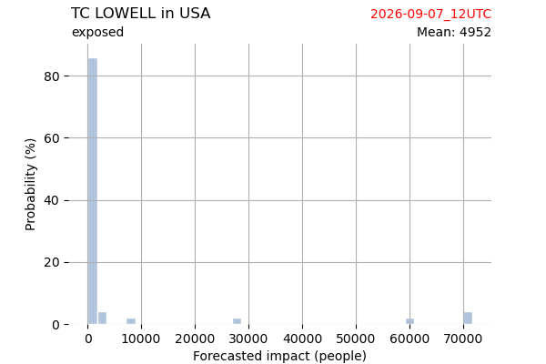
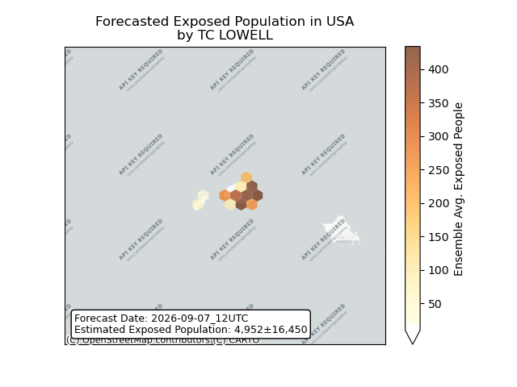
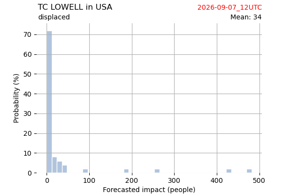
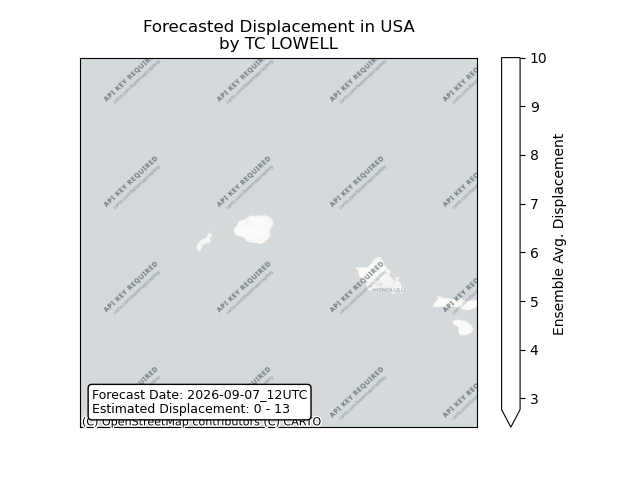

# Displacement forecast

This is a WIP. All this is going to change, for now we're just dumping things here.

## Forecast for 2026-09-07 12:00 UTC

There are 4 active named storms.

## LOWELL United States: areas affected

## LOWELL United States: people exposed

## LOWELL United States: people displaced

## KROVANH All countries: No forecast people exposed

Storm KROVANH is not forecast to affect people in All countries.

## KROVANH All countries: no forecast people displaced

Storm KROVANH is not forecast to displace people in All countries.

## MARIE All countries: No forecast people exposed

Storm MARIE is not forecast to affect people in All countries.

## MARIE All countries: no forecast people displaced

Storm MARIE is not forecast to displace people in All countries.

## KARINA All countries: No forecast people exposed

Storm KARINA is not forecast to affect people in All countries.

## KARINA All countries: no forecast people displaced

Storm KARINA is not forecast to displace people in All countries.

