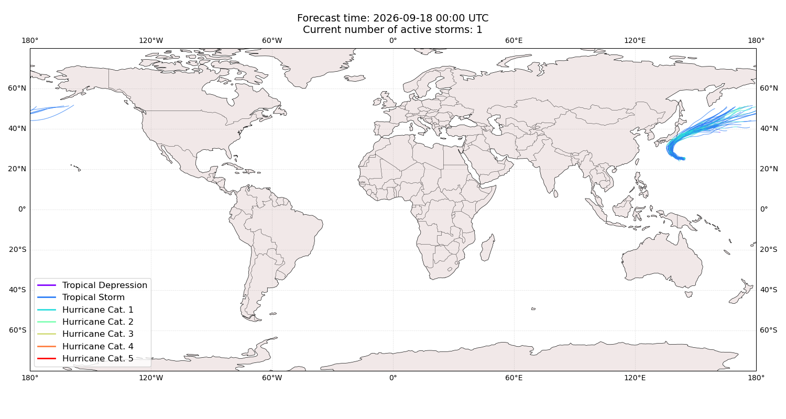
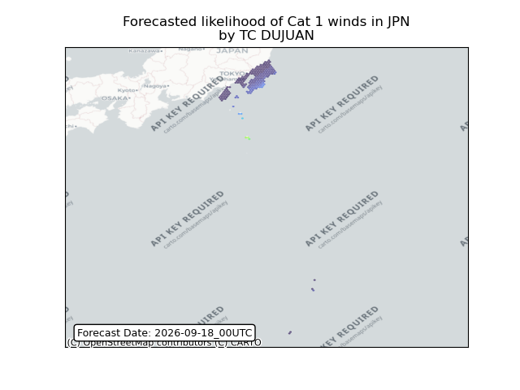
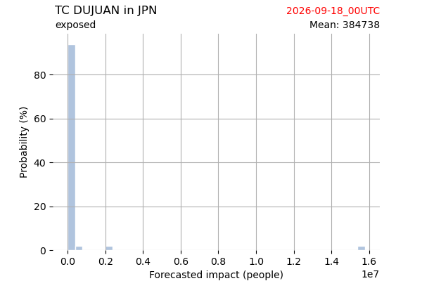
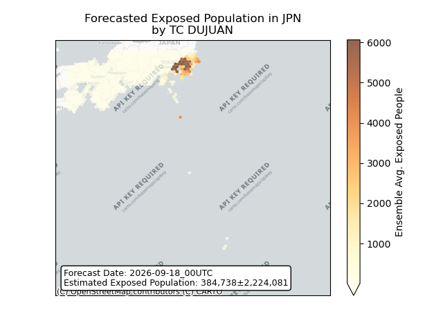
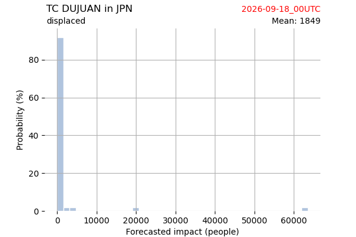
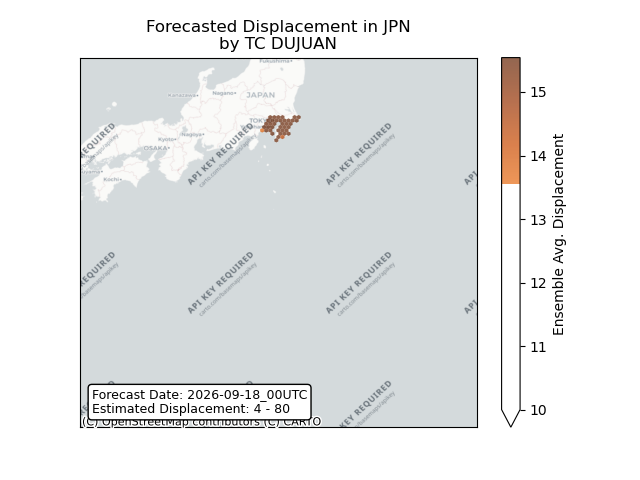
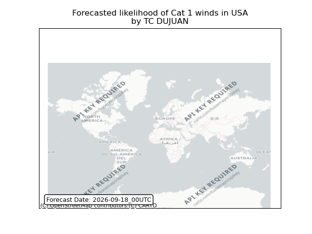

# Displacement forecast

This is a WIP. All this is going to change, for now we're just dumping things here.

## Forecast for 2026-09-18 00:00 UTC

There are 1 active named storms.

## DUJUAN Japan: areas affected

## DUJUAN Japan: people exposed

## DUJUAN Japan: people displaced

## DUJUAN United States: areas affected

## DUJUAN United States: no forecast people displaced

Storm DUJUAN is not forecast to displace people in United States.

