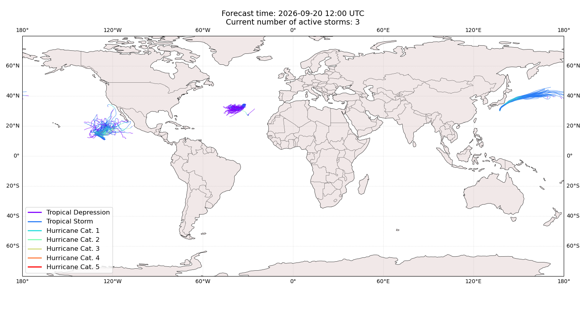
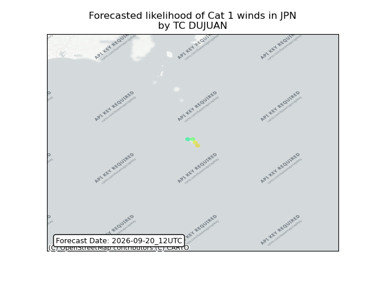
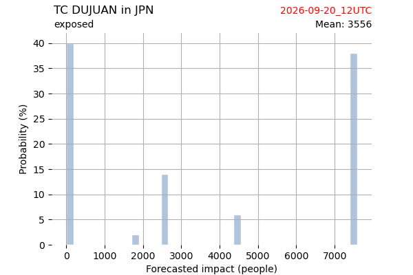
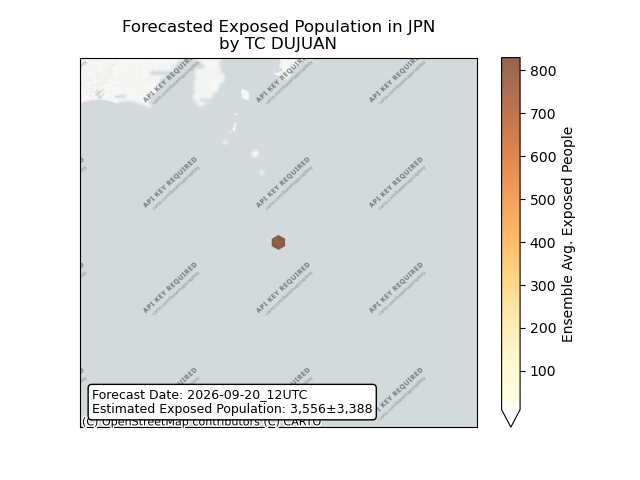
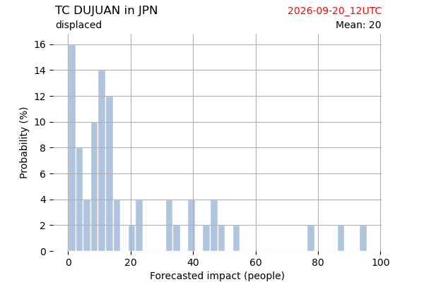
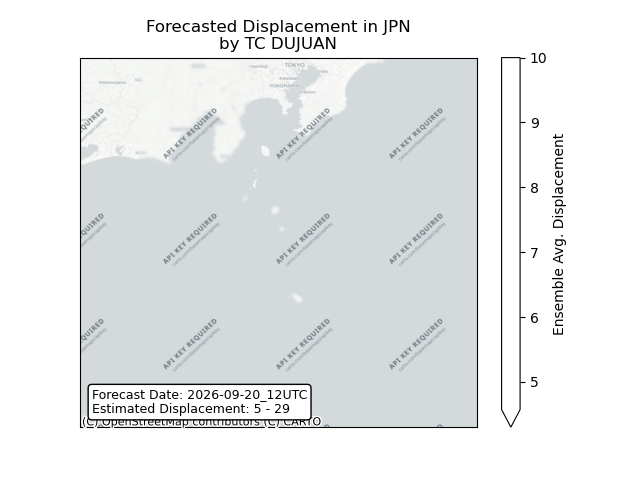
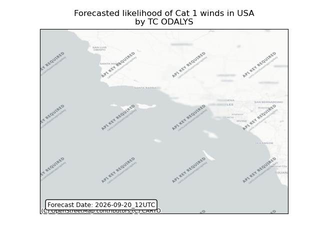
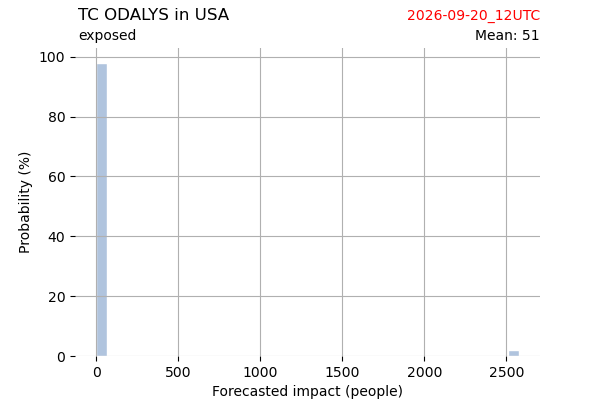
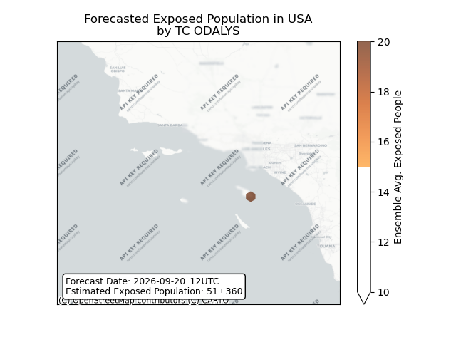
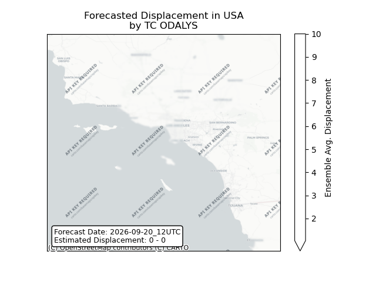

# Displacement forecast

This is a WIP. All this is going to change, for now we're just dumping things here.

## Forecast for 2026-09-20 12:00 UTC

There are 3 active named storms.

## DUJUAN Japan: areas affected

## DUJUAN Japan: people exposed

## DUJUAN Japan: people displaced

## ODALYS United States: areas affected

## ODALYS United States: people exposed

## ODALYS United States: people displaced

## FAY All countries: No forecast people exposed

Storm FAY is not forecast to affect people in All countries.

## FAY All countries: no forecast people displaced

Storm FAY is not forecast to displace people in All countries.

