# Displacement forecast

This is a WIP. All this is going to change, for now we're just dumping things here.

## Forecast for 2026-09-27 12:00 UTC

There are 5 active named storms.

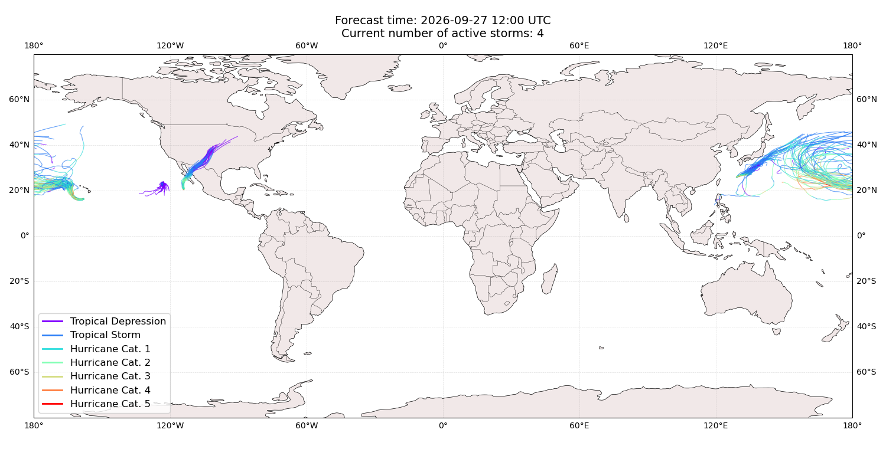

## NOLO All countries: No forecast people exposed

Storm NOLO is not forecast to affect people in All countries.

## NOLO All countries: no forecast people displaced

Storm NOLO is not forecast to displace people in All countries.

## SURIGAE Japan: areas affected

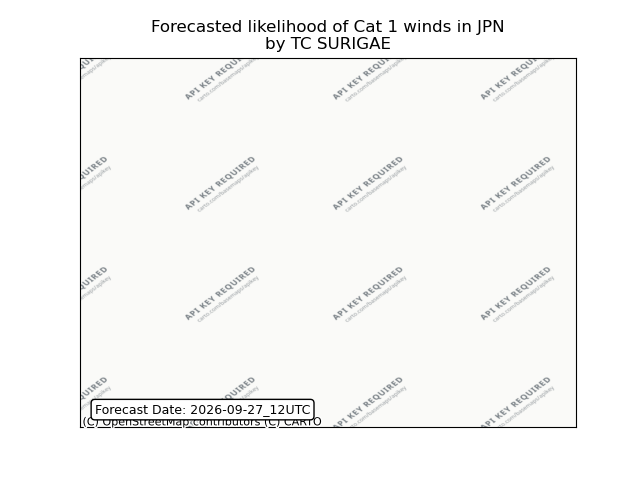

## SURIGAE Japan: people exposed

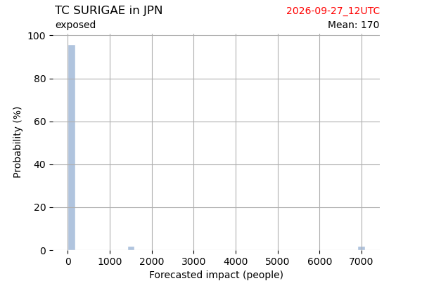

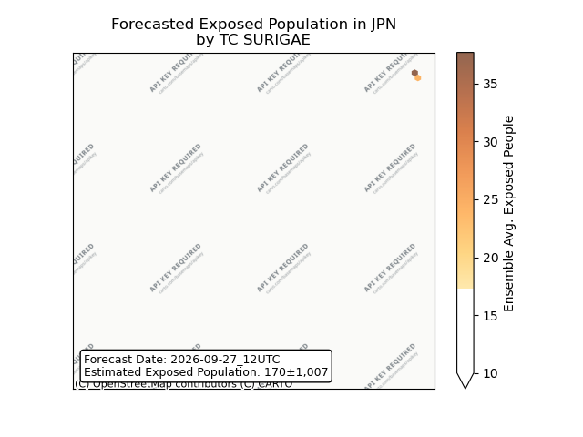

## SURIGAE Japan: people displaced

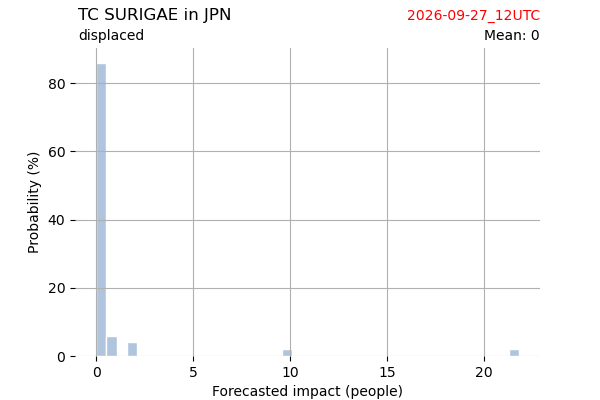

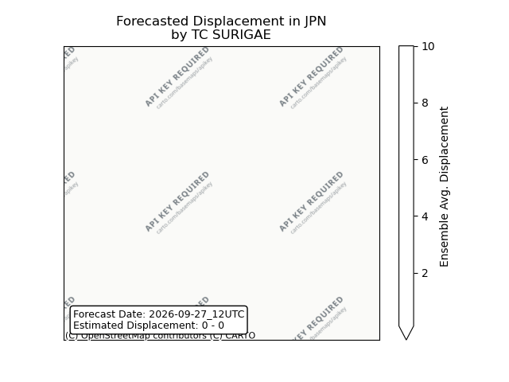

## SURIGAE Philippines: areas affected

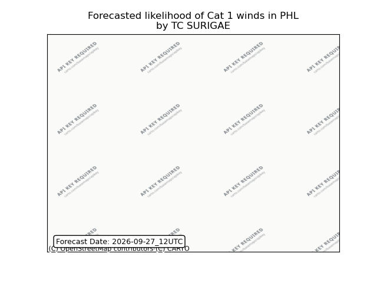

## SURIGAE Philippines: people exposed

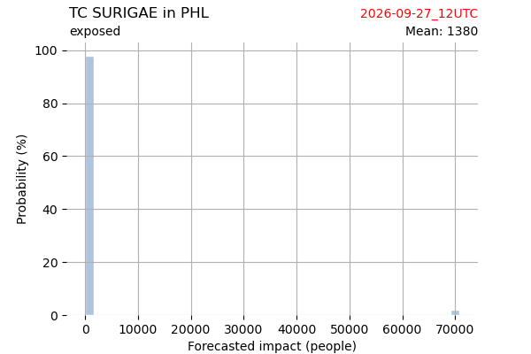

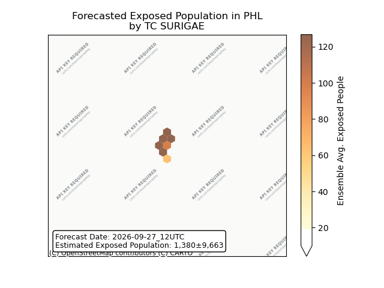

## SURIGAE Philippines: people displaced

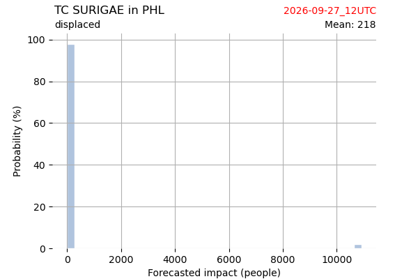

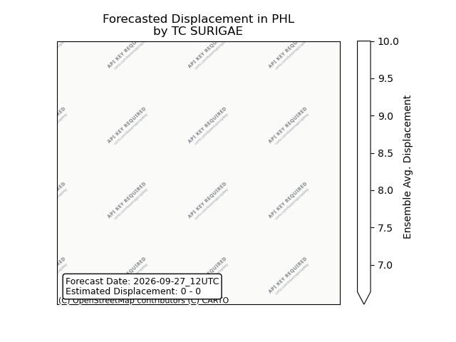

## ODALYS All countries: No forecast people exposed

Storm ODALYS is not forecast to affect people in All countries.

## ODALYS All countries: no forecast people displaced

Storm ODALYS is not forecast to displace people in All countries.

## POLO Mexico: areas affected

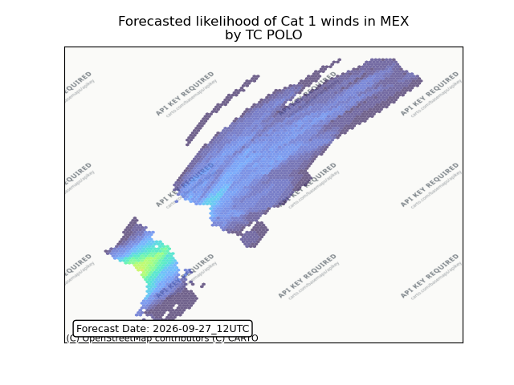

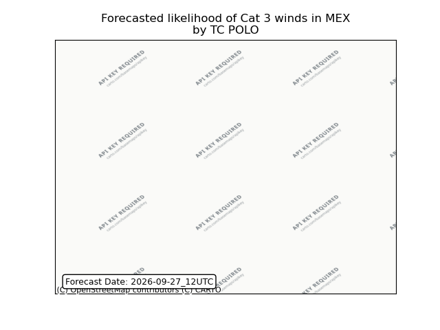

## POLO Mexico: people exposed

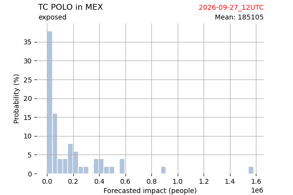

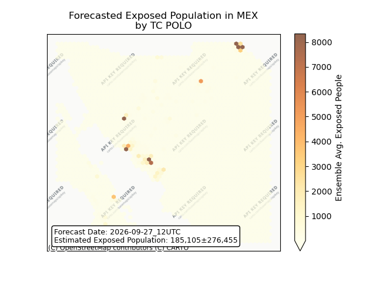

## POLO Mexico: people displaced

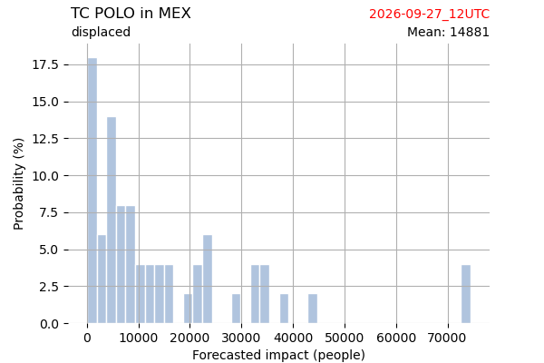

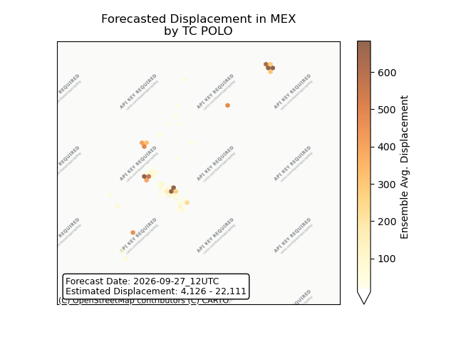

## POLO United States: areas affected

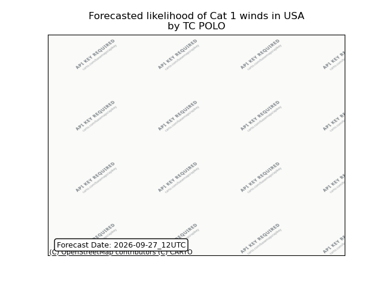

## POLO United States: people exposed

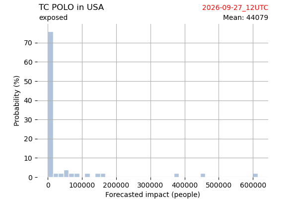

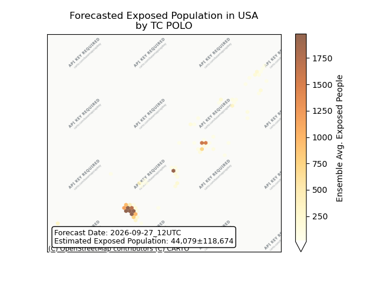

## POLO United States: people displaced

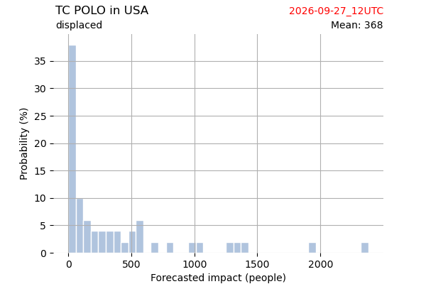

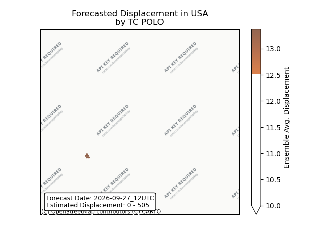

## FAY All countries: No forecast people exposed

Storm FAY is not forecast to affect people in All countries.

## FAY All countries: no forecast people displaced

Storm FAY is not forecast to displace people in All countries.

