# Displacement forecast

This is a WIP. All this is going to change, for now we're just dumping things here.

## Forecast for 2026-09-30 00:00 UTC

There are 6 active named storms.

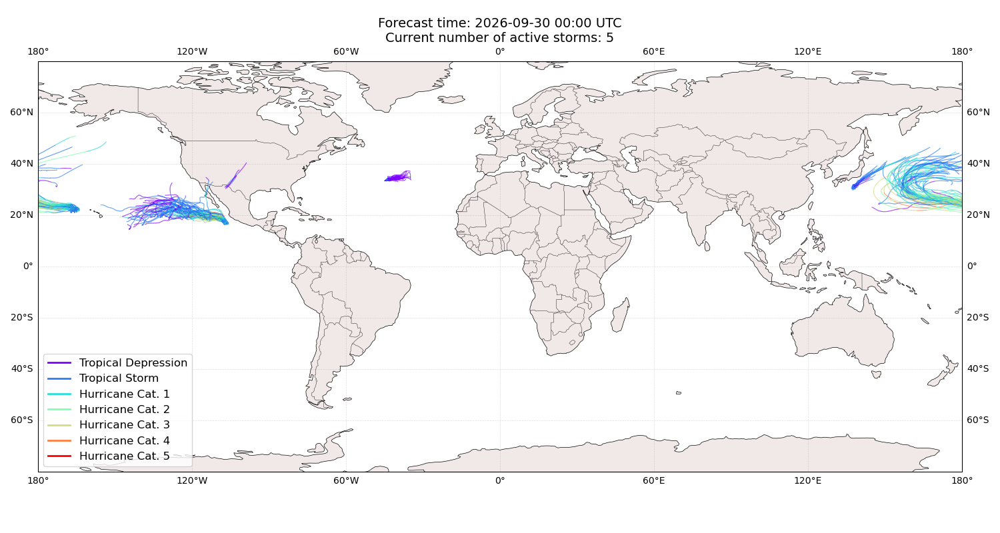

## RACHEL Mexico: areas affected

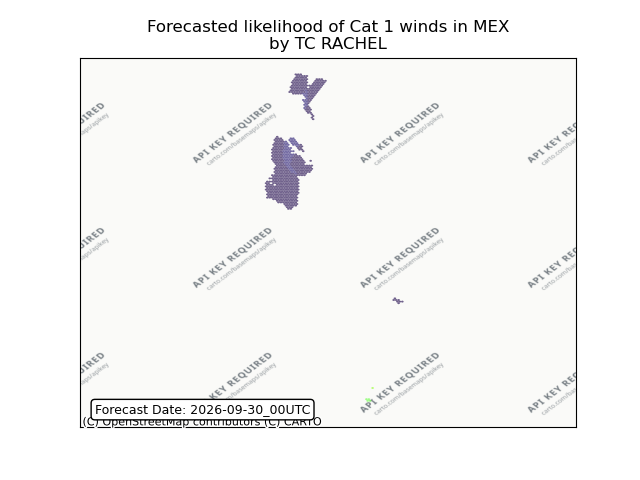

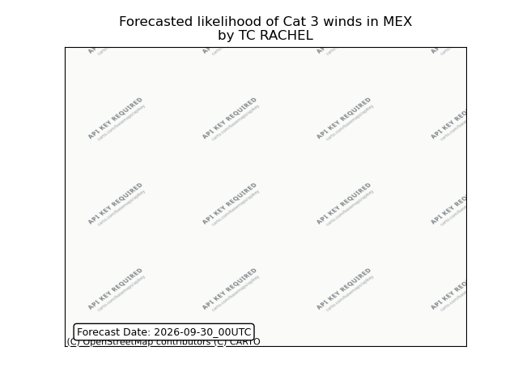

## RACHEL Mexico: people exposed

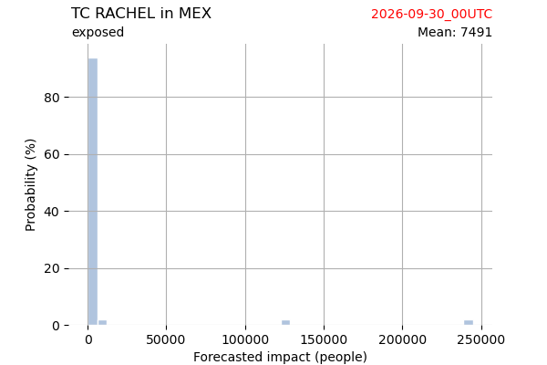

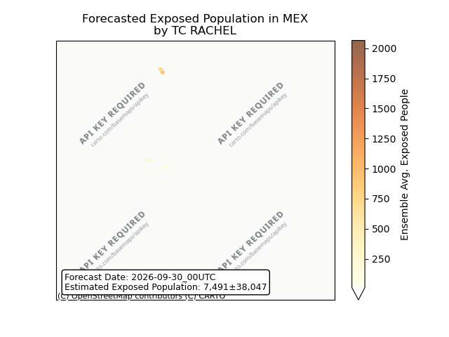

## RACHEL Mexico: people displaced

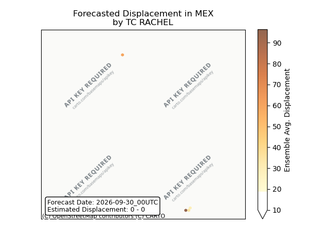

## RACHEL United States: areas affected

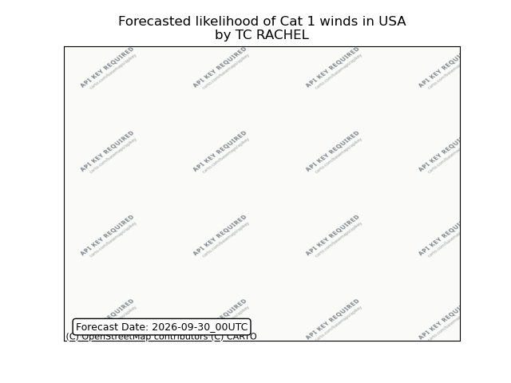

## RACHEL United States: people exposed

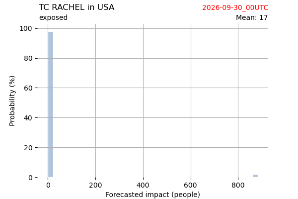

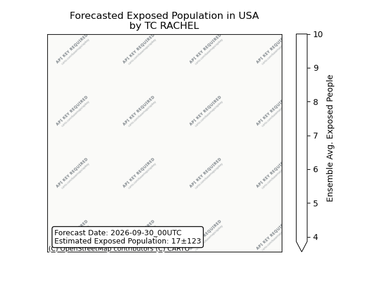

## RACHEL United States: people displaced

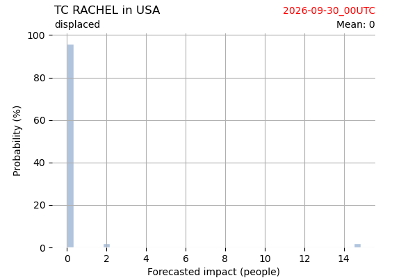

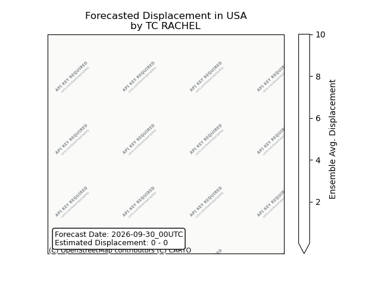

## POLO All countries: No forecast people exposed

Storm POLO is not forecast to affect people in All countries.

## POLO All countries: no forecast people displaced

Storm POLO is not forecast to displace people in All countries.

## SURIGAE All countries: No forecast people exposed

Storm SURIGAE is not forecast to affect people in All countries.

## SURIGAE All countries: no forecast people displaced

Storm SURIGAE is not forecast to displace people in All countries.

## NOLO All countries: No forecast people exposed

Storm NOLO is not forecast to affect people in All countries.

## NOLO All countries: no forecast people displaced

Storm NOLO is not forecast to displace people in All countries.

## FAY All countries: No forecast people exposed

Storm FAY is not forecast to affect people in All countries.

## FAY All countries: no forecast people displaced

Storm FAY is not forecast to displace people in All countries.

## HANNA All countries: No forecast people exposed

Storm HANNA is not forecast to affect people in All countries.

## HANNA All countries: no forecast people displaced

Storm HANNA is not forecast to displace people in All countries.

